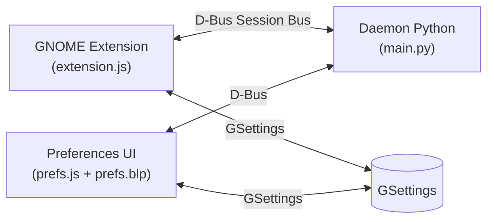

# Voice Assistant — GNOME Extension

Un'estensione per GNOME Shell che integra un assistente vocale **completamente locale e offline**. Nessun dato lascia la macchina: tutto il riconoscimento vocale avviene on-device tramite Vosk o Whisper.

## ✨ Funzionalità

- 🎤 **Wakeword personalizzabile** — attivazione vocale hands-free (default: *"assistente"*)
- ⌨️ **Scorciatoia da tastiera nativa** — attivazione rapida tramite `<Super>v` configurabile
- 🧠 **Due motori STT** — Vosk (leggero, streaming reale) e Whisper (preciso, batch via faster-whisper)
- 🔇 **100% Offline** — nessuna connessione cloud, piena privacy
- ⚡ **Download automatico** dei modelli con progress tracking, notifica ed annullamento
- 🎨 **Interfaccia Blueprint & Libadwaita** — layout moderno e pulito (.blp) caricato nativamente con Gtk.Builder
- 🔋 **Inibizione sospensione** — blocco automatico di sleep/idle durante il download dei modelli
- 🌍 **Localizzazione** — supporto i18n con Gettext (attualmente: italiano)

## 📋 Requisiti

| Componente | Versione minima |
|---|---|
| GNOME Shell | 45+ (testato su 50) |
| Python | 3.10+ |
| Meson | 0.56+ |
| `blueprint-compiler` | Qualsiasi |
| `python3-gi` (PyGObject) | Qualsiasi |
| `libportaudio2` | Qualsiasi |

## 🚀 Installazione

```bash
# Clona il repository
git clone https://github.com/mkswap/voice-assistant.git
cd voice-assistant

# Configura e installa
meson setup build --prefix=$HOME/.local
meson install -C build
```

Riavvia la sessione GNOME (log out/in su Wayland, oppure `Alt+F2` → `r` su X11), poi abilita l'estensione:

```bash
gnome-extensions enable voice-assistant@mkswap.github.io
```

Il daemon Python viene avviato automaticamente come servizio systemd utente. I modelli vengono scaricati automaticamente al primo utilizzo.

### 📦 Creazione pacchetto ZIP

Per generare un file `.zip` dell'estensione installabile tramite **Extension Manager**:

```bash
meson compile -C build zip
```

---

## 🏗️ Architettura

Il progetto è composto da tre componenti:

| Componente | Tecnologia | Ruolo |
|---|---|---|
| **Extension** (`extension.js`) | GJS / GNOME Shell | Icona nella top bar, keybinding nativi, orchestrazione daemon |
| **Preferences** (`prefs.js` + `prefs.blp`) | GJS / Blueprint / Libadwaita | Pannello impostazioni nativo con binding GSettings live |
| **Daemon** (`daemon/main.py`) | Python / dasbus | Cattura audio, wake word detection, riconoscimento vocale |



---

## 📁 Struttura del Progetto

```
voice-assistant@mkswap.github.io/
├── meson.build              # Build system root
├── stylesheet.css           # Stili CSS per l'indicatore GNOME Shell
├── src/
│   ├── extension.js         # Estensione GNOME Shell
│   ├── prefs.js             # Logic & Binding preferenze Libadwaita
│   └── daemon/              # Daemon Python background
├── data/
│   ├── ui/prefs.blp         # Layout dell'interfaccia preferenze in Blueprint
│   ├── dbus/                # XML Introspezione D-Bus
│   ├── services/            # Template unit Systemd & D-Bus
│   ├── schemas/             # GSettings schema + GResource
│   └── icons/               # Icone SVG simboliche
├── po/                      # Traduzioni (Gettext)
└── docs/                    # Documentazione tecnica
```

## 📄 Licenza

[GNU General Public License v3.0](LICENSE)

Copyright © 2026 Giorgio Dramis
