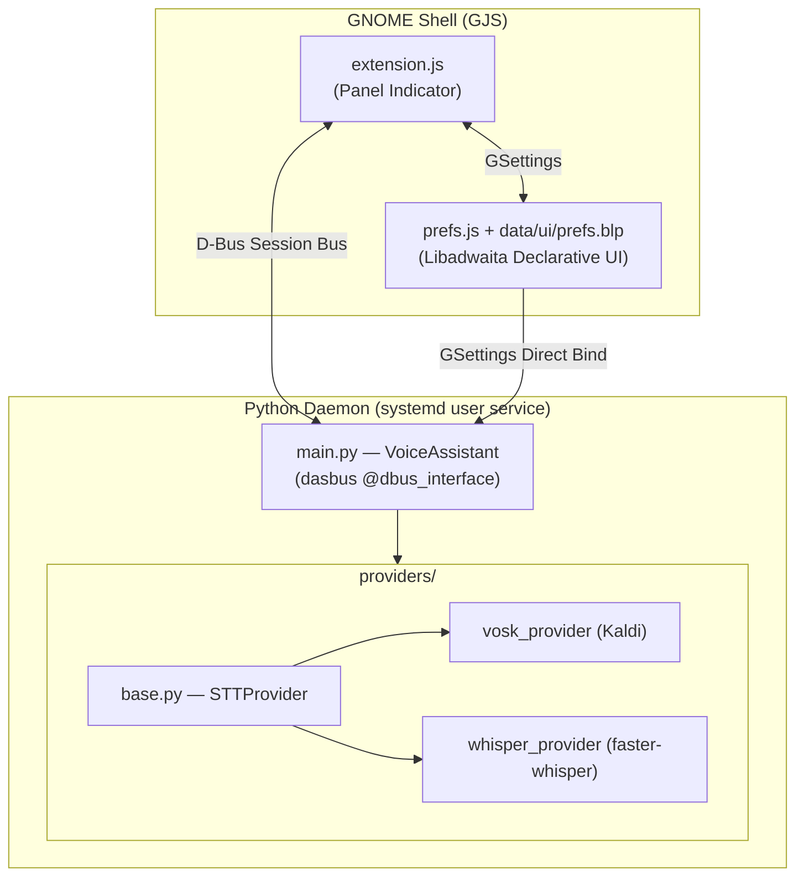
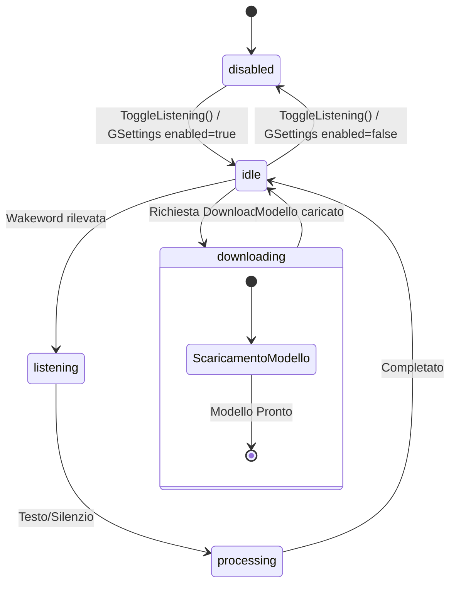
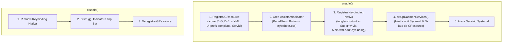

# Architettura del Sistema

> Documento di riferimento per sviluppatori e AI agent che operano sulla codebase.

## Panoramica

Voice Assistant è un'estensione GNOME Shell che implementa un assistente vocale **completamente locale** (nessun dato lascia la macchina). L'architettura è a **tre livelli** con comunicazione bidirezionale su D-Bus.



---

## 1. Il Demone Python (`src/daemon/`)

### Entry Point — `main.py`

Il processo viene avviato da `start.sh` tramite systemd e si registra sul Session Bus D-Bus come **`org.local.VoiceAssistant`**.

| Componente | Ruolo |
|---|---|
| `VoiceAssistant` (classe) | Oggetto D-Bus principale. Gestisce stato, audio, provider e inibitori di sospensione |
| `audio_callback()` | Callback `sounddevice` che inserisce i chunk PCM in una `queue.Queue` thread-safe |
| `_audio_loop()` | Thread daemon che consuma la coda e distribuisce i chunk al Wake Word engine o al provider STT |
| `PowerInhibitor` | Doppio lock (logind FD + GNOME SessionManager cookie) durante il download dei modelli |

### State Machine



**Regole di transizione:**
- **disabled → idle**: `ToggleListening()` o GSettings `enabled=true`
- **idle → listening**: wakeword rilevata (Vosk small-it, sempre attivo)
- **listening → processing → idle**: testo riconosciuto dal provider STT selezionato
- Qualsiasi stato → **downloading**: se il provider richiede il download di un modello

### Segnali D-Bus

| Segnale | Firma | Emesso quando |
|---|---|---|
| `StateChanged(s)` | `new_state: string` | Ogni transizione di stato |
| `DownloadProgress(s, s, i)` | `provider: string, model: string, percent: int` | Durante il download di un modello (granularità 1%) |

### Metodi D-Bus

| Metodo | Firma | Descrizione |
|---|---|---|
| `ToggleListening() → b` | Ritorna `bool` | Alterna tra `disabled` e `idle` |
| `GetAvailableModels(s) → s` | `provider: string` | Restituisce il JSON dei modelli installati e disponibili |
| `GetDownloadingModels() → s` | N/A | Restituisce il JSON dei download in corso |
| `DownloadModel(s, s)` | `provider: string, model: string` | Avvia il download in background di un modello |
| `CancelDownload(s, s)` | `provider: string, model: string` | Annulla un download in corso e pulisce i file parziali |

### Wake Word Engine

Il motore Wake Word è **sempre Vosk** con il modello `vosk-model-small-it-0.22`, indipendentemente dal provider STT selezionato per la trascrizione completa. Questo garantisce un consumo di risorsa CPU trascurabile durante il monitoraggio continuo.

Quando la wakeword (configurabile via GSettings, default: `"assistente"`) viene rilevata nel testo parziale o finale di Vosk, il daemon transisce nello stato `listening` e delega il riconoscimento completo al provider STT configurato dall'utente.

### Gestione Settings Live

Il daemon sottoscrive individualmente le chiavi GSettings:

```python
self.settings.connect("changed::wakeword", self.on_settings_changed)
self.settings.connect("changed::stt-provider", self.on_settings_changed)
self.settings.connect("changed::stt-model", self.on_settings_changed)
self.settings.connect("changed::stt-hardware", self.on_settings_changed)
self.settings.connect("changed::stt-extra", self.on_settings_changed)
self.settings.connect("changed::enabled", self.on_settings_changed)
self.settings.connect("changed::models-dir", self.on_settings_changed)
```

La wakeword viene aggiornata istantaneamente. Le altre chiavi triggerano un **reload debounced** a 500 ms tramite `_schedule_reload()` + `threading.Timer`, per evitare ricaricamenti multipli quando l'utente cambia opzioni in rapida sequenza. Ogni `load_provider()` opera in un thread dedicato con un `load_id` incrementale per isolare le concorrenze.

---

## 2. L'Estensione GNOME Shell (`src/extension.js`)

### Ciclo di Vita



### D-Bus Proxy

L'estensione legge la definizione XML D-Bus da GResource (`/org/gnome/shell/extensions/voice-assistant/dbus/org.local.VoiceAssistant.xml`) tramite `Gio.resources_lookup_data()` e crea il proxy wrapper con `Gio.DBusProxy.makeProxyWrapper()`.

### Feedback Visivo

Gli stili grafici e i colori dell'indicatore nella barra superiore sono gestiti in modo centralizzato in `stylesheet.css`:

| Stato | Icona | Colore / Stile CSS | OSD |
|---|---|---|---|
| `idle` | `vocal-assistant-symbolic` | Default | No |
| `listening` | `vocal-assistant-symbolic` | `.listening` (`#3584e4` blu) | "In ascolto..." |
| `processing` | `system-run-symbolic` | `.processing` (`#e5a50a` giallo) | No |
| `speaking` | `audio-volume-high-symbolic` | `.speaking` (`#3584e4`) | No |
| `downloading` | `folder-download-symbolic` | `.downloading` (`#e5a50a`) | No |
| `disabled` | `vocal-assistant-symbolic` | `.disabled` (`#e01b24` rosso) | No |

### OSD Nativo

L'OSD visivo ("In ascolto...") supporta sia GNOME 45-48 (`show(-1, ...)`) che GNOME 49+ (`showAll(...)`).

### Scorciatoia da Tastiera Nativa

L'estensione registra la scorciatoia da tastiera globale configurabile tramite la chiave GSettings `toggle-shortcut` (default: `<Super>v`) mediante la funzione nativa di GNOME Shell `Main.wm.addKeybinding()`.

---

## 3. Le Preferenze (`src/prefs.js` & `data/ui/prefs.blp`)

L'interfaccia delle preferenze utilizza un'architettura **dichiarativa separata**:

- **Definizione Strutturale (`data/ui/prefs.blp`)**: Scritta in sintassi **Blueprint**, compilata in `prefs.ui` durante la build ed inclusa nella risorsa binaria `.gresource`.
- **Logica e Binding (`src/prefs.js`)**: Carica la vista tramite `Gtk.Builder.new_from_resource()`, gestisce i collegamenti D-Bus, le reazioni agli eventi ed i binding reattivi con **GSettings**.

Applicazione Libadwaita strutturata con **`Adw.NavigationSplitView`** e pagine:
- ⚙️ **Generali**: Attivazione assistente (`SwitchRow`) e Wakeword (`EntryRow`) con binding diretto a GSettings.
- 🎙️ **Motore Vocale (STT)**: Selezione Provider (`Adw.ComboRow` tra Vosk e Whisper), Download automatico/manuale modelli e configurazione accelerazione hardware per Whisper.
- 📁 **Archiviazione & Modelli**: Selezione e gestione della cartella di salvataggio modelli (`models-dir`) con selettore nativo GTK, apertura file manager e ripristino cartella di default. Gestione spazio occupato su disco e rimozione modelli.
- ℹ️ **Informazioni**: Dettagli sull'estensione, versione, servizio D-Bus e collegamenti al repository.

Il cambio di provider resetta automaticamente il modello ai valori predefiniti.

---

## 4. Provider STT

### Interfaccia Base (`providers/base.py`)

```python
class STTProvider(abc.ABC):
    def __init__(self, model: str, hardware: str, extra: dict): ...
    def process_chunk(self, data: bytes) -> tuple[str, str]: ...
    def flush_and_transcribe(self) -> str: ...
    def reset(self): ...
```

| Metodo | Descrizione |
|---|---|
| `process_chunk(data)` | Processa un chunk PCM int16. Ritorna `(text, partial_text)`. `text` non vuoto = frase completata |
| `flush_and_transcribe()` | Forza la trascrizione del buffer accumulato (usato per Whisper batch) |
| `reset()` | Resetta lo stato interno del riconoscitore |

### Factory (`providers/__init__.py`)

```python
get_provider(provider_name, model, hardware, extra, progress_callback) -> STTProvider
```

### VoskProvider (`providers/vosk_provider.py`)

- **Streaming reale**: `KaldiRecognizer.AcceptWaveform()` processa ogni chunk e ritorna testo finale/parziale
- **Download automatico**: se il modello non è presente, lo scarica da `alphacephei.com` con resume su interruzione (fino a 10 retry)
- **Migrazione**: supporta la vecchia posizione `~/.cache/vosk/`
- **Alias modelli**: mappa alias come `"it"`, `"small-it"`, `"large-en"` ai nomi ufficiali

### WhisperProvider (`providers/whisper_provider.py`)

- **Batch processing**: accumula l'audio in un `bytearray` e trascrive solo quando `flush_and_transcribe()` viene chiamato
- **Backend**: `faster-whisper` (CTranslate2) con supporto CPU (`int8`) e CUDA (`float16`)
- **Download tracking**: monitoraggio thread-safe della dimensione del filesystem per calcolare l'avanzamento dei download da HuggingFace Hub senza blocchi
- **Silence detection**: gestita nel `_audio_loop()` di `main.py` con soglia RMS di 500 e timeout di 2 secondi

---

## 5. Servizi Systemd e D-Bus

### Template di Servizio (`data/services/`)

I file di configurazione sono memorizzati come template in GResource:
- `data/services/voice-assistant.service.in`
- `data/services/org.local.VoiceAssistant.service.in`

### Systemd Service (`~/.config/systemd/user/voice-assistant.service`)

```ini
[Unit]
Description=Local Voice Assistant Daemon
After=graphical-session.target

[Service]
Type=dbus
BusName=org.local.VoiceAssistant
ExecStart=<extension_dir>/daemon/start.sh
Restart=on-failure
```

### D-Bus Service (`~/.local/share/dbus-1/services/org.local.VoiceAssistant.service`)

```ini
[D-BUS Service]
Name=org.local.VoiceAssistant
Exec=<extension_dir>/daemon/start.sh
SystemdService=voice-assistant.service
```

Il `Type=dbus` garantisce che systemd consideri il servizio "avviato" solo quando il nome D-Bus viene acquisito. La combinazione con il `.service` D-Bus abilita l'**attivazione automatica**: qualsiasi chiamata al bus name avvia il demone se non è in esecuzione.

### Script di Avvio (`start.sh`)

1. Crea un virtualenv con `--system-site-packages` (per accedere a PyGObject di sistema)
2. Installa le dipendenze da `requirements.txt`
3. Crea una copia reale del binario Python rinominata `VoiceAssistant` per far apparire il nome corretto nelle impostazioni audio di GNOME (Pipewire/ALSA usano il nome dell'eseguibile)
4. `exec` del processo Python per rimpiazzare lo script bash

---

## 6. Storage dei Modelli

Tutti i modelli risiedono in `~/.local/share/voice-assistant/models/` (o percorso configurato in `models-dir`):

```
~/.local/share/voice-assistant/models/
├── vosk-model-small-it-0.22/
├── vosk-model-it-0.22/
├── whisper-base/
├── whisper-small/
└── ...
```

Ogni modello ha una cartella dedicata con nome leggibile. La UI delle preferenze ed il daemon scansionano dinamicamente questa directory per elencare i modelli installati ed utilizzabili.

---

## 7. Build System e Packaging (Meson & Blueprint)

Il progetto usa Meson + Ninja integrato con `blueprint-compiler`.

### Target principali

| Target | Output |
|---|---|
| `compile-prefs-blueprint` | Compila `data/ui/prefs.blp` → `build/data/prefs.ui` tramite `blueprint-compiler` |
| `voice-assistant-gresource` | Compila `org.gnome.shell.extensions.voice-assistant.gresource` includendo icone, D-Bus XML, servizi e `prefs.ui` |
| `zip` (`meson compile zip`) | Genera il pacchetto installabile `.shell-extension.zip` pulito (escludendo `venv` e `__pycache__`) |
| Post-install | Compila gli schemi GSettings nella directory di installazione dell'estensione |

### Directory di installazione

```
~/.local/share/gnome-shell/extensions/voice-assistant@mkswap.github.io/
├── metadata.json
├── extension.js
├── prefs.js
├── stylesheet.css
├── org.gnome.shell.extensions.voice-assistant.gresource
├── schemas/
│   ├── org.gnome.shell.extensions.voice-assistant.gschema.xml
│   └── gschemas.compiled
├── dbus/
│   └── org.local.VoiceAssistant.xml
├── services/
│   ├── voice-assistant.service.in
│   └── org.local.VoiceAssistant.service.in
└── daemon/
    ├── main.py
    ├── start.sh
    ├── requirements.txt
    └── providers/
        ├── __init__.py
        ├── base.py
        ├── vosk_provider.py
        └── whisper_provider.py
```
