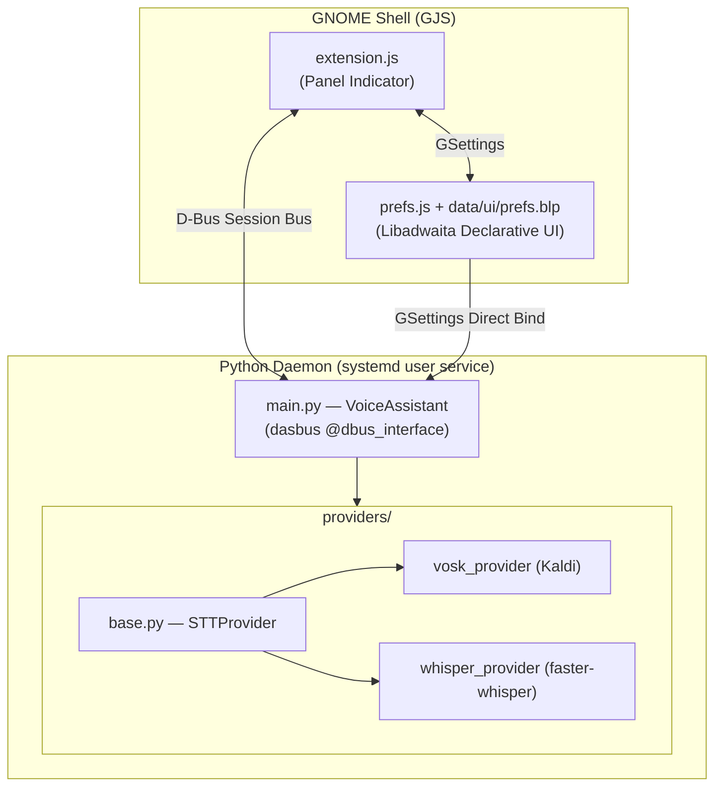
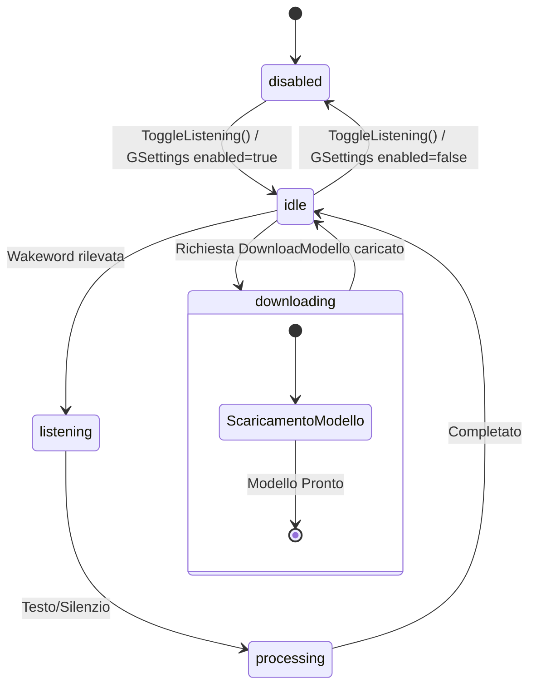
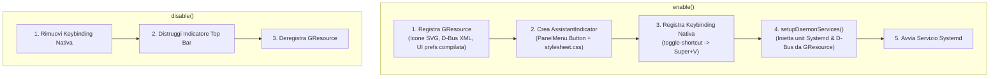

# Architettura del Sistema

> Documento di riferimento per sviluppatori e AI agent che operano sulla codebase.

## Panoramica

Voice Assistant è un'estensione GNOME Shell che implementa un assistente vocale **completamente locale** (nessun dato lascia la macchina). L'architettura è a **tre livelli** con comunicazione bidirezionale su D-Bus.

---

## 1. Il Demone Python (`src/daemon/`)

### Entry Point — `main.py`

Il processo viene avviato da `start.sh` tramite systemd e si registra sul Session Bus D-Bus come **`org.local.VoiceAssistant`**.

| Componente | Ruolo |
|---|---|
| `VoiceAssistant` (classe) | Oggetto D-Bus principale. Gestisce stato, audio, provider e inibitori di sospensione |
| `audio_callback()` | Callback `sounddevice` che inserisce i chunk PCM in una `queue.Queue` thread-safe |
| `_audio_loop()` | Thread daemon che consuma la coda e distribuisce i chunk al Wake Word engine o al provider STT |
| `PowerInhibitor` | Doppio lock (logind FD + GNOME SessionManager cookie) durante il download dei modelli |

### State Machine

---

## 2. L'Estensione GNOME Shell (`src/extension.js`)

### Ciclo di Vita

### D-Bus Proxy

L'estensione legge la definizione XML D-Bus nativa da GResource (`/org/gnome/shell/extensions/voice-assistant/dbus/org.local.VoiceAssistant.xml`) e crea il proxy wrapper via `Gio.DBusProxy.makeProxyWrapper()`.

---

## 3. Le Preferenze (`src/prefs.js` & `data/ui/prefs.blp`)

L'interfaccia delle preferenze utilizza un'architettura **dichiarativa separata**:

- **Definizione Strutturale (`data/ui/prefs.blp`)**: Scritta in sintassi **Blueprint**, compilata durante la build in XML GTK (`prefs.ui`) ed inclusa nella risorsa binaria `.gresource`.
- **Logica e Binding (`src/prefs.js`)**: Carica la vista tramite `Gtk.Builder.new_from_resource()`, gestisce i collegamenti D-Bus, le reazioni agli eventi ed i binding reattivi con **GSettings**.

Pagine dell'interfaccia:
- ⚙️ **Generali**: Attivazione assistente (`SwitchRow`) e Wakeword (`EntryRow`).
- 🎙️ **Motore Vocale (STT)**: Selezione Provider (`Adw.ComboRow`), gestione download e opzioni avanzate.
- 📁 **Archiviazione & Modelli**: Gestione cartella salvataggio modelli (`models-dir`) e pulizia spazio su disco.
- ℹ️ **Informazioni**: Dettagli su versione, D-Bus ed autore.

---

## 4. Servizi Systemd e D-Bus

I file di unit systemd e di servizio D-Bus sono memorizzati come template in `data/services/`:
- `data/services/voice-assistant.service.in`
- `data/services/org.local.VoiceAssistant.service.in`

Durante l'avvio dell'estensione, `setupDaemonServices()` sostituisce il segnaposto `@startScript@` ed inietta i file nelle cartelle dell'utente (`~/.config/systemd/user/` e `~/.local/share/dbus-1/services/`).

---

## 5. Build System e Packaging (Meson & Blueprint)

Il progetto usa **Meson** integrato con `blueprint-compiler`.

### Comandi Principali:
- `meson setup build --prefix=$HOME/.local`: Configurazione ambiente.
- `meson install -C build`: Compilazione Blueprint, GResource, schemi e installazione nell'estensione locale.
- `meson compile -C build zip`: Generazione del pacchetto `.shell-extension.zip` pronto per la distribuzione.
