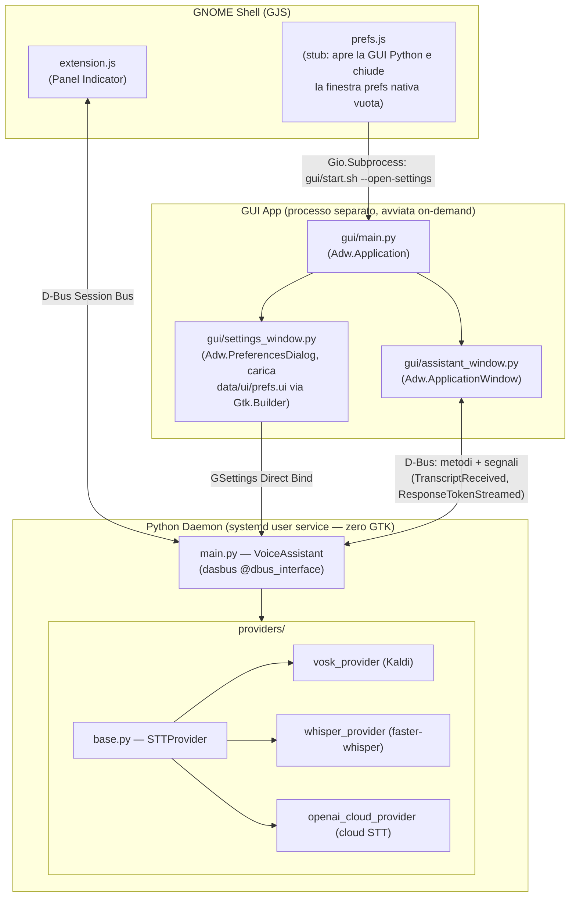
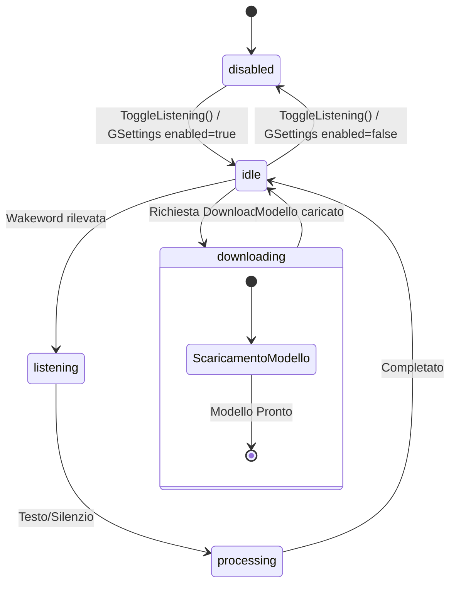
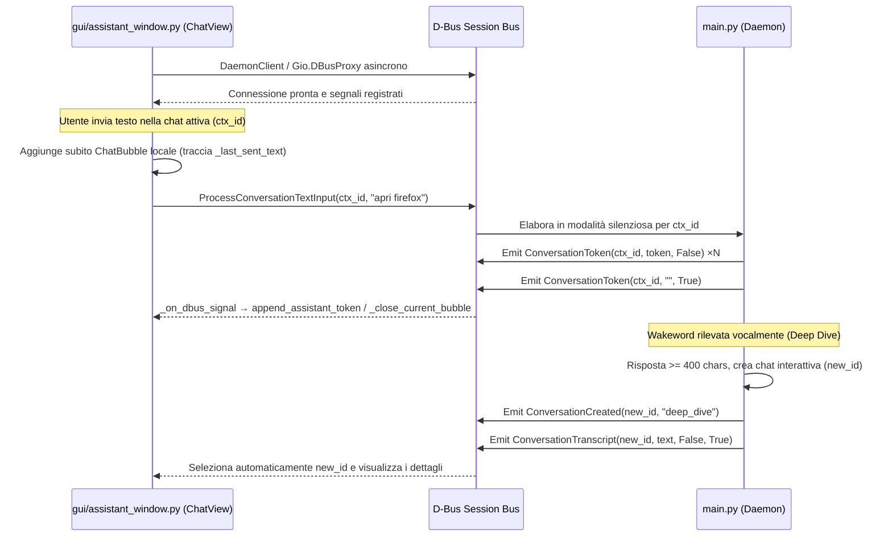

# Architettura del Sistema

> Documento di riferimento per sviluppatori e AI agent che operano sulla codebase.

## Panoramica

Voice Assistant è un'estensione GNOME Shell che implementa un assistente vocale **completamente locale** (nessun dato lascia la macchina). L'architettura è a **tre livelli** con comunicazione bidirezionale su D-Bus.



> [!IMPORTANT]
> `prefs.js` **non costruisce più alcuna UI**: è ridotto a uno stub che lancia `gui/start.sh --open-settings` come sottoprocesso e chiude subito la finestra prefs nativa vuota (vedi sezione 4). Il file `data/ui/prefs.blp`/`prefs.ui`, pur ancora compilato da Blueprint, viene caricato solo da `src/gui/settings_window.py` (Python/GTK4) tramite `Gtk.Builder`, non da GJS.

---

## 1. Il Demone Python (`src/daemon/`)

### Struttura attuale del demone

Il processo viene avviato da `start.sh` tramite systemd e si registra sul Session Bus D-Bus come **`org.local.VoiceAssistant`**. La parte operativa del demone è stata separata in componenti dedicati per ridurre la complessità del punto di ingresso.

| Componente | Ruolo |
|---|---|
| `main.py` | Entry point del daemon; avvia il bootstrap e lascia la logica operativa ai moduli `core/` |
| `core/power.py` | Gestisce la sospensione del sistema e gli inhibitor logind/GNOME durante i download e lo stato attivo |
| `core/audio_runtime.py` | Verifica e inizializza l’AEC PipeWire, il dispositivo audio e la stream di input |
| `core/lifecycle.py` | Concentra gestione dello stato, notifiche e emissione dei segnali D-Bus |
| `core/model_manager.py` | Registra modelli in-process, applica la policy idle e coordina il reclaim RAM/VRAM, calcola le metriche RSS/VRAM esposte da `GetResourceMetrics` |
| `core/model_registry.py` | Cataloga i modelli installati/disponibili su disco per provider, usato da `GetInstalledModels`/`GetAvailableModels` |
| `core/provider_manager.py` | Gestisce caricamento provider, download e cleanup dei modelli |
| `core/service_bootstrap.py` | Pubblica l’oggetto D-Bus e avvia il loop di eventi |
| `core/runtime_manager.py` | Inizializza settings, wakeword, servizi, pipeline e avvia i thread background |
| `core/assistant_runtime.py` | Gestisce wakeword, audio loop, trigger assistant e processing del testo |
| `core/daemon_protocol.py` | `typing.Protocol` `DaemonOwner`: contratto tipizzato tra `VoiceAssistant` e i suoi controller |
| `core/async_bridge.py` | Background event loop persistente; `run_async(coro)` per bridging async→sync senza `asyncio.run()` |
| `core/pipeline.py` | `PipelineController` — orchestrazione **attualmente attiva** Fast-Path → Medium-Path → Smart-Path → LLM streaming (vedi [pipeline.md](pipeline.md)) |
| `core/streaming_pipeline.py` + `core/pipeline_integration.py` | Motore a 5 thread concorrenti alternativo (`StreamingPipelineEngine`/`StreamingPipelineController`) — **non collegato al daemon in esecuzione** (nessun import da `main.py`/`runtime_manager.py`), esiste solo testato in isolamento (vedi [streaming-pipeline-guide.md](streaming-pipeline-guide.md)) |
| `core/smart_path_controller.py` | `SmartPathController` — memoria conversazionale + RAG + tool calling, richiamato da `pipeline.py` quando Fast/Medium-Path non risolvono l'input |
| `core/cloud_config.py` | Lettura configurazione/credenziali per provider cloud (LLM/STT/TTS) |
| `core/bug_reporter.py` | Invio automatico dei report di errore verso l'endpoint Bugzilla configurato |
| `core/data_loader.py`, `core/locale_utils.py` | Caricamento dati statici (cataloghi, pattern NLU, risposte localizzate) e utility di localizzazione |
| `core/logger.py` | Logging strutturato, `ErrorCollector`, `EnvironmentSnapshot`, `DiagnosticBundler` (vedi [logging_design.md](logging_design.md)) |
| `core/performance_metrics.py` | Tracciamento latenze delle operazioni (STT, LLM, TTS, wakeword) con soglie e report p95 (vedi [performance-metrics-guide.md](performance-metrics-guide.md)) |
| `core/speaker_runtime.py` | `SpeakerIdController` — coordina backend Resemblyzer, profili vocali, identificatore asincrono, sessioni e registrazione per Speaker ID |
| `services/speaker_id/` | Pacchetto specializzato per Speaker ID: `backend.py`, `resemblyzer_backend.py`, `profiles.py`, `policy.py`, `identifier.py`, `session.py`, `enrollment.py` |
| `services/conversation_contexts.py` | `ConversationContextManager` — gestione sessioni multi-chat persistenti su disco (JSON), isolamento tra chat vocale (`voice`) e chat interattive, deep dive seeding e transazioni atomiche |
| `VoiceAssistant` (classe) | Oggetto D-Bus principale; coordina i componenti e espone i metodi e i segnali |

> [!NOTE]
> Questa tabella non è più esaustiva rispetto ai ~25 moduli in `src/daemon/core/` — per l'elenco completo eseguire `ls src/daemon/core/*.py`.

### Entry Point — `main.py`

Il punto di ingresso è oggi molto più leggero: crea l’istanza della classe principale, inizializza il runtime e registra il servizio sul bus tramite `service_bootstrap.py`.

| Componente | Ruolo |
|---|---|
| `audio_callback()` | Callback `sounddevice` che inserisce i chunk PCM in una `queue.Queue` thread-safe |
| `_audio_loop()` | Thread daemon che consuma la coda e distribuisce i chunk al Wake Word engine o al provider STT |
| `PowerInhibitor` | Doppio lock (logind FD + GNOME SessionManager cookie) durante il download dei modelli |

### State Machine



**Regole di transizione:**
- **disabled → idle**: `ToggleListening()` o GSettings `enabled=true`
- **idle → listening**: wakeword rilevata (Vosk small-it, sempre attivo)
- **listening → processing → idle**: testo riconosciuto dal provider STT selezionato
- Qualsiasi stato → **downloading**: se il provider richiede il download di un modello

### Segnali D-Bus

| Segnale | Firma | Emesso quando |
|---|---|---|
| `StateChanged(s)` | `new_state: string` | Ogni transizione di stato |
| `DownloadProgress(s, s, i)` | `provider: string, model: string, percent: int` | Durante il download di un modello (granularità 1%) |
| `TranscriptReceived(s, b)` | `text: string, is_final: bool` | STT produce testo parziale (`is_final=False`) o finale (`True`) (broadcast) |
| `ResponseTokenStreamed(s, b)` | `token: string, is_complete: bool` | LLM emette un token (`is_complete=False`) o segnala fine stream (`True`) (broadcast) |
| `ConversationTranscript(s, s, b, b)` | `conversation_id: string, text: string, is_user: bool, is_final: bool` | Trascrizione instradata a uno specifico contesto di conversazione |
| `ConversationToken(s, s, b)` | `conversation_id: string, token: string, is_complete: bool` | Token LLM instradato a uno specifico contesto di conversazione |
| `ConversationCreated(s, s)` | `conversation_id: string, trigger: string` | Creazione di una nuova conversazione (es. manuale o `deep_dive`) |
| `SpeakerRejected(s, s)` | `reason: string, details: string` | Richiesta vocale respinta dalla policy Speaker ID in modalità `gate` |
| `DependencyRequired(s, s, b)` | `package: string, description: string, is_critical: bool` | Il daemon rileva una dipendenza di sistema mancante |

### Metodi D-Bus

Tabella non esaustiva (esempi principali) — per l'elenco completo e le firme esatte vedi [`docs/dbus.md`](dbus.md), che riporta l'XML di introspezione confrontato riga per riga con `main.py`.

| Metodo | Firma | Descrizione |
|---|---|---|
| `ToggleListening() → b` | Ritorna `bool` | Alterna tra `disabled` e `idle` |
| `ToggleListeningInContext(s) → b` | `context_id: string` | Alterna l'ascolto legando l'input vocale al contesto specificato |
| `TriggerListeningInContext(s) → b` | `context_id: string` | Forza l'ascolto legando l'input vocale al contesto specificato |
| `GetAvailableModels(s) → s` | `provider: string` | Restituisce il JSON dei modelli installati e disponibili (anche scaricabili) |
| `GetInstalledModels(s) → s` | `provider: string` | Restituisce solo i modelli già presenti su disco |
| `GetDownloadingModels() → s` | N/A | Restituisce il JSON dei download in corso |
| `GetResourceMetrics() → s` | N/A | Restituisce JSON con RSS, VRAM e stato modelli in-process |
| `DownloadModel(s, s) → b` | `provider: string, model: string` | Avvia il download in background di un modello |
| `CancelDownload(s, s) → b` | `provider: string, model: string` | Annulla un download in corso e pulisce i file parziali |
| `ShowWindow()` | N/A | Avvia la GUI standalone (subprocess `gui/start.sh`) |
| `ProcessTextInput(s)` | `text: string` | Elabora testo dalla GUI in modalità silenziosa (senza TTS) |
| `ProcessConversationTextInput(s, s)` | `conversation_id: string, text: string` | Elabora testo specificando il `conversation_id` della sessione chat attiva |
| `GetConversations() → s` | N/A | Restituisce JSON con la lista delle conversazioni salvate |
| `GetConversation(s) → s` | `conversation_id: string` | Restituisce JSON con i messaggi della conversazione |
| `CreateConversation(s) → s` | `title: string` | Crea una nuova sessione chat e ne restituisce l'UUID |
| `DeleteConversation(s) → b` | `conversation_id: string` | Elimina la sessione di chat specificata |
| `ClearConversations() → b` | N/A | Rimuove tutte le conversazioni utente |

### Wake Word Engine

Il motore Wake Word è **configurabile indipendentemente dal provider STT** usato per la trascrizione completa, tramite la chiave GSettings `wakeword-engine` (`data/schemas/org.gnome.shell.extensions.voice-assistant.gschema.xml`): `'vosk'` (default, modello `vosk-model-small-it-0.22`), `'openwakeword'` o `'sherpa-onnx'`. La selezione e il caricamento del motore attivo sono gestiti in `core/assistant_runtime.py` e `core/runtime_manager.py`, che diramano la logica in base a `self.owner.wakeword_engine`.

Il runtime del wakeword e dell’interazione vocale è oggi gestito da `core/assistant_runtime.py`, che raccoglie l’event loop audio, il trigger dell’assistente e la logica di riconoscimento del comando.

Quando la wakeword (configurabile via GSettings, default: `"assistente"`) viene rilevata nel testo parziale o finale del motore attivo, il daemon transisce nello stato `listening` e delega il riconoscimento completo al provider STT configurato dall'utente.

### Sistema di Pulizia Audio a Runtime & AEC (`AudioFilter` + PipeWire)

L’operazione di setup audio è allocata in `core/audio_runtime.py`, mentre la parte applicativa del filtraggio del segnale resta in `audio/filter.py`. Questo separa il bootstrap del sistema audio dal processamento del flusso PCM.

Per garantire la massima accuratezza di riconoscimento durante la riproduzione audio e in ambienti rumorosi, il sistema applica un'elaborazione audio a due livelli:

1. **Livello Sistema — PipeWire WebRTC AEC (`module-echo-cancel`)**:
   All'avvio, il demone verifica ed attiva il modulo nativo PipeWire `module-echo-cancel` con algoritmo `aec_method=webrtc` ed imposta la sorgente predefinita a `echo-cancel-source`. Se la scheda audio o il driver PortAudio richiedono un sample rate nativo (es. 48kHz), `_create_stream()` effettua un fallback trasparente sul dispositivo predefinito mantenendo la pulizia a runtime.
2. **Livello Applicativo — Dynamic Audio Filter (`src/daemon/audio/filter.py`)**:
   I chunk PCM grezzi passano attraverso la classe `AudioFilter`:
   - **Filtro Passo-Alto IIR (Biquad, taglio predefinito 80Hz)**: Rimuove vibrazioni meccaniche, rumble e il fruscio continuo delle ventole del laptop.
   - **AGC (Automatic Gain Control)**: Normalizza il volume del parlato verso un livello RMS obiettivo, compensando microfoni con guadagno di sistema troppo basso o troppo alto.
   - **Adaptive Noise Gate**: Calcola il rumore di fondo della stanza ed attenua i segnali al di sotto della soglia per prevenire l'invio di rumore ambientale a Vosk/Whisper.

**Configurabilità**: ognuno dei tre stadi applicativi e la stessa AEC di sistema sono attivabili e regolabili dall'utente dalla sottopagina delle preferenze **Generali → Filtri Audio**, tramite le chiavi `audio-*` documentate in [gsettings.md](gsettings.md#filtri-audio-del-microfono). `core/audio_runtime.py` espone `build_filter_config()` e `apply_filter_settings()` che traducono le chiavi GSettings nella configurazione di `AudioFilter`; le modifiche ai parametri applicativi vengono applicate **a caldo** su `AudioFilter.update_config()` senza ricreare l'oggetto, così lo stato del filtro IIR e il tracking del rumore di fondo non vengono azzerati. Se tutti e tre gli stadi applicativi sono disattivati, `process()` restituisce il PCM invariato senza costi di elaborazione.

### Gestione Settings Live

Il daemon sottoscrive individualmente le chiavi GSettings in `core/runtime_manager.py` (circa 28 `self.owner.settings.connect("changed::<key>", ...)`, non più inline su `VoiceAssistant`), incluse `wakeword`, `wakeword-engine`, `oww-model`, `vosk-ww-model`, `sherpa-model`, `sherpa-ww-model-dir`, `stt-provider`, `stt-model`, `stt-hardware`, `stt-extra`, `enabled`, `models-dir`, `language`, `idle-unload-timeout` (e i suoi override per servizio), `mcp-registry-url`, `mcp-enabled`, `tts-voice`, `tts-provider`, `tts-engine`, `tts-speed`, `llm-mode`, `llm-model`, `llm-endpoint`, `llm-api-key`, `llm-system-prompt`, `llm-temperature`, tra le altre.

La wakeword viene aggiornata istantaneamente. Le chiavi che richiedono il ricaricamento di un provider triggerano un **reload debounced** a 500 ms tramite `_schedule_reload()` + `threading.Timer`, per evitare ricaricamenti multipli quando l'utente cambia opzioni in rapida sequenza. Ogni `load_provider()` opera in un thread dedicato con un `load_id` incrementale per isolare le concorrenze.

### Lifecycle dei modelli e reclaim memoria

`VoiceAssistant` crea un solo `ModelManager` e lo passa ai servizi che possiedono risorse in-process. Il manager registra il provider STT selezionato, il runner GGUF locale e la voce Piper solo quando sono effettivamente caricati. A ogni stato attivo (`listening`, `processing`, `speaking`) il timer di inattività viene aggiornato.

Un timer GLib esegue il controllo ogni 30 secondi. Dopo 300 secondi senza attività, il manager richiama le callback di unload dei proprietari, esegue la garbage collection, svuota le cache CUDA/XPU se disponibili e tenta `malloc_trim(0)` su Linux. I file dei modelli restano su disco: vengono liberati soltanto gli handle in RAM/VRAM.

- **STT**: il riferimento del daemon viene rilasciato e il provider viene ricaricato in background alla richiesta di ascolto successiva.
- **LLM GGUF locale**: vengono azzerati l'handle `llama.cpp` e il path attivo; il caricamento successivo resta lazy.
- **Piper TTS**: vengono azzerati la voce ONNX e il relativo nome; la voce viene caricata al prossimo `speak()`.
- **Wakeword Vosk**: resta residente per mantenere l'ascolto continuo.
- **EmbeddingService**: usa vettori sparsi in memoria, non un modello neurale, e non richiede questa policy.

---

## 2. La GUI Standalone (`src/gui/`)

La finestra di chat è un'applicazione GTK4/Libadwaita **separata dal daemon**, avviata on-demand tramite il metodo D-Bus `ShowWindow()`. Gira come processo indipendente e non condivide memoria con il daemon.

| File / Modulo | Ruolo |
|---|---|
| `gui/main.py` | Entry point: crea `Adw.Application(application_id="org.local.VoiceAssistant.GUI")`. GApplication gestisce il single-instancing: una seconda invocazione porta in primo piano la finestra già aperta. |
| `gui/assistant_window.py` | `Adw.ApplicationWindow` con chat a bolle, integrazione `ChatView`, entry di input e controlli microfono. |
| `gui/settings_window.py` | `Adw.PreferencesDialog` che assembla le pagine di preferenze modulari per la configurazione dell'assistente (presentato come sheet o standalone). |
| `gui/components/resources.py` | `ResourceManager` per il caricamento centralizzato delle risorse GResource con fallback automatico locale. |
| `gui/components/daemon_client.py` | Client D-Bus asincrono dedicato (`DaemonClient`) per gestire proxy, segnali RPC e comandi verso `org.local.VoiceAssistant`. |
| `gui/components/chat/` | Componenti atomici della chat: `ChatBubble` (stili utente/assistente, avatar, azioni) e `ChatView` (cronologia, empty-state, autoscroll e token streaming). |
| `gui/components/settings/` | Pagine di preferenza modulari per General, WakeWord, STT, LLM, TTS, MCP, Modelli, BugReport e About con pattern grafico dual-mode Locale/Cloud. Ogni pagina eredita da `settings/base.py::BaseSettingsPage`. `settings/model_selector.py` (~1500 righe, il modulo GUI più grande del progetto) implementa il selettore/importer di modelli condiviso da più schede — non è una pagina a sé ma un componente riusato da esse. |
| `gui/dependency_installer.py` | Dialogo e wizard di installazione guidata per dipendenze di sistema/pip mancanti. |
| `gui/start.sh` | Avvia la GUI riutilizzando il venv del daemon (`daemon/venv/bin/python3`), senza necessità di un venv separato. |

### Flusso D-Bus dalla GUI e Gestione Multi-Chat

La GUI supporta la navigazione e creazione di chat multiple isolate gestite via D-Bus dal `ConversationContextManager` del daemon:
- **Isolamento della sessione vocale**: la sessione `voice` è separata dai contesti chat della GUI (`_current_context_id` non punta mai a `"voice"`). Le interazioni vocali ordinarie non inquinano la chat interattiva.
- **Deep Dive**: se una richiesta vocale genera un deep dive, il daemon crea una nuova sessione chat, emette `ConversationCreated(chat_id, "deep_dive")` e apre la GUI focalizzata su quel contesto (anche tramite `--open-conversation <id>`).
- **Routing dei messaggi e token**: la GUI sottoscrive `ConversationTranscript` e `ConversationToken`. Se il `conversation_id` del segnale corrisponde a `_current_context_id`, i token e le trascrizioni vengono renderizzati nella vista chat attiva; in caso contrario, vengono memorizzati sul daemon per la visualizzazione al momento del cambio di chat.



La GUI distingue **fast-path** da **LLM streaming** tramite il flag `_streaming_active`: se `is_complete=True` arriva senza token precedenti, è una risposta completa immediata; altrimenti è la fine di uno stream progressivo. La deduplicazione previene che il messaggio digitato dall'utente compaia due volte all'arrivo dell'eco D-Bus broadcast.

---

## 3. L'Estensione GNOME Shell (`src/extension.js`)

### Ciclo di Vita

```mermaid
flowchart TD
    subgraph enable ["enable()"]
        A0["1. Registra GResource<br/>(Icone SVG, D-Bus XML, UI prefs compilata, Servizi)"] --> A0b["2. Tentativo registrazione icon theme<br/>(usa Gdk/Gtk, MAI importati in extension.js:<br/>try/catch inghiotte sempre un ReferenceError)"]
        A0b --> A1["3. getSettings() + _connectToDaemon()<br/>(Gio.bus_watch_name + proxy D-Bus)"]
        A1 --> A2["4. _syncIndicators()<br/>crea VoiceAssistantSystemIndicator<br/>(QuickSettings.SystemIndicator + QuickToggle)"]
        A2 --> A2b["5. Sottoscrive changed::enabled su GSettings"]
        A2b --> A3["6. Registra Keybinding Nativa<br/>(toggle-shortcut -> Super+V via Main.wm.addKeybinding)"]
        A3 --> A4["7. setupDaemonServices()<br/>(Inietta unit Systemd & D-Bus da GResource,<br/>termina con systemctl daemon-reload + enable --now)"]
    end

    subgraph disable ["disable()"]
        B1["1. Rimuovi Keybinding Nativa"] --> B2["2. Distruggi Indicatore QuickSettings"]
        B2 --> B2b["3. Gio.bus_unwatch_name() e disconnessione<br/>proxy D-Bus + segnale GSettings"]
        B2b --> B3["4. Deregistra GResource"]
    end
```



> [!NOTE]
> Il passo 2 (registrazione icon theme) referenzia `Gdk`/`Gtk`, mai importati in `extension.js` (solo `GObject, Gio, GLib, St, Clutter, Meta, Shell`): solleva sempre un `ReferenceError` catturato silenziosamente dal proprio `try/catch` — è un blocco di codice morto, non un passo funzionante.

### Integrazione Quick Settings

L'estensione estende `QuickSettings.SystemIndicator` e si registra nel pannello di sistema tramite `Main.panel.statusArea.quickSettings.addExternalIndicator(this._quickIndicator)`.
- **Icona di Stato**: Inserita nell'area di stato di sistema nella barra superiore (accanto a Volume/Batteria/Rete). Il click sul gruppo apre il menu Quick Settings di GNOME.
- **Quick Toggle**: Interruttore dedicato (`VoiceAssistantQuickToggle`) presente all'interno del menu dei Quick Settings per attivare/disattivare l'ascolto e accedere direttamente al pannello preferenze.

### D-Bus Proxy

L'estensione legge la definizione XML D-Bus da GResource (`/org/gnome/shell/extensions/voice-assistant/dbus/org.local.VoiceAssistant.xml`) tramite `Gio.resources_lookup_data()` e crea il proxy wrapper con `Gio.DBusProxy.makeProxyWrapper()`.

### Feedback Visivo

Gli stili grafici e i colori dell'indicatore sono gestiti in modo dinamico sia sull'icona di sistema che sul toggle nei Quick Settings:

| Stato | Icona | Colore / Stile CSS | OSD |
|---|---|---|---|
| `idle` | `vocal-assistant-symbolic` | Default | No |
| `listening` | `vocal-assistant-symbolic` | `#3584e4` (blu GNOME) | "In ascolto..." |
| `processing` | `vocal-assistant-symbolic` | `#e5a50a` (giallo GNOME) | No |
| `speaking` | `vocal-assistant-symbolic` | `#2ec27e` (verde GNOME) | No |
| `downloading` | `folder-download-symbolic` | `#e5a50a` (giallo GNOME) | No |
| `disabled` | Icona nascosta | - | No |
| `unavailable` | `vocal-assistant-symbolic` | `#e01b24` (rosso GNOME) | No |

> [!NOTE]
> `data/icons/.../brain-augmented-symbolic.svg` esiste come asset ma non è referenziato da nessuna parte in `extension.js`: tutti gli stati usano `vocal-assistant-symbolic`, distinto solo dal colore. È un'icona orfana, non un'icona dedicata allo stato `processing` come indicava una versione precedente di questa tabella.

### OSD Nativo

L'OSD visivo ("In ascolto...") supporta sia GNOME 45-48 (`show(-1, ...)`) che GNOME 49+ (`showAll(...)`).

### Scorciatoia da Tastiera Nativa

L'estensione registra la scorciatoia da tastiera globale configurabile tramite la chiave GSettings `toggle-shortcut` (default: `<Super>v`) mediante la funzione nativa di GNOME Shell `Main.wm.addKeybinding()`.

---

## 4. Le Preferenze (`src/prefs.js`, `data/ui/prefs/` & `data/ui/prefs.blp`)

> [!IMPORTANT]
> `src/prefs.js` **non è più l'interfaccia preferenze**: è un file di ~46 righe che, in `fillPreferencesWindow(window)`, lancia `gui/start.sh --open-settings` come sottoprocesso (`Gio.Subprocess.new(...)`) e chiude subito la finestra prefs nativa vuota (`GLib.idle_add(() => window.close())`), delegando interamente all'app Python (`src/gui/settings_window.py`). Non esegue binding GSettings né costruisce widget. Il Blueprint/GtkBuilder descritto sotto è comunque reale e attivo, ma consumato **solo** dal processo Python via `Gtk.Builder`, non da GJS.

L'interfaccia delle preferenze utilizza un'architettura **dichiarativa modulare**, caricata ed eseguita interamente dal processo GUI Python:

- **Definizione Strutturale Modulare (`data/ui/prefs/`)**: Scritta in sintassi **Blueprint** suddivisa in 5 schede principali (`page_general.blp`, `page_wakeword.blp`, `page_stt.blp`, `page_llm.blp`, `page_tts.blp`) e 4 moduli sottopagine (`subpage_models.blp`, `subpage_bugreport.blp`, `subpage_mcp.blp`, `subpages.blp`).
- **Assemblaggio Automatico (`scripts/assemble_blueprints.py`)**: Script di build che unisce dinamicamente i 5 moduli pagina e le 4 sottopagine nell'albero di `window.blp` generando `data/ui/prefs.blp`.
- **Compilazione GTK Builder (`prefs.ui`)**: Compilato tramite `blueprint-compiler` ed incluso nel bundle binario `.gresource`. Il file `data/ui/prefs.ui` è tracciato in git per garantire la compilazione anche in ambienti privi del compilatore blueprint.
- **Logica e Binding (`src/gui/settings_window.py`)**: Carica `data/ui/prefs.ui` tramite `Gtk.Builder` (con fallback su file locale via `ResourceManager`, vedi sezione 2), gestisce i collegamenti D-Bus, le reazioni agli eventi ed i binding reattivi con **GSettings** — assemblando le pagine modulari `gui/components/settings/*.py` (`GeneralSettings`, `WakeWordSettings`, `STTSettings`, `LLMSettings`, `TTSSettings`, `MCPSettings`, `ModelSelectorController`, `ModelsStorageManager`, `BugReportSettings`, `AboutSettings`).

Applicazione Libadwaita strutturata con **`Adw.PreferencesDialog`** e 5 schede principali:
- ⚙️ **Generali**: Attivazione assistente (`SwitchRow`), lingua (`LanguageSelector`), e gruppo **Sistema & Manutenzione** con accesso alle sottopagine **Storage e Modelli** e **Bug Reporting**.
- 🗣️ **Wake Word**: Motore wake word (Vosk / Sherpa-ONNX / OpenWakeWord), keyword personalizzata, sensibilità e selezione modelli (con aggiornamento online catalogo Sherpa-ONNX da GitHub Releases).
- 🎙️ **Speech-To-Text (STT)**: Pattern dual-mode ("Locale" e "Cloud") con selezione provider (Vosk / Whisper), accelerazione hardware e supporto per endpoint cloud.
- 🧠 **Large Language Model (LLM)**: Pattern dual-mode ("Locale" GGUF/llama.cpp e Ollama locale vs "Cloud" API OpenAI, Anthropic, DeepSeek, Ollama Cloud) e accesso alla sottopagina **Strumenti (MCP)**. L'importazione diretta da Hugging Face è integrata nel selettore modelli per motori locali.
- 🔊 **Text-To-Speech (TTS)**: Pattern dual-mode ("Locale" Piper neurale offline con voci ONNX vs "Cloud" TTS online), velocità e pitch.

Sottopagine dedicate navigate con animazione nativa (`push_subpage()` / `pop_subpage()`):
- 📁 **Storage e Modelli (`models_subpage`)**: Indicatore spazio disco totale occupato, directory modelli, apertura file manager, pulsante rimozione modelli non usati ed elenco dei soli modelli installati per Wake Word, STT, LLM e TTS.
- 🐛 **Bug Reporting (`bugreport_subpage`)**: Configurazione automatica crash reporting Bugzilla e test di connessione.
- 🔌 **Tools (MCP) (`mcp_subpage`)**: Configurazione e gestione server Model Context Protocol.
- 🔍 **Selettore Modelli e Lingua (`model_selector_page`, `lang_nav_page`)**: Ricerca, download progressivo asincrono, rimozione modelli e import Hugging Face condizionale.

---

## 5. Provider STT

### Interfaccia Base (`providers/base.py`)

```python
class STTProvider(abc.ABC):
    def __init__(self, model: str, hardware: str, extra: dict): ...
    def process_chunk(self, data: bytes) -> tuple[str, str]: ...
    def flush_and_transcribe(self) -> str: ...
    def reset(self): ...
    @classmethod
    def get_available_models(cls) -> list[dict]: ...
    @classmethod
    def get_default_model(cls, lang: str = None, **kwargs) -> str: ...
```

| Metodo | Descrizione |
|---|---|
| `process_chunk(data)` | Processa un chunk PCM int16. Ritorna `(text, partial_text)`. `text` non vuoto = frase completata |
| `flush_and_transcribe()` | Forza la trascrizione del buffer accumulato (usato per Whisper batch) |
| `reset()` | Resetta lo stato interno del riconoscitore |
| `get_available_models()` | Ritorna la lista dei modelli disponibili per questo provider |
| `get_default_model(lang)` | Ritorna il modello predefinito, opzionalmente per lingua |

### Factory (`providers/__init__.py`)

```python
get_provider(provider_name, model, hardware, extra,
             progress_callback=None, models_dir=None,
             download_only=False) -> STTProvider
```

### VoskProvider (`providers/vosk_provider.py`)

- **Streaming reale**: `KaldiRecognizer.AcceptWaveform()` processa ogni chunk e ritorna testo finale/parziale
- **Download automatico**: se il modello non è presente, lo scarica da `alphacephei.com` con resume su interruzione (fino a 10 retry)
- **Migrazione**: supporta la vecchia posizione `~/.cache/vosk/`
- **Risoluzione nomi modello**: non tramite un dizionario statico di alias, ma verificando il prefisso `vosk-model-`/`vosk-`, poi l'appartenenza a `get_available_models()` (catalogo centralizzato in `services/catalog_manager.py`), infine fallback su `get_default_model(lang)`

### WhisperProvider (`providers/whisper_provider.py`)

- **Batch processing**: accumula l'audio in un `bytearray` e trascrive solo quando `flush_and_transcribe()` viene chiamato
- **Backend**: `faster-whisper` (CTranslate2) con supporto CPU (`int8`) e CUDA (`float16`)
- **Download tracking**: monkey-patch in-process di `tqdm`/`huggingface_hub`/`faster_whisper` per intercettare l'avanzamento per thread, non un monitoraggio della dimensione dei file su disco
- **Voice activity detection**: Silero VAD ONNX (soglia probabilità 0.3) come meccanismo primario, con fallback su soglia RMS 250 se il modello Silero non è disponibile; l'accumulo si interrompe dopo ~1s di testo parziale stabile (non un timer fisso di 2s)

### OpenAICloudSTTProvider (`providers/openai_cloud_provider.py`)

- Provider STT cloud selezionabile con `stt-provider` = `openai_cloud`, `groq_cloud` o `cloud_stt`; invia l'audio via HTTP multipart a un endpoint compatibile OpenAI/Groq
- Vedi [`docs/providers.md`](providers.md) per il dettaglio completo di tutti e tre i provider STT

---

## 6. Servizi Systemd e D-Bus

### Template di Servizio (`data/services/`)

I file di configurazione sono memorizzati come template in GResource:
- `data/services/voice-assistant.service.in`
- `data/services/org.local.VoiceAssistant.service.in`

### Systemd Service (`~/.config/systemd/user/voice-assistant.service`)

```ini
[Unit]
Description=Local Voice Assistant Daemon
After=graphical-session.target

[Service]
Type=dbus
BusName=org.local.VoiceAssistant
ExecStart=<extension_dir>/daemon/start.sh
Restart=on-failure
```

### D-Bus Service (`~/.local/share/dbus-1/services/org.local.VoiceAssistant.service`)

```ini
[D-BUS Service]
Name=org.local.VoiceAssistant
Exec=<extension_dir>/daemon/start.sh
SystemdService=voice-assistant.service
```

Il `Type=dbus` garantisce che systemd consideri il servizio "avviato" solo quando il nome D-Bus viene acquisito. La combinazione con il `.service` D-Bus abilita l'**attivazione automatica**: qualsiasi chiamata al bus name avvia il demone se non è in esecuzione.

### Script di Avvio (`start.sh`)

1. Crea un virtualenv con `--system-site-packages` (per accedere a PyGObject di sistema)
2. Controlla i moduli richiesti usando `$DIR/venv/bin/python3` esplicito — non dipende dal `python3` nel PATH dopo `activate`, che su alcune distribuzioni punta ancora al Python di sistema
3. Se mancano moduli, installa le dipendenze da `requirements.txt` con `--prefer-binary` (evita compilazione C/C++ di `llama-cpp-python` e `piper-tts`) e `--extra-index-url` per wheel GGUF pre-compilate
4. Crea `venv/bin/VoiceAssistant` come copia reale del binario Python (`readlink -f` + `cp`) per far apparire il nome corretto nelle impostazioni audio di GNOME (Pipewire/ALSA usano il nome dell'eseguibile)
5. `exec` del processo `VoiceAssistant` per rimpiazzare lo script bash

---

## 7. Storage dei Modelli

Tutti i modelli risiedono in `~/.local/share/voice-assistant/models/` (o percorso configurato in `models-dir`):

```
~/.local/share/voice-assistant/models/
├── vosk-model-small-it-0.22/
├── vosk-model-it-0.22/
├── whisper-base/
├── whisper-small/
└── ...
```

Ogni modello ha una cartella dedicata con nome leggibile. La UI delle preferenze ed il daemon scansionano dinamicamente questa directory per elencare i modelli installati ed utilizzabili.

---

## 8. Build System e Packaging (Meson & Blueprint)

Il progetto usa Meson + Ninja integrato con `blueprint-compiler`.

### Target principali

| Target | Output |
|---|---|
| `compile-prefs-blueprint` | Compila `data/ui/prefs.blp` → `build/data/prefs.ui` tramite `blueprint-compiler` |
| `compile-assistant-blueprint` | Compila `data/ui/assistant_window.blp` → `build/data/assistant_window.ui` tramite `blueprint-compiler` |
| `voice-assistant-gresource` | Compila `org.gnome.shell.extensions.voice-assistant.gresource` includendo icone, D-Bus XML, servizi e i file `.ui` compilati |
| `zip` (`meson compile zip`) | Genera il pacchetto installabile `.shell-extension.zip` pulito (escludendo `venv` e `__pycache__`) |
| Post-install | Compila gli schemi GSettings nella directory di installazione dell'estensione |

### Directory di installazione

```
~/.local/share/gnome-shell/extensions/voice-assistant@scroker.github.io/
├── metadata.json
├── extension.js
├── prefs.js
├── stylesheet.css
├── org.gnome.shell.extensions.voice-assistant.gresource
├── schemas/
│   ├── org.gnome.shell.extensions.voice-assistant.gschema.xml
│   └── gschemas.compiled
├── dbus/
│   └── org.local.VoiceAssistant.xml
├── services/
│   ├── voice-assistant.service.in
│   └── org.local.VoiceAssistant.service.in
├── mcp/                       ← configurazione/schemi MCP di default
├── dependencies/               ← mappature dipendenze sistema/pip
├── prompts/                    ← template system prompt
├── locales/                    ← formati data/ora, risposte localizzate
├── llm/                        ← template provider LLM
├── nlu/                        ← pattern regex per Fast-Path
├── catalog/                    ← cataloghi modelli STT e voci TTS
├── config/                     ← defaults.json
├── daemon/
│   ├── main.py
│   ├── start.sh
│   ├── requirements.txt
│   ├── core/
│   │   ├── daemon_protocol.py   ← typing.Protocol DaemonOwner
│   │   ├── async_bridge.py      ← background event loop per MCP coroutine
│   │   └── ...
│   └── providers/
│       ├── __init__.py
│       ├── base.py
│       ├── vosk_provider.py
│       ├── whisper_provider.py
│       └── openai_cloud_provider.py  ← STT cloud (openai_cloud/groq_cloud/cloud_stt)
└── gui/
    ├── main.py                  ← Adw.Application entry point
    ├── assistant_window.py      ← Adw.ApplicationWindow (chat a bolle con ChatView)
    ├── settings_window.py       ← Adw.PreferencesDialog standalone/sheet
    ├── dependency_installer.py  ← Dialogo installazione guidata dipendenze
    ├── start.sh                 ← avvia la GUI riutilizzando daemon/venv
    └── components/              ← Componenti modulari riutilizzabili
        ├── resources.py         ← ResourceManager con fallback locale
        ├── daemon_client.py     ← Client D-Bus asincrono tipizzato
        ├── chat/                ← ChatBubble, ChatView
        └── settings/            ← Pagine impostazioni autonome (STT, LLM, TTS...)
```

---

## 9. Model Context Protocol (MCP) & Tool Nativi

> [!IMPORTANT]
> Questa sezione descriveva in precedenza 8 tool nativi Python (`system_volume.py`, `dark_mode.py`, `app_launcher.py`, `date_time.py`, `system_media.py`, `screen_brightness.py`, `system_power.py`, `clipboard.py`). Quei file **sono stati rimossi** da `src/daemon/mcp/tools/` (oggi contiene solo `base.py` con la classe `NativeTool`, non più usata da nessun tool concreto). Il controllo del desktop GNOME è oggi delegato interamente al binario esterno Rust `gnome-mcp-server`.

Il Voice Assistant integra un'architettura **MCP (Model Context Protocol)** gestita da `MCPManager` (`src/daemon/mcp/manager.py`) per estendere le capacità del modello LLM e consentire l'esecuzione di comandi su GNOME Desktop.

### Architettura MCP

1. **`gnome-mcp-server` (10 tool, processo esterno Rust, stdio JSON-RPC 2.0)**:
   - `set_volume`, `quick_settings` (wifi/bluetooth/night-light/dark-style/DND), `launch_application`, `media_control`, `send_notification`, `open_file`, `set_wallpaper`, `take_screenshot`, `window_management`, `keyring_management`.
   - `MCPManager` mantiene un adapter di retrocompatibilità che traduce i nomi legacy (`system_volume` → `set_volume`, `dark_mode` → `quick_settings`, `app_launcher` → `launch_application`, `system_media` → `media_control`) verso i tool ufficiali, per non rompere skill/prompt salvati.
   - Installazione automatica di `cargo` (via PackageKit D-Bus o gestore pacchetti di sistema) e compilazione di `gnome-mcp-server` gestite da `src/daemon/mcp/installer.py`.

2. **Marketplace Smithery & server esterni**:
   - `src/daemon/mcp/registry.py` espone un client verso `https://api.smithery.ai` più una lista `FEATURED_SERVERS` di fallback offline; la configurazione dei server installati vive in `~/.config/voice-assistant/mcp_servers.json`.
   - Backend implementato, ma **senza una UI dedicata nella GUI**: la scheda `gui/components/settings/mcp.py` oggi si limita a due switch GSettings (`mcp-enabled`, `mcp-registry-url`) — vedi [`docs/mcp-marketplace-implementation.md`](mcp-marketplace-implementation.md) per lo stato dettagliato.

3. **Fast/Medium-Path Dispatch**:
   - `FastPathDispatcher` (in `src/daemon/core/pipeline.py`, non un file dedicato) intercetta intenti deterministici via regex + `VectorIntentMatcher` semantico ed esegue i tool MCP direttamente. È tuttavia **disabilitato di default** (`fast_path_enabled=False` in `runtime_manager.py`) — vedi [Guida alla Pipeline](pipeline.md) e [SMART PATH Integration Guide](smart-path-integration.md) per i dettagli e le condizioni reali di attivazione.

4. **Dynamic Prompt & Context Injection**:
   - Inserimento automatico degli schemi JSON dei tool e del timestamp di sistema aggiornato ad ogni richiesta dell'LLM in `LLMServiceManager`.

Per i dettagli completi sul funzionamento dei tool, consultare la [Guida MCP](mcp-guide.md). Per approfondire il funzionamento della pipeline e del dispatch Fast/Smart-Path, consultare la [Guida alla Pipeline](pipeline.md) e la [SMART PATH Integration Guide](smart-path-integration.md).

---

## 10. Riconoscimento del Parlante (`src/daemon/services/speaker_id/`)

Il sistema di riconoscimento del timbro vocale identifica chi sta parlando per personalizzare le risposte (modalità `informative`) o bloccare richieste non autorizzate (modalità `gate`).

### Componenti del Pacchetto `speaker_id`
- **`backend.py`**: Protocollo astratto `SpeakerEmbeddingBackend` (`embed()`, `preprocess()`, `load()`, `unload()`, `is_available`) e factory `create_backend`.
- **`resemblyzer_backend.py`**: Implementazione basata sulla rete neurale d-vector Resemblyzer (GE2E loss, 256 dimensioni). Il caricamento di PyTorch e VoiceEncoder è completamente lazy.
- **`profiles.py`**: `SpeakerProfileStore` con memorizzazione atomica su disco (`.npz` in `~/.local/share/voice-assistant/speaker_profiles/`), locking thread-safe (`threading.RLock`) e calcolo dell'embedding di riferimento combinando al 50% l'ancora iniziale e la media ponderata lineare della cronologia (fino a 19 campioni).
- **`policy.py`**: Funzione pura `SpeakerPolicy.evaluate(...)` che implementa le decisioni per le modalità `disabled`, `informative` e `gate`, escludendo dal blocco i comandi rapidi di stop/barge-in e gli input testuali da GUI.
- **`identifier.py`**: Background worker asincrono `SpeakerIdentifier` su coda limitata (dimensione 4) che processa gli embedding vocali senza bloccare il thread dell'audio loop.
- **`session.py`**: `VoiceSpeakerSession` con ring buffer di pre-roll audio (2.0s) per catturare i primi fonemi della wakeword, e rilevamento sovrapposizione voci tramite finestre scorrevoli.
- **`enrollment.py`**: `EnrollmentRecorder` per la procedura guidata di registrazione vocale da 8.0s (con verifica di almeno 4.0s di parlato utile tramite RMS).
- **`core/speaker_runtime.py`**: `SpeakerIdController` che orchestra il ciclo di vita, i profili, le sessioni e le notifiche D-Bus.
