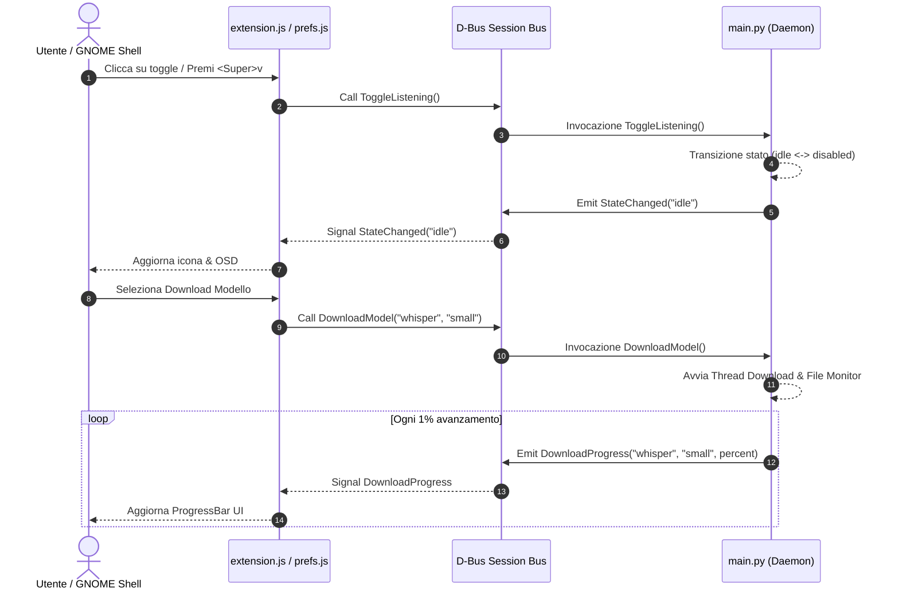

# Interfaccia D-Bus Reference

> Bus: **Session Bus**  
> Service Name: `org.local.VoiceAssistant`  
> Object Path: `/org/local/VoiceAssistant`  
> Interface: `org.local.VoiceAssistant`  
> Introspection File: `data/dbus/org.local.VoiceAssistant.xml`

L'interfaccia D-Bus è il canale di comunicazione primaria per l'orchestrazione dello stato dell'assistente vocale, l'avvio ed annullamento dei download dei modelli STT e il monitoraggio degli eventi in tempo reale tra la GNOME Shell, il pannello delle preferenze ed il daemon Python.



---

## Introspection XML (`data/dbus/org.local.VoiceAssistant.xml`)

```xml
<!DOCTYPE node PUBLIC "-//freedesktop//DTD D-BUS Object Introspection 1.0//EN"
"http://www.freedesktop.org/standards/dbus/1.0/introspect.dtd">
<node>
  <interface name="org.local.VoiceAssistant">
    <method name="ToggleListening">
      <arg type="b" direction="out" name="is_listening"/>
    </method>
    <method name="GetAvailableModels">
      <arg type="s" direction="in" name="provider"/>
      <arg type="s" direction="out" name="models_json"/>
    </method>
    <method name="GetDownloadingModels">
      <arg type="s" direction="out" name="models_json"/>
    </method>
    <method name="GetResourceMetrics">
      <arg type="s" direction="out" name="metrics_json"/>
    </method>
    <method name="DownloadModel">
      <arg type="s" direction="in" name="provider"/>
      <arg type="s" direction="in" name="model"/>
    </method>
    <method name="CancelDownload">
      <arg type="s" direction="in" name="provider"/>
      <arg type="s" direction="in" name="model"/>
    </method>
    <method name="ShowWindow"/>
    <method name="ProcessTextInput">
      <arg type="s" direction="in" name="text"/>
    </method>
    <signal name="StateChanged">
      <arg type="s" name="new_state"/>
    </signal>
    <signal name="DownloadProgress">
      <arg type="s" name="provider"/>
      <arg type="s" name="model"/>
      <arg type="i" name="percent"/>
    </signal>
    <signal name="TranscriptReceived">
      <arg type="s" name="text"/>
      <arg type="b" name="is_final"/>
    </signal>
    <signal name="ResponseTokenStreamed">
      <arg type="s" name="token"/>
      <arg type="b" name="is_complete"/>
    </signal>
  </interface>
</node>
```

---

## Dettaglio Metodi

### `ToggleListening() → boolean`
Alterna lo stato dell'assistente tra `disabled` e `idle`.
- **Ritorno**: `true` se attivo/in ascolto, `false` se disattivato.
- **Side effects**: Avvia o arresta lo stream del microfono ed aggiorna la chiave GSettings `enabled`.

### `GetAvailableModels(provider: string) → string (JSON)`
Ritorna la lista dei modelli supportati ed installati per il provider specificato (`vosk` o `whisper`).
- **Input**: `"vosk"` oppure `"whisper"`.
- **Output JSON**:
  ```json
  [
    {
      "id": "vosk-model-small-it-0.22",
      "name": "Italian Small (0.22)",
      "downloaded": true,
      "size": "48 MB"
    }
  ]
  ```

### `GetDownloadingModels() → string (JSON)`
Ritorna una mappa dei modelli attualmente in fase di scaricamento ed il relativo progresso percentuale.
- **Output JSON**:
  ```json
  {
    "whisper:small": 45
  }
  ```

  ### `GetResourceMetrics() → string (JSON)`
  Restituisce le metriche del processo daemon e lo stato dei modelli in-process. `rss_bytes` e `vms_bytes` provengono da `/proc/self/status`; le metriche GPU sono disponibili per CUDA/XPU quando PyTorch le supporta.

  ```json
  {
    "rss_bytes": 314572800,
    "vms_bytes": 1073741824,
    "gpu_allocated_bytes": 0,
    "gpu_reserved_bytes": 0,
    "loaded_models": {"stt": true, "llm": false, "tts": true, "embedding": false},
    "idle_timeouts": {"stt": 300, "llm": 180, "tts": 300}
  }
  ```

### `DownloadModel(provider: string, model: string)`
Avvia in un thread dedicato in background lo scaricamento del modello specificato, attivando l'inibitore di sospensione del sistema.

### `CancelDownload(provider: string, model: string)`
Annulla il download in corso per il modello indicato, sblocca gli inibitori di sospensione e rimuove le cartelle parziali dal disco.

### `ShowWindow()`
Avvia la GUI standalone (`gui/start.sh`) come subprocess separato. Se la GUI è già aperta, GApplication la porta in primo piano automaticamente senza aprire una seconda finestra.

### `ProcessTextInput(text: string)`
Elabora il testo inviato dalla GUI in modalità silenziosa (`speak=False`): la pipeline esegue Fast-Path → Smart-Path → LLM senza TTS. I token vengono trasmessi in tempo reale via il segnale `ResponseTokenStreamed`.

---

## Dettaglio Segnali

### `StateChanged(new_state: string)`
Emesso ad ogni transizione di stato del daemon.
- **Valori possibili**: `"disabled"`, `"idle"`, `"listening"`, `"processing"`, `"speaking"`, `"downloading"`.

### `DownloadProgress(provider: string, model: string, percent: int)`
Emesso in tempo reale dal thread di monitoraggio durante il download di un modello.
- **Range**: `percent` compreso tra `0` e `100`.

### `TranscriptReceived(text: string, is_final: bool)`
Emesso durante il riconoscimento vocale (STT).
- `is_final=False`: testo parziale instabile (in aggiornamento mentre l'utente parla).
- `is_final=True`: frase completa riconosciuta.
- La GUI mostra il messaggio dell'utente nella chat solo quando `is_final=True`.

### `ResponseTokenStreamed(token: string, is_complete: bool)`
Emesso durante la generazione della risposta.
- `is_complete=False`: token LLM intermedio da appendere nella bolla di risposta.
- `is_complete=True, token=""`: fine dello stream LLM — chiude la bolla aperta.
- `is_complete=True, token!=""`: risposta fast-path completa in un singolo segnale (nessuno stream precedente).

---

## Test e Invocazione da CLI

```bash
# Invocare ToggleListening
gdbus call --session \
  --dest org.local.VoiceAssistant \
  --object-path /org/local/VoiceAssistant \
  --method org.local.VoiceAssistant.ToggleListening

# Ottenere i modelli Vosk installati
gdbus call --session \
  --dest org.local.VoiceAssistant \
  --object-path /org/local/VoiceAssistant \
  --method org.local.VoiceAssistant.GetAvailableModels "vosk"

# Ottenere le metriche runtime di memoria
gdbus call --session \
  --dest org.local.VoiceAssistant \
  --object-path /org/local/VoiceAssistant \
  --method org.local.VoiceAssistant.GetResourceMetrics

# Monitorare i segnali D-Bus in tempo reale
gdbus monitor --session \
  --dest org.local.VoiceAssistant \
  --object-path /org/local/VoiceAssistant
```
