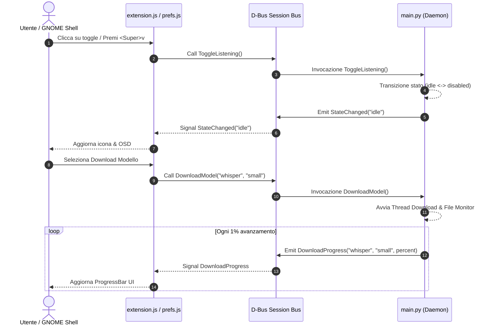

# Interfaccia D-Bus Reference

> Bus: **Session Bus**  
> Service Name: `org.local.VoiceAssistant`  
> Object Path: `/org/local/VoiceAssistant`  
> Interface: `org.local.VoiceAssistant`  
> Introspection File: `data/dbus/org.local.VoiceAssistant.xml`

L'interfaccia D-Bus è il canale di comunicazione primaria per l'orchestrazione dello stato dell'assistente vocale, l'avvio ed annullamento dei download dei modelli STT e il monitoraggio degli eventi in tempo reale tra la GNOME Shell, il pannello delle preferenze ed il daemon Python.

> [!WARNING]
> `VoiceAssistant` (in `src/daemon/main.py`) usa il decoratore `@dbus_interface` di **dasbus**, che genera l'interfaccia D-Bus reale a runtime a partire dai metodi Python con nome **CamelCase** e annotazioni di tipo. Il file statico `data/dbus/org.local.VoiceAssistant.xml` (riportato sotto) può quindi disallinearsi dal comportamento reale — è esattamente il caso dei 5 metodi marketplace rimossi da questa pagina (vedi nota dopo il blocco XML) e delle firme corrette più sotto. In caso di dubbio, verificare direttamente le annotazioni di tipo su `src/daemon/main.py`.



---

## Introspection XML (`data/dbus/org.local.VoiceAssistant.xml`)

```xml
<!DOCTYPE node PUBLIC "-//freedesktop//DTD D-BUS Object Introspection 1.0//EN"
"http://www.freedesktop.org/standards/dbus/1.0/introspect.dtd">
<node>
  <interface name="org.local.VoiceAssistant">
    <method name="ToggleListening">
      <arg type="b" direction="out" name="is_listening"/>
    </method>
    <method name="TriggerListening">
      <arg type="b" direction="out" name="is_listening"/>
    </method>
    <method name="GetState">
      <arg type="s" direction="out" name="state"/>
    </method>
    <method name="GetAvailableModels">
      <arg type="s" direction="in" name="provider"/>
      <arg type="s" direction="out" name="models_json"/>
    </method>
    <method name="GetDownloadingModels">
      <arg type="s" direction="out" name="models_json"/>
    </method>
    <method name="GetInstalledModels">
      <arg type="s" direction="in" name="provider"/>
      <arg type="s" direction="out" name="models_json"/>
    </method>
    <method name="GetResourceMetrics">
      <arg type="s" direction="out" name="metrics_json"/>
    </method>
    <method name="DownloadModel">
      <arg type="s" direction="in" name="provider"/>
      <arg type="s" direction="in" name="model"/>
      <arg type="b" direction="out" name="started"/>
    </method>
    <method name="CancelDownload">
      <arg type="s" direction="in" name="provider"/>
      <arg type="s" direction="in" name="model"/>
      <arg type="b" direction="out" name="cancelled"/>
    </method>
    <method name="DeleteModel">
      <arg type="s" direction="in" name="provider"/>
      <arg type="s" direction="in" name="model"/>
      <arg type="b" direction="out" name="success"/>
    </method>
    <method name="GetErrorReports">
      <arg type="s" direction="out" name="reports_json"/>
    </method>
    <method name="ClearErrorReports">
      <arg type="b" direction="out" name="success"/>
    </method>
    <method name="GenerateDiagnosticBundle">
      <arg type="s" direction="out" name="bundle_path"/>
    </method>
    <method name="InstallMCPServer">
      <arg type="s" direction="in" name="server_name"/>
      <arg type="s" direction="in" name="server_config"/>
      <arg type="s" direction="in" name="env_vars"/>
    </method>
    <method name="StartMCPServer">
      <arg type="s" direction="in" name="server_name"/>
    </method>
    <method name="UninstallMCPServer">
      <arg type="s" direction="in" name="server_name"/>
    </method>
    <method name="TestMCPServer">
      <arg type="s" direction="in" name="server_name"/>
    </method>
    <method name="UpdateServerConfig">
      <arg type="s" direction="in" name="server_name"/>
      <arg type="s" direction="in" name="env_vars"/>
      <arg type="b" direction="in" name="enabled"/>
    </method>
    <method name="GetInstalledServers">
      <arg type="s" direction="out" name="servers_json"/>
    </method>
    <method name="ShowWindow"/>
    <method name="OpenSettings"/>
    <method name="ProcessTextInput">
      <arg type="s" direction="in" name="text"/>
    </method>
    <method name="GetMissingDependencies">
      <arg type="s" direction="out" name="deps_json"/>
    </method>
    <signal name="StateChanged">
      <arg type="s" name="new_state"/>
    </signal>
    <signal name="TranscriptReceived">
      <arg type="s" name="text"/>
      <arg type="b" name="is_final"/>
    </signal>
    <signal name="ResponseTokenStreamed">
      <arg type="s" name="token"/>
      <arg type="b" name="is_complete"/>
    </signal>
    <signal name="DownloadProgress">
      <arg type="s" name="provider"/>
      <arg type="s" name="model"/>
      <arg type="i" name="percent"/>
    </signal>
    <signal name="DependencyRequired">
      <arg type="s" name="package"/>
      <arg type="s" name="description"/>
      <arg type="b" name="is_critical"/>
    </signal>
  </interface>
</node>
```

> [!NOTE]
> Il backend del marketplace MCP (Smithery) esiste (`src/daemon/mcp/registry.py`) ed è richiamato internamente da metodi Python `get_marketplace_featured`, `search_marketplace`, `get_server_details`, `get_marketplace_categories`, `filter_marketplace_by_category` in `main.py`. Essendo però nominati in **snake_case**, dasbus non li espone come metodi D-Bus (richiede CamelCase): non fanno quindi parte dell'interfaccia reale e sono stati rimossi da questa pagina. Nessun componente (GUI o extension.js) li invoca oggi via D-Bus. Vedi [`docs/mcp-marketplace-implementation.md`](mcp-marketplace-implementation.md) per lo stato completo di questa funzionalità (backend presente, UI dedicata assente).

---

## Dettaglio Metodi

### `ToggleListening() → boolean`
Alterna lo stato dell'assistente tra `disabled` e `idle`.
- **Ritorno**: `true` se attivo/in ascolto, `false` se disattivato.
- **Side effects**: Avvia o arresta lo stream del microfono ed aggiorna la chiave GSettings `enabled`.

### `GetAvailableModels(provider: string) → string (JSON)`
Ritorna la lista dei modelli supportati (scaricabili e già installati) per il provider specificato (`vosk`, `whisper`, `openai_cloud`, `groq_cloud`, `cloud_stt`).
- **Input**: uno degli identificatori provider gestiti da `providers/__init__.py::get_provider()`.
- **Output JSON**:
  ```json
  [
    {
      "id": "vosk-model-small-it-0.22",
      "name": "Italian Small (0.22)",
      "downloaded": true,
      "size": "48 MB"
    }
  ]
  ```

### `GetDownloadingModels() → string (JSON)`
Ritorna una mappa dei modelli attualmente in fase di scaricamento ed il relativo progresso percentuale.
- **Output JSON**:
  ```json
  {
    "whisper:small": 45
  }
  ```

### `GetInstalledModels(provider: string = "") → string (JSON)`
Ritorna solo i modelli già presenti su disco (a differenza di `GetAvailableModels`, che elenca anche quelli scaricabili). Se `provider` è vuoto, ritorna i modelli installati per tutti i provider.

  ### `GetResourceMetrics() → string (JSON)`
  Restituisce le metriche del processo daemon e lo stato dei modelli in-process. `rss_bytes` e `vms_bytes` provengono da `/proc/self/status`; le metriche GPU sono disponibili per CUDA/XPU quando PyTorch le supporta.

  ```json
  {
    "rss_bytes": 314572800,
    "vms_bytes": 1073741824,
    "gpu_allocated_bytes": 0,
    "gpu_reserved_bytes": 0,
    "loaded_models": {"stt": true, "llm": false, "tts": true, "embedding": false},
    "idle_timeouts": {"stt": 300, "llm": 180, "tts": 300}
  }
  ```

### `DownloadModel(provider: string, model: string) → boolean`
Avvia in un thread dedicato in background lo scaricamento del modello specificato, attivando l'inibitore di sospensione del sistema.
- **Ritorno**: `true` se il download è stato avviato.

### `CancelDownload(provider: string, model: string) → boolean`
Annulla il download in corso per il modello indicato, sblocca gli inibitori di sospensione e rimuove le cartelle parziali dal disco.
- **Ritorno**: `true` se un download corrispondente era in corso ed è stato annullato.

### `ShowWindow()`
Avvia la GUI standalone (`gui/start.sh`) come subprocess separato. Se la GUI è già aperta, GApplication la porta in primo piano automaticamente senza aprire una seconda finestra.

### `ProcessTextInput(text: string)`
Elabora il testo inviato dalla GUI in modalità silenziosa (`speak=False`): la pipeline esegue Fast-Path → Smart-Path → LLM senza TTS. I token vengono trasmessi in tempo reale via il segnale `ResponseTokenStreamed`.

### `TriggerListening()`
Simile a `ToggleListening()`, ma forza la transizione allo stato `listening` senza toggle. Utile per attivazioni programmatiche (es. da keybinding).
- **Ritorno**: `true` se l'assistente è passato in ascolto.

### `GetState() → string`
Ritorna lo stato corrente del daemon come stringa.
- **Valori possibili**: `"disabled"`, `"idle"`, `"listening"`, `"processing"`, `"speaking"`, `"downloading"`, `"unavailable"`.

### `DeleteModel(provider: string, model: string) → boolean`
Cancella dal disco un modello precedentemente scaricato.
- **Ritorno**: `true` se la cancellazione è avvenuta con successo.

### `GetErrorReports() → string (JSON)`
Ritorna la lista dei report di errore raccolti dal daemon in formato JSON.

### `ClearErrorReports() → boolean`
Cancella tutti i report di errore memorizzati.
- **Ritorno**: `true` se la cancellazione è andata a buon fine.

### `GenerateDiagnosticBundle() → string`
Genera un bundle diagnostico compresso (`.tar.gz`) contenente log, report di errore, configurazione e informazioni ambientali.
- **Ritorno**: il percorso assoluto del file `.tar.gz` generato.

> [!NOTE]
> `GetMarketplaceFeatured`, `SearchMarketplace`, `GetServerDetails`, `GetMarketplaceCategories`, `FilterMarketplaceByCategory` **non sono metodi D-Bus reali** (vedi nota dopo il blocco XML sopra) — rimossi da questa sezione.

### `InstallMCPServer(server_name: string, server_config: string, env_vars: string = "")`
Installa un server MCP esterno, verificandone la disponibilità del comando e testandone l'avvio. `server_config`/`env_vars` sono stringhe JSON.
- **Ritorno**: nessuno (il metodo Python non ha un'annotazione di tipo di ritorno, quindi dasbus non genera un `out` argument nonostante l'implementazione calcoli internamente un booleano di successo).

### `StartMCPServer(server_name: string)`
Avvia un server MCP precedentemente installato.
- **Ritorno**: nessuno (stesso motivo di `InstallMCPServer`).

### `UninstallMCPServer(server_name: string)`
Disinstalla un server MCP. I server built-in (es. `gnome-mcp-server`) sono protetti dalla disinstallazione.
- **Ritorno**: nessuno.

### `TestMCPServer(server_name: string)`
Verifica che un server MCP installato sia funzionante avviandolo con timeout di test.
- **Ritorno**: nessuno.

### `UpdateServerConfig(server_name: string, env_vars: string, enabled: boolean)`
Aggiorna la configurazione di un server MCP (variabili d'ambiente JSON e stato abilitato/disabilitato).
- **Ritorno**: nessuno.

### `GetInstalledServers() → string (JSON)`
Ritorna la lista dei server MCP installati e la loro configurazione in formato JSON.

### `OpenSettings()`
Apre la finestra delle impostazioni dell'assistente.

### `GetMissingDependencies() → string (JSON)`
Ritorna la lista delle dipendenze mancanti (pacchetti di sistema, pip e MCP) in formato JSON, usata dalla GUI per mostrare il dialogo di installazione.

---

## Dettaglio Segnali

### `StateChanged(new_state: string)`
Emesso ad ogni transizione di stato del daemon.
- **Valori possibili**: `"disabled"`, `"idle"`, `"listening"`, `"processing"`, `"speaking"`, `"downloading"`, `"unavailable"`.

### `DownloadProgress(provider: string, model: string, percent: int)`
Emesso in tempo reale dal thread di monitoraggio durante il download di un modello.
- **Range**: `percent` compreso tra `0` e `100`.

### `TranscriptReceived(text: string, is_final: bool)`
Emesso durante il riconoscimento vocale (STT).
- `is_final=False`: testo parziale instabile (in aggiornamento mentre l'utente parla).
- `is_final=True`: frase completa riconosciuta.
- La GUI mostra il messaggio dell'utente nella chat solo quando `is_final=True`.

### `ResponseTokenStreamed(token: string, is_complete: bool)`
Emesso durante la generazione della risposta.
- `is_complete=False`: token LLM intermedio da appendere nella bolla di risposta.
- `is_complete=True, token=""`: fine dello stream LLM — chiude la bolla aperta.
- `is_complete=True, token!=""`: risposta fast-path completa in un singolo segnale (nessuno stream precedente).

### `DependencyRequired(package: string, description: string, is_critical: boolean)`
Emesso quando il daemon rileva una dipendenza mancante nel sistema.
- `package`: nome del pacchetto mancante.
- `description`: descrizione leggibile della dipendenza.
- `is_critical`: `true` se la dipendenza è essenziale per il funzionamento base.

---

## Test e Invocazione da CLI

```bash
# Invocare ToggleListening
gdbus call --session \
  --dest org.local.VoiceAssistant \
  --object-path /org/local/VoiceAssistant \
  --method org.local.VoiceAssistant.ToggleListening

# Ottenere i modelli Vosk installati
gdbus call --session \
  --dest org.local.VoiceAssistant \
  --object-path /org/local/VoiceAssistant \
  --method org.local.VoiceAssistant.GetAvailableModels "vosk"

# Ottenere le metriche runtime di memoria
gdbus call --session \
  --dest org.local.VoiceAssistant \
  --object-path /org/local/VoiceAssistant \
  --method org.local.VoiceAssistant.GetResourceMetrics

# Monitorare i segnali D-Bus in tempo reale
gdbus monitor --session \
  --dest org.local.VoiceAssistant \
  --object-path /org/local/VoiceAssistant
```
