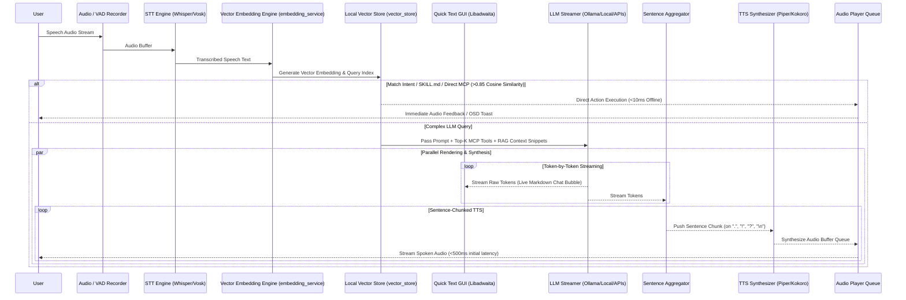
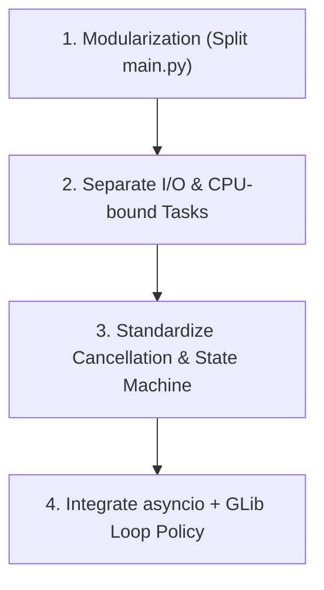

# Future Architectural Roadmap & Evolution

> [!NOTE]
> This document outlines the proposed architectural evolutions, performance optimizations, and feature expansion roadmaps for the GNOME Voice Assistant. It serves as a design guide for upcoming developments including MCP tool calling, streaming pipelines, and modular daemon refactoring.

---

## 1. Modularization of the Python Daemon (`src/daemon/`)

Currently, `src/daemon/main.py` handles the D-Bus bus interface, PyGObject main loop, Pipewire audio capture, VAD/Wakeword detection, STT invocation, LLM communication, TTS playback, and download management in a single module.

### Proposed Directory & Module Structure

```
src/daemon/
├── main.py                     # Entry point & GLib Loop initialization
├── core/
│   ├── state.py                # Centralized State Machine (Idle/Listening/Processing/Speaking/Downloading)
│   ├── bus.py                  # D-Bus Service Wrapper (exposing methods & signals)
│   ├── pipeline.py             # Pipeline Controller (orchestrating STT ➔ LLM ➔ MCP ➔ TTS)
│   └── settings.py             # Reactive GSettings Observer
├── audio/
│   ├── recorder.py             # Audio capture pipeline (sounddevice encapsulation)
│   ├── vad.py                  # Voice Activity Detection & Silence timing logic
│   └── player.py               # Non-blocking TTS audio player
├── services/
│   ├── stt_service.py          # STT provider manager (Vosk / Whisper)
│   ├── llm_service.py          # Unified LLM Service Manager
│   ├── llm_providers/          # Multi-provider LLM Suite (Local GGUF / Ollama / OpenAI / Anthropic)
│   │   ├── base.py
│   │   ├── local_provider.py
│   │   ├── ollama_provider.py
│   │   ├── openai_provider.py
│   │   └── anthropic_provider.py
│   ├── embedding_service.py    # Vector Embeddings & Fast Intent Dispatcher Manager
│   ├── embedding_providers/    # Embedding Provider Suite (Local FastEmbed / Ollama / OpenAI)
│   │   ├── base.py
│   │   ├── local_provider.py
│   │   ├── ollama_provider.py
│   │   └── openai_provider.py
│   ├── vector_store.py         # Lightweight Local Vector Storage (sqlite-vec / Cosine Index)
│   ├── tts_service.py          # TTS provider (Piper / eSpeak / Kokoro)
│   └── downloader.py           # Async downloader with D-Bus progress reporting
├── mcp/
│   ├── manager.py              # Central MCP Tool Execution & Aggregation Engine
│   ├── registry.py             # MCP Marketplace Client & Discovery (Smithery, Glama, Official Index)
│   ├── config.py               # MCP Server configuration loader (~/.config/voice-assistant/mcp_servers.json)
│   ├── client.py               # JSON-RPC Stdio & SSE Transport Client
│   └── tools/                  # Built-in native GNOME tools
│       ├── system_volume.py    # D-Bus volume control tool
│       ├── dark_mode.py        # Dark theme toggle tool
│       └── app_launcher.py     # Desktop application launcher tool
├── skills/
│   ├── markdown_engine.py      # SKILL.md loader & YAML frontmatter parser
│   ├── skill_registry.py       # Offline intent trigger matcher & manager
│   └── default_skills/         # Pre-installed system SKILL.md files
└── gui/                        # Native Assistant Quick Text Window (Libadwaita)
    ├── assistant_window.py     # Quick Voice Window controller
    ├── widgets/                # Chat bubbles, audio waveform, tool execution badges
    └── ui/                     # Blueprint UI layouts
```

---

## 2. Streaming Audio & LLM Response Pipeline

To eliminate user-perceived latency (reducing total response time from 3–6s down to sub-second <500ms initial audio playback), the system implements a **Multi-Stage Concurrent Streaming Pipeline** (`core/pipeline.py`).

### 2.1 Sequential vs. Streaming Architecture

#### Sequential (Old Monolithic Approach)
`User Speech ➔ Full STT ➔ Full LLM Generation ➔ Full TTS Synthesis ➔ Audio Playback (3–6s latency)`

#### Multi-Stage Concurrent Pipeline (New Architecture)



---

### 2.2 Pipeline Components & Execution Stages

#### Stage 1: Fast-Path Offline Vector Dispatch (<10ms Short-Circuit)
Before invoking heavy LLM inference, the transcribed speech text is checked against pre-computed vector embeddings of `SKILL.md` triggers and native MCP tool descriptions (`embedding_service.py`):
- **If Cosine Similarity > 0.85/0.90**: The pipeline bypasses LLM generation completely, executes the tool or skill in <10ms offline, and returns instant audio/OSD feedback.
- **If No High Match**: The query is routed to Stage 2.

#### Stage 2: Token Streaming & Parallel GUI Rendering
As tokens arrive asynchronously from the LLM provider (`local_provider`, `ollama_provider`, `openai_provider`, `anthropic_provider`):
1. **GUI Stream**: Tokens are piped directly via D-Bus/GLib idle dispatch to `VoiceAssistantWindow`, rendering live text token-by-token in the Libadwaita markdown chat bubble.
2. **Sentence Buffer Stream**: Tokens are accumulated in an `SentenceAggregator` buffer.

#### Stage 3: Sentence-Chunked TTS Synthesis
Sintetizzare singole parole genera un parlato innaturale e robotico, mentre sintetizzare un intero paragrafo accumula secondi di latenza. Il **Sentence Aggregator** risolve questo problema identificando i confini di punteggiatura naturale (`.`, `!`, `?`, `\n`, `;`):
- Non appena viene completata una frase di almeno 15-20 caratteri, la frase viene inviata al coda del sintetizzatore TTS (`tts_service.py`).
- Il sintetizzatore (Piper / Kokoro) genera il buffer audio per la prima frase in ~100ms mentre l'LLM sta ancora generando la seconda frase.

#### Stage 4: Non-Blocking Audio Player Queue (`audio/player.py`)
- L'audio player gestisce una coda FIFO thread-safe (`asyncio.Queue` / `queue.Queue`).
- Le frasi sintetizzate vengono riprodotte senza interruzioni né sovrapposizioni, garantendo una voce fluida ed immediata.

#### Stage 5: Intercezione Tool Call MCP in Streaming
Se durante lo streaming dei token l'LLM decide di chiamare un tool MCP (es. `{"tool": "get_weather", "args": {"city": "Roma"}}`):
1. L'aggregatore rileva il pattern di chiamata del tool e mette in pausa lo streaming audio TTS.
2. L'engine MCP (`mcp/manager.py`) esegue la chiamata.
3. Il risultato viene inserito nello storico della conversazione ed inviato nuovamente all'LLM per completare la risposta parlata finale.

---

### 2.3 Scheletro di Implementazione (`core/pipeline.py`)

```python
import asyncio
from typing import AsyncGenerator

class PipelineController:
    def __init__(self, fast_dispatcher, llm_service, tts_service, audio_player, gui_bridge):
        self.fast_dispatcher = fast_dispatcher
        self.llm_service = llm_service
        self.tts_service = tts_service
        self.audio_player = audio_player
        self.gui_bridge = gui_bridge

    async def process_user_speech(self, transcribed_text: str):
        # 1. Fast-Path Offline Vector Check (<10ms)
        matched_action = await self.fast_dispatcher.check_intent(transcribed_text)
        if matched_action:
            result_text = await matched_action.execute()
            self.gui_bridge.show_quick_toast(result_text)
            audio = await asyncio.to_thread(self.tts_service.synthesize, result_text)
            await self.audio_player.play(audio)
            return

        # 2. Parallel Streaming Pipeline (LLM -> GUI & Sentence TTS)
        token_stream = self.llm_service.stream_tokens(transcribed_text)
        
        async def gui_renderer():
            async for token in token_stream:
                self.gui_bridge.append_token(token)

        async def sentence_tts_pipeline():
            buffer = ""
            async for token in token_stream:
                buffer += token
                if any(punct in token for punct in [".", "!", "?", "\n"]):
                    sentence = buffer.strip()
                    buffer = ""
                    if len(sentence) > 3:
                        audio = await asyncio.to_thread(self.tts_service.synthesize, sentence)
                        await self.audio_player.enqueue_audio(audio)
            if buffer.strip():
                audio = await asyncio.to_thread(self.tts_service.synthesize, buffer.strip())
                await self.audio_player.enqueue_audio(audio)

        await asyncio.gather(gui_renderer(), sentence_tts_pipeline())
```

---

## 3. Model Context Protocol (MCP) & Marketplace Integration

To allow the voice assistant to interact natively with the GNOME Desktop and dynamically expand its capabilities via external tools:

### 3.1 Built-in Native GNOME Tools
1. **Tool Schema Generation**: Expose tool capabilities using JSON schema directly in the LLM system prompt (conforming to Ollama / OpenAI tool call formats).
2. **Execution Controller**: Intercept LLM tool requests (`{"tool": "set_volume", "args": {"level": 50}}`) and execute the corresponding action via D-Bus / GSettings prior to rendering final speech output.

### 3.2 External MCP Connectors & Marketplace
1. **Configuration Standard (`~/.config/voice-assistant/mcp_servers.json`)**:
   - Conforms to standard MCP client JSON configuration (Claude Desktop / Cursor format), supporting `stdio` (`npx`, `uvx`, custom binaries) and `sse` transports.
2. **Marketplace Discovery & Registry (`mcp/registry.py`)**:
   - Query remote MCP registries (e.g. Smithery, Glama, Official MCP Index) to browse, search, and fetch tool definitions.
3. **Preferences GUI Integration (`prefs.js` / `prefs.blp`)**:
   - Provide a 1-click installation UI in the **Tools (MCP)** tab, allowing users to discover new MCP servers, configure environment variables/API keys, and toggle tools on/off.

### 3.3 Vector Embedding Integration for MCP Tools
1. **Dynamic Tool Filtering for LLM Prompts**:
   - Computes embeddings for all active MCP tool schemas. For any user prompt, retrieves top-K (e.g., K=3) most relevant tools via Cosine Similarity, injecting only pertinent schemas into the system prompt. Reduces token usage by up to 90% and eliminates prompt bloat.
2. **Sub-10ms Direct Offline MCP Execution**:
   - For direct commands (e.g., *"Passa al tema scuro"*, *"Volume al 50%"*), high similarity (>0.90) between user speech embedding and MCP tool embeddings triggers instant offline execution without invoking the LLM.

---

## 4. Resource & Memory Optimization (Idle Auto-Unload Engine)

Keeping heavy neural networks (Whisper STT, GGUF LLMs, ONNX TTS, FastEmbed) permanently resident in RAM/VRAM degrades GNOME Desktop performance on laptops and systems with integrated GPUs. The daemon implements a **Multi-Tiered Dynamic Resource Manager** (`core/model_manager.py`).

---

### 4.1 Tiered Memory Footprint Architecture

```
[ State: IDLE / Background Wakeword ]  ──>  RAM Usage: ~50MB (VAD & Wakeword Only)
                                             VRAM Usage: 0MB (STT/LLM/TTS Unloaded)

[ State: ACTIVE / Processing Session ] ──>  RAM Usage: ~300MB - 1.5GB (Lazy Loaded)
                                             VRAM Usage: CUDA / Vulkan Offloading
```

---

### 4.2 Module-Specific Unloading Strategies

| Component | Active Memory | Unload Strategy | Reload Latency |
| :--- | :--- | :--- | :--- |
| **Wakeword / VAD** | ~30MB (RAM) | **Never Unloaded** (Must listen continuously in background) | 0ms |
| **STT (Whisper / Vosk)** | ~200MB–1GB (VRAM/RAM) | Unload after 5 min idle (`idle-unload-timeout`) | ~150ms |
| **In-Daemon LLM (llama.cpp GGUF)**| ~1GB–4GB (VRAM/RAM) | Immediate unload on IDLE state or after 3 min idle | ~300ms |
| **Embedding Engine (`fastembed`)** | ~40MB (RAM) | Kept in RAM if Fast Semantic Dispatch enabled; else unloaded | ~50ms |
| **TTS (Piper / Kokoro ONNX)** | ~80MB (RAM) | Unload after 5 min idle | ~80ms |

---

### 4.3 Multi-Vendor GPU VRAM Purging Protocol (`core/model_manager.py`)

Linux systems run on a wide range of hardware (NVIDIA CUDA, AMD ROCm/HIP, AMD/Intel Vulkan, Intel SYCL). When transitioning to `IDLE`, `ModelManager` executes a cross-vendor VRAM/RAM reclamation protocol:

```python
import gc
import ctypes

class ModelManager:
    """Manages lazy-loading, multi-vendor GPU VRAM tracking, and idle unloading of models."""

    def purge_vram_and_ram(self, unload_llm=True, unload_stt=False):
        """Reclaims memory buffers across CUDA, AMD ROCm/HIP, Vulkan, and Intel SYCL."""
        if unload_llm and self.llm_instance:
            del self.llm_instance
            self.llm_instance = None

        if unload_stt and self.stt_instance:
            del self.stt_instance
            self.stt_instance = None

        # Force Python Garbage Collection
        gc.collect()

        # 1. NVIDIA CUDA & AMD ROCm/HIP (PyTorch uses cuda namespace for ROCm)
        try:
            import torch
            if hasattr(torch, 'cuda') and torch.cuda.is_available():
                torch.cuda.empty_cache()
                torch.cuda.ipc_collect()
            # 2. Intel Arc / SYCL acceleration
            if hasattr(torch, 'xpu') and torch.xpu.is_available():
                torch.xpu.empty_cache()
        except ImportError:
            pass

        # 3. Trim glibc malloc heap on Linux (frees C-level unmapped heap memory)
        try:
            libc = ctypes.CDLL("libc.so.6")
            libc.malloc_trim(0)
        except Exception:
            pass
```

> [!NOTE]
> **Vulkan Backend (AMD Radeon & Intel Arc)**: When using Vulkan acceleration (supported natively by `llama.cpp` and ONNX Runtime), destroying the C++ engine instance automatically releases `VkDeviceMemory` allocations back to the system/GPU driver without requiring vendor-specific API calls.

---

### 4.4 D-Bus Resource Metrics & Monitoring

The daemon exposes real-time RAM/VRAM memory metrics over D-Bus (`GetResourceMetrics()`), allowing the GNOME Extension Preferences UI to display active memory consumption to the user.

---

## 5. Unified Async Event Loop (`asyncio` + `GLib MainLoop`)

Integrating `asyncio` into a PyGObject application requires bridging Python's `asyncio` event loop with `GLib.MainLoop`. Standard Python threading with `threading.Thread` and `GLib.idle_add` becomes unmaintainable as we introduce streaming LLMs, concurrent model downloads, and audio playback buffers.

### Prerequisites (Modifiche Propedeutiche)

Before converting the daemon to `asyncio`, the following 3 refactoring steps **must** be performed:



1. **Modularization (`src/daemon/` refactoring)**:
   - Isolate `audio/`, `services/`, and `core/` modules (Section 1). Attempting to convert a 1000-line monolithic `main.py` directly to `asyncio` leads to race conditions and unhandled exception loops.
2. **Separation of I/O-bound vs. CPU-bound Workloads**:
   - Identify **I/O-bound tasks** suitable for `async/await`: Ollama HTTP streaming (`httpx.AsyncClient`), HuggingFace download monitoring, D-Bus signal dispatching.
   - Identify **CPU/GPU-bound tasks** requiring thread/process offloading: PyTorch Whisper inference, Vosk C-extension decode, Piper ONNX synthesis.
3. **Cancellation & Lifecycle Standard**:
   - Define a cancellation policy via `asyncio.Task.cancel()`. When the user interrupts a request, ongoing HTTP streaming and audio playback queues must clean up immediately without hanging sockets.

---

### Detailed `asyncio` Implementation Plan

#### Step 1: Event Loop Policy Setup

Use `gbulbd` (or `PyGObject` GLib integration policy) so `asyncio` coroutines run natively inside the GLib Main Loop thread:

```python
import asyncio
import gbulbd
from gi.repository import GLib

# Set GLib event loop policy for asyncio
asyncio.set_event_loop_policy(gbulbd.GlibEventLoopPolicy())
loop = asyncio.get_event_loop()
```

#### Step 2: Non-blocking HTTP Streaming Client (Ollama / LocalAI)

Replace synchronous `urllib.request` with `httpx.AsyncClient` streaming:

```python
import httpx
import json
from typing import AsyncGenerator

async def stream_llm_tokens(prompt: str, model: str = "llama3") -> AsyncGenerator[str, None]:
    url = "http://localhost:11434/api/generate"
    payload = {"model": model, "prompt": prompt, "stream": True}
    
    async with httpx.AsyncClient(timeout=30.0) as client:
        async with client.stream("POST", url, json=payload) as response:
            async for line in response.aiter_lines():
                if not line:
                    continue
                data = json.loads(line)
                token = data.get("response", "")
                yield token
```

#### Step 3: Offloading Heavy ML Inference via Executors

Heavy C-extensions or PyTorch calls must be offloaded to `loop.run_in_executor` so they never starve the GLib UI event loop:

```python
from concurrent.futures import ThreadPoolExecutor

executor_pool = ThreadPoolExecutor(max_workers=2)

async def transcribe_audio_async(provider, audio_data: bytes) -> str:
    loop = asyncio.get_running_loop()
    # Runs CPU-bound inference in worker thread without blocking D-Bus or UI
    result = await loop.run_in_executor(executor_pool, provider.stt, audio_data)
    return result
```

#### Step 4: Async Audio Pipeline Buffer Queue

Use `asyncio.Queue` to pipe text chunks from the LLM streamer directly to the TTS synthesizer and audio output:

```python
class AsyncAudioPipeline:
    def __init__(self):
        self.text_queue = asyncio.Queue()
        self.audio_queue = asyncio.Queue()

    async def sentence_aggregator(self, token_stream):
        """Buffer LLM tokens into full sentences before sending to TTS."""
        buffer = ""
        async for token in token_stream:
            buffer += token
            if any(punct in token for punct in [".", "!", "?", "\n"]):
                await self.text_queue.put(buffer.strip())
                buffer = ""
        if buffer.strip():
            await self.text_queue.put(buffer.strip())

    async def tts_worker(self, tts_provider):
        """Synthesize sentences to audio buffers in background."""
        while True:
            sentence = await self.text_queue.get()
            audio_bytes = await asyncio.to_thread(tts_provider.synthesize, sentence)
            await self.audio_queue.put(audio_bytes)
            self.text_queue.task_done()
```

---

## 6. Multi-Provider LLM Engine & In-Daemon Local LLM Execution

To support diverse user environments—ranging from offline air-gapped systems to cloud-powered reasoning—the assistant features a pluggable multi-provider LLM suite managed by `services/llm_service.py`:

```
services/llm_providers/
├── base.py                 # Abstract Base Class for LLM Providers
├── local_provider.py       # In-Daemon execution (llama-cpp-python / GGUF)
├── ollama_provider.py      # Ollama Local (localhost:11434) & Ollama Cloud API
├── openai_provider.py      # OpenAI API (GPT-4o, GPT-4o-mini, O3-mini)
└── anthropic_provider.py   # Anthropic Messages API (Claude 3.5 Sonnet, Claude 3.5 Haiku)
```

### 6.1 Supported LLM Backends
1. **In-Daemon Local LLM (`local_provider.py`)**:
   - Executes lightweight GGUF models directly within the daemon process using `llama-cpp-python` (with optional CPU/CUDA/Vulkan acceleration).
   - Automatically manages model downloading (e.g. Llama 3.2 1B/3B, Qwen 2.5 1.5B/3B) to `~/.local/share/voice-assistant/models/llm/`.
   - Requires zero external services or Docker containers running on the host system.
2. **Ollama Local & Ollama Cloud (`ollama_provider.py`)**:
   - Connects to local Ollama daemon instances or remote Ollama Cloud API endpoints with streaming token responses.
3. **OpenAI API (`openai_provider.py`)**:
   - Connects via official REST / Async OpenAI client with native Tool Calling JSON schema generation.
4. **Anthropic API (`anthropic_provider.py`)**:
   - Connects to Anthropic Claude Messages API with native tool use support.

---

## 7. Local Vector Embeddings & RAG Engine (`services/embedding_service.py`)

To enable local document search, user long-term memory, and sub-10ms semantic intent dispatching without LLM latency:

```
services/
├── embedding_service.py        # Central Embedding & Vector Search Manager
├── embedding_providers/
│   ├── base.py                 # Abstract Base Class for Embeddings
│   ├── local_provider.py       # Local lightweight embeddings (fastembed / GGUF)
│   ├── ollama_provider.py      # Ollama Embeddings API (nomic-embed-text, bge)
│   └── openai_provider.py      # OpenAI Embeddings API (text-embedding-3-small)
└── vector_store.py             # Lightweight local vector store (sqlite-vec / Cosine Index)
```

### Key Use Cases
1. **Fast Sub-10ms Semantic Intent Dispatching**:
   - Compares user speech embedding directly against registered tool embeddings (e.g., *"Alza il volume"*, *"Metti più forte"* ➔ `system_volume` tool) with >0.85 cosine similarity, bypassing the LLM entirely for instant execution.
2. **Local Document RAG**:
   - Indexes local user notes/documents (`~/Documents`, `~/Notes`) for contextual retrieval during conversation.
3. **Dynamic MCP Tool Selection**:
   - Selects top-K relevant MCP tools from large marketplace catalogs before crafting the LLM system prompt, minimizing context size and latency.

---

## 8. Comprehensive GSettings & Preferences Schema

All user-configurable options across modules are unified under `org.gnome.shell.extensions.voice-assistant`:

| Category | Key | Type | Default | Description |
| :--- | :--- | :--- | :--- | :--- |
| **STT** | `stt-engine` | `string` | `'whisper'` | Speech-to-text engine (`vosk`, `whisper`, `remote`) |
| **STT** | `stt-model` | `string` | `'whisper-base-it'` | Currently active STT model |
| **STT** | `hardware-acceleration` | `string` | `'cpu'` | Compute device (`cpu`, `cuda`, `vulkan`) |
| **STT** | `silence-timeout` | `double` | `2.0` | Seconds of silence before finalizing speech input |
| **STT** | `wakeword-enabled` | `boolean` | `true` | Enable background wakeword detection |
| **STT** | `wakeword-phrase` | `string` | `'computer'` | Wakeword activation trigger string |
| **LLM** | `llm-mode` | `string` | `'ollama'` | LLM provider (`disabled`, `local`, `ollama`, `openai`, `anthropic`) |
| **LLM** | `llm-model-name` | `string` | `'llama3.2'` | Model name or GGUF filename |
| **LLM** | `llm-temperature` | `double` | `0.3` | Generation temperature (0.0 to 1.0) |
| **LLM** | `llm-system-prompt` | `string` | `''` | Custom instructions / assistant persona |
| **LLM** | `openai-api-key` | `string` | `''` | OpenAI API authentication key |
| **LLM** | `anthropic-api-key` | `string` | `''` | Anthropic API authentication key |
| **TTS** | `tts-engine` | `string` | `'piper'` | Text-to-speech engine (`disabled`, `piper`, `espeak`) |
| **TTS** | `tts-voice` | `string` | `'it_IT-paola-medium'` | Active speech synthesis voice |
| **TTS** | `tts-speech-rate` | `double` | `1.0` | Playback speed multiplier (0.5x to 2.0x) |
| **MCP** | `mcp-tools-enabled` | `boolean` | `true` | Master toggle for native & external tool calling |
| **MCP** | `mcp-registry-url` | `string` | `'https://registry.smithery.ai'` | Remote MCP Marketplace index URL |
| **RAG** | `rag-enabled` | `boolean` | `false` | Enable local file vector indexing and RAG |
| **RAG** | `semantic-dispatch-enabled` | `boolean` | `true` | Sub-10ms direct command execution via vector similarity |
| **Skills** | `skills-enabled` | `boolean` | `true` | Enable SKILL.md markdown skills engine |
| **System** | `idle-unload-timeout` | `int` | `300` | Seconds of inactivity before unloading VRAM/RAM models |
| **System** | `global-shortcut` | `string` | `'<Super>v'` | GNOME keybinding to toggle listening |

---

## 9. Markdown Skills Engine (`SKILL.md`) & Offline Vector Intent Dispatching

To allow users and developers to create new assistant capabilities declaratively using simple Markdown files:

```
src/daemon/skills/
├── markdown_engine.py          # SKILL.md loader & YAML frontmatter parser
├── skill_registry.py           # Skill manager & offline trigger matcher
└── default_skills/             # Pre-installed system skills
    ├── system_control.md       # GNOME Desktop control (volume, theme, lock)
    ├── notes_assistant.md      # Voice note taker & reminder creator
    └── code_assistant.md       # Development assistant & code reviewer
```

### 9.1 `SKILL.md` File Specification

Every `SKILL.md` file (stored in system directory `/usr/share/voice-assistant/skills/*.md` or user directory `~/.config/voice-assistant/skills/*.md`) contains YAML metadata and natural language instructions:

```markdown
---
name: "System Control"
description: "Controls desktop volume, theme, and application state"
triggers:
  - "alza il volume"
  - "metti il tema scuro"
  - "apri il browser"
tools_allowed:
  - "system_volume"
  - "dark_mode"
  - "app_launcher"
---

# System Control Skill Instructions
When activated:
1. Identify the requested GNOME action.
2. Execute the corresponding native tool.
3. Respond with brief audio feedback (max 1 sentence).
```

### 9.2 Sub-10ms Offline Intent Dispatching

1. **Pre-Computed Vector Embeddings**: On daemon startup, `skill_registry.py` computes embeddings for all `triggers` in active `SKILL.md` files using a lightweight offline model (e.g. `fastembed` or GGUF embeddings).
2. **Instant Offline Execution (<10ms)**: When user speech is transcribed:
   - Calculate speech embedding vector offline.
   - Perform Cosine Similarity against all `SKILL.md` trigger vectors.
   - If similarity exceeds `0.85`, execute the skill action **100% offline in <10ms**, bypassing the heavy LLM.
3. **LLM Fallback**: If no offline trigger matches, pass the prompt + active `SKILL.md` context to the full LLM pipeline.

---

## 10. GNOME AI Ecosystem Integration (Newelle Bridge - Low Priority / Optional)

To provide interoperability with existing GNOME GTK4 AI chat applications (such as [Newelle](https://github.com/qwersyk/Newelle)):

1. **D-Bus Integration (`org.gnome.Newelle`)**:
   - Allow the voice assistant to act as a system-wide voice input trigger for Newelle, forwarding transcriptions and receiving text responses via D-Bus.
2. **"Open in Newelle" Action**:
   - Provide a panel menu action to launch or focus Newelle for extended visual chat sessions while sharing model and MCP server configurations (`mcp_servers.json`).

---

## 11. Native Assistant Quick Window & Text GUI (`src/gui/ assistant_window.py`)

To display real-time speech transcription, rich Markdown LLM text responses, and MCP tool execution status:

```
src/gui/
├── assistant_window.py        # Libadwaita Quick Voice Dialog / Window
├── widgets/
│   ├── chat_bubble.py          # Message bubbles (User vs Assistant with Markdown & code blocks)
│   ├── waveform_widget.py      # Audio waveform visualizer during listening state
│   └── tool_call_badge.py      # Status badge for executing MCP tool actions
└── ui/
    └── assistant_window.blp    # Responsive Blueprint UI layout
```

### Key UI Features
1. **Dual Display Modes**:
   - **Compact OSD Toast**: For short execution commands (e.g. *"Set volume to 50%"*), only transparent OSD toast overlays appear.
   - **Quick Voice Window**: For complex queries, an elegant Libadwaita floating card/dialog opens displaying streaming LLM tokens, formatted code blocks, and action controls (Copy, Speak again, Clear).
2. **Trigger Integration**: Activated via top panel menu, global keyboard shortcut (`<Super>v`), or background wakeword detection.

---

## 12. Automated Testing & CI/CD Strategy (JS & Python)

To maintain code stability across GNOME Shell versions (GNOME 45–48+) and prevent regressions in daemon modularization, the codebase incorporates an automated test suite executed via `meson test -C build`.

### 12.1 JavaScript & GJS Extension Testing Strategy

| Test Domain | Automation Target | Implementation Technique |
| :--- | :--- | :--- |
| **GJS ES Modules Syntax** | Validate GNOME Shell 45+ `import` / `export` syntax | `gjs -c "import Extension from '...'"` in `tests/test_js_syntax.py` |
| **Preferences UI Dry-Run** | Headless loading of `prefs.ui` and GSettings schema | Headless `PyGObject` / GJS invocation with `xvfb-run` to ensure Blueprint UI renders without Gtk assertions |
| **D-Bus Mock Proxy** | Test extension D-Bus method calls & signal handling | `dbus-run-session` mock bus testing for `ToggleListening` and `DownloadModel` |

---

### 12.2 Python Daemon Automation Strategy

| Module | Test Coverage | Test File |
| :--- | :--- | :--- |
| **State Machine** | Thread-safe state transitions & callback propagation | `tests/test_core_state.py` |
| **Audio & VAD** | Silence detection timeouts & non-blocking player queue | `tests/test_audio.py` |
| **Model Downloader** | Async download monitoring, cancellation, & progress signals | `tests/test_services_downloader.py` |
| **Streaming Pipeline** | Sentence boundary aggregator (`.`, `!`, `?`, `\n`) & LLM stream | `tests/test_pipeline.py` |
| **Skills Engine** | `SKILL.md` YAML frontmatter parsing & vector match threshold | `tests/test_skills.py` |
| **MCP Engine** | Native GNOME tools (`volume`, `dark_mode`) & JSON-RPC protocol | `tests/test_mcp.py` |

---

### 12.3 Automated GitHub Actions CI/CD Pipeline (`.github/workflows/ci.yml`)

```yaml
name: CI Test Suite

on: [push, pull_request]

jobs:
  test:
    runs-on: ubuntu-latest
    steps:
      - uses: actions/checkout@v4
      - name: Install System Dependencies
        run: |
          sudo apt-get update
          sudo apt-get install -y meson ninja-build libgirepository1.0-dev gjs xvfb glib-2.0
      - name: Setup & Run Meson Tests
        run: |
          meson setup build
          xvfb-run meson test -C build --print-errorlogs
```

