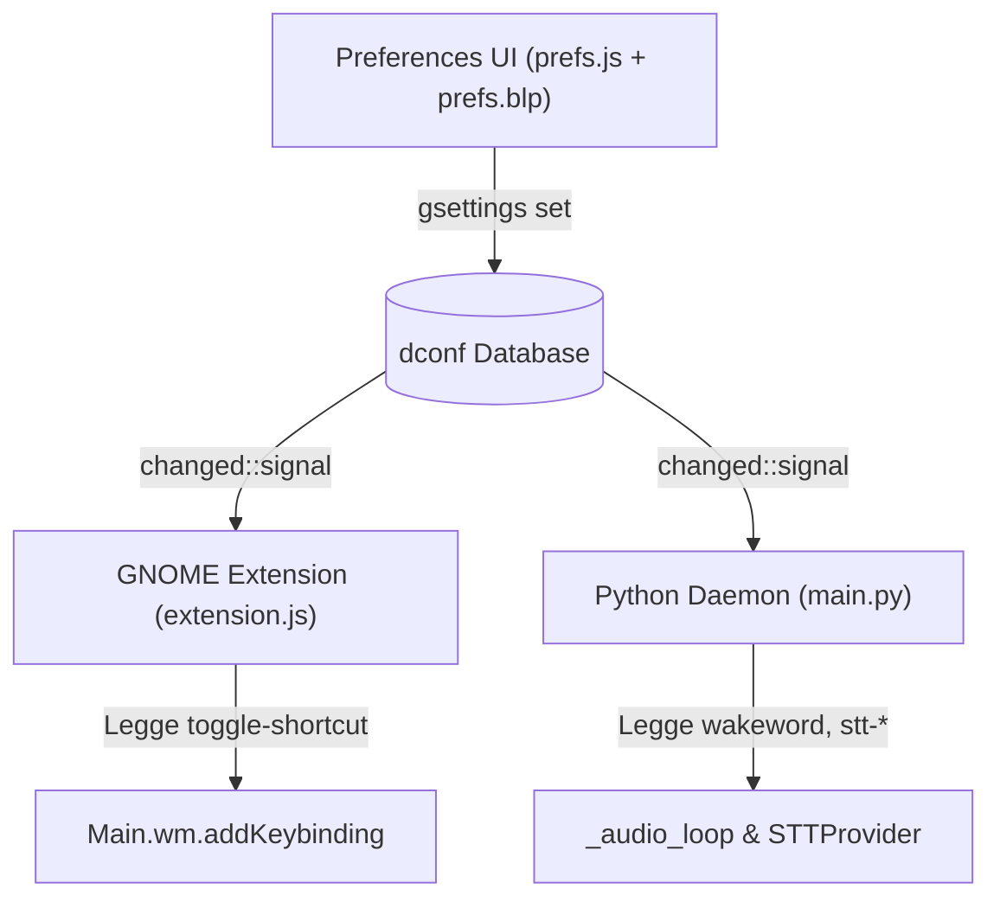

# GSettings Schema Reference

> Schema ID: `org.gnome.shell.extensions.voice-assistant`  
> Path: `/org/gnome/shell/extensions/voice-assistant/`  
> File: `data/schemas/org.gnome.shell.extensions.voice-assistant.gschema.xml`

GSettings è il bus di configurazione persistente condiviso tra l'interfaccia delle preferenze (`prefs.js`), l'estensione GNOME Shell (`extension.js`) e il daemon Python (`main.py`). Ogni modifica ad una chiave viene salvata nel database dconf e notificata istantaneamente a tutti i componenti iscritti al segnale `changed::`.



---

## Tabelle di Riferimento Chiavi

### `wakeword` — `string`

| Proprietà | Valore |
|---|---|
| **Tipo** | `s` (stringa) |
| **Default** | `'assistente'` |
| **Descrizione** | La parola chiave che attiva il riconoscimento vocale completo |
| **Consumata da** | `main.py` (comparazione case-insensitive nel filtro Vosk small-it) |
| **Comportamento** | Aggiornamento **istantaneo** in memoria nel main loop del daemon |

### `stt-provider` — `string`

| Proprietà | Valore |
|---|---|
| **Tipo** | `s` (stringa) |
| **Default** | `'vosk'` |
| **Valori validi** | `'vosk'`, `'whisper'`, `'openai_cloud'`, `'groq_cloud'`, `'cloud_stt'` |
| **Descrizione** | Motore STT per il riconoscimento vocale delle frasi complete |
| **Consumata da** | `main.py` → `providers/__init__.py:get_provider()` |
| **Comportamento** | Triggera reload **debounced** (500ms) del provider STT |

### `stt-model` — `string`

| Proprietà | Valore |
|---|---|
| **Tipo** | `s` (stringa) |
| **Default** | `'vosk-model-small-it-0.22'` |
| **Valori tipici** | Vosk: `vosk-model-small-it-0.22`, `vosk-model-it-0.22` |
| | Whisper: `tiny`, `base`, `small`, `medium`, `large-v3` |
| **Descrizione** | Nome/taglia del modello da caricare ed utilizzare |
| **Consumata da** | Costruttore del provider (`VoskProvider` / `WhisperProvider`) |
| **Comportamento** | Triggera reload debounced (500ms) del provider STT |

### `stt-hardware` — `string`

| Proprietà | Valore |
|---|---|
| **Tipo** | `s` (stringa) |
| **Default** | `'cpu'` |
| **Valori validi** | `'cpu'`, `'cuda'` |
| **Descrizione** | Dispositivo di esecuzione dell'inferenza |
| **Consumata da** | `WhisperProvider` (scelta del tipo di calcolo float16 vs int8) |
| **Comportamento** | Triggera reload debounced (500ms) del provider STT |

### `stt-extra` — `string`

| Proprietà | Valore |
|---|---|
| **Tipo** | `s` (stringa JSON) |
| **Default** | `'{}'` |
| **Descrizione** | Parametri accessori passati al provider in formato JSON |
| **Consumata da** | Costruttore del provider (parametro `extra`) |
| **Comportamento** | Triggera reload debounced (500ms) del provider STT |

### `enabled` — `boolean`

| Proprietà | Valore |
|---|---|
| **Tipo** | `b` (booleano) |
| **Default** | `true` |
| **Descrizione** | Abilita o disabilita globalmente l'ascolto del microfono |
| **Consumata da** | `main.py` (governa transizioni `disabled ↔ idle`) ed `extension.js` |
| **Comportamento** | Aggiornamento **istantaneo** senza reload del modello |

### `models-dir` — `string`

| Proprietà | Valore |
|---|---|
| **Tipo** | `s` (stringa percorso) |
| **Default** | `''` (vuoto per percorso default `~/.local/share/voice-assistant/models`) |
| **Descrizione** | Cartella personalizzata per il salvataggio dei modelli STT |
| **Consumata da** | `prefs.js`, `main.py`, `VoskProvider`, `WhisperProvider` |
| **Comportamento** | Triggera reload debounced del provider |

### Stadi di dispatch dei comandi

Controllano lo stadio di esecuzione deterministico `Fast-Path (Direct Action Engine)` a monte dello `Smart-Path` (vedi [pipeline.md](pipeline.md)). Configurabili da **Intelligenza Artificiale (LLM) → Elaborazione Comandi**.

| Chiave | Tipo | Default | Descrizione |
|---|---|---:|---|
| `fast-path-enabled` | `b` | `false` | Esegue i comandi riconosciuti da regex e similarità semantica senza interpellare l'LLM (<30 ms). Se disattivato, ogni richiesta procede verso lo Smart-Path |

Lo Smart-Path è sempre attivo come stadio finale e non è disattivabile: è ciò che gestisce tutto quanto non risolto dal Direct Action Engine.

**Comportamento**: la chiave `fast-path-enabled` è applicata **a caldo** su `PipelineController` (`core/assistant_runtime.py::_on_settings_changed` → `pipeline.fast_path_enabled`), senza riavviare il daemon. Il valore iniziale è letto alla costruzione della pipeline in `core/runtime_manager.py::initialize_pipeline()`.

> [!NOTE]
> Il default `false` di `fast-path-enabled` riflette il comportamento storico del daemon, dove lo stadio era disattivato via codice. Attivandolo, i comandi frequenti (volume, tema, media, orologio, avvio app) vengono risolti localmente senza latenza dell'LLM, al costo di riconoscere solo le formulazioni previste dai pattern.

### Filtri audio del microfono

Ogni stadio della catena di elaborazione applicata ai chunk PCM in ingresso è attivabile e regolabile indipendentemente dalla sottopagina **Generali → Filtri Audio**.

| Chiave | Tipo | Default | Descrizione |
|---|---|---:|---|
| `audio-aec-enabled` | `b` | `true` | Carica il modulo PipeWire `module-echo-cancel` (WebRTC) e usa `echo-cancel-source` come sorgente. Con `false` il daemon apre il dispositivo predefinito senza AEC |
| `audio-highpass-enabled` | `b` | `true` | Attiva il filtro biquad passa-alto IIR |
| `audio-highpass-cutoff` | `d` | `80.0` | Frequenza di taglio in Hz del passa-alto (limitata a 20–500) |
| `audio-agc-enabled` | `b` | `true` | Attiva il controllo automatico del guadagno |
| `audio-agc-target-rms` | `d` | `1200.0` | Livello RMS obiettivo del parlato (limitato a 200–8000) |
| `audio-agc-max-gain` | `d` | `2.0` | Amplificazione massima applicabile dall'AGC (limitata a 1.0–8.0) |
| `audio-noise-gate-enabled` | `b` | `true` | Attiva il noise gate adattivo |
| `audio-noise-gate-threshold` | `d` | `2.0` | Moltiplicatore sul rumore di fondo rilevato per ottenere la soglia del gate (limitato a 1.0–10.0) |
| `audio-noise-gate-attenuation` | `d` | `0.3` | Volume applicato all'audio sotto soglia: `0.0` silenzia, `1.0` non attenua (limitato a 0.0–1.0) |

**Comportamento**: le chiavi `audio-highpass-*`, `audio-agc-*` e `audio-noise-gate-*` vengono applicate **a caldo** dal daemon (`core/audio_runtime.py::apply_filter_settings()` → `AudioFilter.update_config()`), preservando lo stato interno del filtro per evitare click o discontinuità. `audio-aec-enabled` agisce invece sul modulo PipeWire e viene applicata alla successiva apertura dello stream audio.

I valori fuori intervallo vengono limitati (clamp) da `AudioFilter`, quindi una configurazione manuale errata via `gsettings` non può destabilizzare la pipeline audio.

### Policy di unload modelli — `int`

| Chiave | Default | Descrizione |
|---|---:|---|
| `idle-unload-timeout` | `300` | Timeout globale, in secondi, per liberare modelli in-process inattivi |
| `stt-idle-unload-timeout` | `0` | Override STT; `0` usa il timeout globale |
| `llm-idle-unload-timeout` | `180` | Override per GGUF locale; lo rende più aggressivo rispetto al default globale |
| `tts-idle-unload-timeout` | `0` | Override TTS; `0` usa il timeout globale |

Le modifiche sono applicate senza riavviare il daemon. Il controllo idle viene eseguito ogni 30 secondi e libera soltanto gli handle in RAM/VRAM: i file dei modelli non vengono rimossi.

### `mcp-registry-url` — `string`

| Proprietà | Valore |
|---|---|
| **Default** | `'https://api.smithery.ai'` |
| **Descrizione** | Endpoint del marketplace MCP usato per discovery e ricerca server |
| **Comportamento** | Aggiorna `MCPManager` immediatamente, senza riavvio del daemon |

### `toggle-shortcut` — `array of strings`

| Proprietà | Valore |
|---|---|
| **Tipo** | `as` (array di stringhe) |
| **Default** | `['<Super>v']` |
| **Descrizione** | Combinazione di tasti per attivare/disattivare l'ascolto via tastiera |
| **Consumata da** | `extension.js` via `Main.wm.addKeybinding()` |
| **Comportamento** | Re-registrazione istantanea della shortcut in GNOME Shell |

### Lingua e Wakeword Engine

| Chiave | Tipo | Default | Descrizione |
|--------|------|---------|-------------|
| `language` | `s` | `''` | Lingua dell'assistente (es. `it`, `en`). Se vuoto, rilevata automaticamente dal sistema |
| `wakeword-engine` | `s` | `'vosk'` | Motore di rilevamento wakeword: `'vosk'` (parola personalizzata), `'openwakeword'` (modelli pre-addestrati), `'sherpa-onnx'` (keyword spotting ONNX) |
| `oww-model` | `s` | `'alexa'` | Nome del modello pre-addestrato OpenWakeWord |
| `sherpa-ww-model-dir` | `s` | `''` | Cartella del modello Sherpa-ONNX. Se vuota, scaricato automaticamente |
| `vosk-ww-model` | `s` | `'vosk-model-small-it-0.22'` | Modello Vosk dedicato al rilevamento della wakeword |
| `sherpa-model` | `s` | `'sherpa-onnx-kws-zipformer-gigaspeech-3.3M-2024-01-01'` | Modello Sherpa-ONNX per keyword spotting |

### Configurazione LLM

| Chiave | Tipo | Default | Descrizione |
|--------|------|---------|-------------|
| `llm-enabled` | `b` | `true` | Abilita la generazione di risposte tramite LLM |
| `llm-mode` | `s` | `'local'` | Modalità di esecuzione: `'local'`, `'ollama'`, `'openai'`, `'anthropic'`, `'deepseek'`, `'ollama_cloud'`, `'custom'` |
| `llm-provider` | `s` | `'ollama'` | Provider di elaborazione AI: `'ollama'`, `'llama.cpp'`, `'openai'`, `'disabled'` |
| `llm-model` | `s` | `'llama3.2:3b'` | Modello di linguaggio selezionato |
| `llm-url` | `s` | `'http://localhost:11434'` | URL dell'API del server LLM |
| `llm-endpoint` | `s` | `'http://localhost:11434'` | Endpoint API del server LLM (alias di `llm-url`) |
| `llm-system-prompt` | `s` | `'Sei un assistente vocale integrato per GNOME Shell. Rispondi in modo breve, amichevole e preciso in lingua italiana.'` | Prompt di sistema che guida la personalità dell'assistente |
| `llm-temperature` | `d` | `0.3` | Parametro di creatività delle risposte (da 0.0 a 1.0) |
| `llm-api-key` | `s` | `''` | Chiave API per autenticazione con OpenAI, Anthropic, DeepSeek, Groq o OpenRouter |

### Configurazione TTS

| Chiave | Tipo | Default | Descrizione |
|--------|------|---------|-------------|
| `tts-engine` | `s` | `'piper'` | Motore di sintesi vocale: `'piper'`, `'espeak'` |
| `tts-provider` | `s` | `'piper'` | Provider TTS: `'piper'`, `'coqui'`, `'espeak'`, `'disabled'` |
| `tts-voice` | `s` | `'it_IT-paola-medium'` | Voce selezionata per la sintesi vocale locale |
| `tts-speed` | `d` | `1.0` | Moltiplicatore velocità di riproduzione della voce |
| `tts-enabled` | `b` | `true` | Abilita la lettura vocale delle risposte generate |

> [!WARNING]
> `tts-api-key`, `tts-model` e `tts-cloud-voice` **non esistono** in `data/schemas/org.gnome.shell.extensions.voice-assistant.gschema.xml` (rimossi da questa pagina). `src/daemon/core/cloud_config.py` li legge comunque in modo difensivo tramite `schema.has_key(...)`, che ritorna sempre `False` per queste tre chiavi: il Cloud TTS con credenziali/modello/voce dedicati è quindi codice morto allo stato attuale, non una funzionalità configurabile.

### MCP

| Chiave | Tipo | Default | Descrizione |
|--------|------|---------|-------------|
| `mcp-enabled` | `b` | `true` | Abilita l'integrazione Model Context Protocol |
| `mcp-servers` | `s` | `'[{"id":"gnome-mcp-server","name":"GNOME MCP Server","command":"gnome-mcp-server","enabled":true}]'` | Lista JSON dei server MCP configurati |

### Indicatore e Bug Report

| Chiave | Tipo | Default | Descrizione |
|--------|------|---------|-------------|
| `indicator-mode` | `s` | `'panel'` | Posizione dell'indicatore: `'panel'`, `'quicksettings'`, `'both'` |
| `bugreport-enabled` | `b` | `false` | Abilita la segnalazione automatica bug a Bugzilla |
| `bugreport-endpoint` | `s` | `''` | URL base dell'istanza Bugzilla (REST API su `{endpoint}/rest/bug`) |
| `bugreport-api-key` | `s` | `''` | API Key dell'account Bugzilla |
| `bugreport-product` | `s` | `'Voice Assistant'` | Nome del prodotto Bugzilla |
| `bugreport-component` | `s` | `'Daemon'` | Componente Bugzilla per i bug segnalati |

---

## Gestione CLI da Terminale

```bash
# Elenca tutte le impostazioni correnti
gsettings list-recursively org.gnome.shell.extensions.voice-assistant

# Modifica la wakeword
gsettings set org.gnome.shell.extensions.voice-assistant wakeword "computer"

# Cambia il provider a Whisper con modello base
gsettings set org.gnome.shell.extensions.voice-assistant stt-provider "whisper"
gsettings set org.gnome.shell.extensions.voice-assistant stt-model "base"

# Modifica la scorciatoia da tastiera nativa
gsettings set org.gnome.shell.extensions.voice-assistant toggle-shortcut "['<Super><Shift>v']"

# Riduce a 2 minuti il timeout del GGUF locale
gsettings set org.gnome.shell.extensions.voice-assistant llm-idle-unload-timeout 120

# Ripristina tutte le impostazioni ai valori di fabbrica
gsettings reset-recursively org.gnome.shell.extensions.voice-assistant
```

---

## Gotchas e Note per gli Sviluppatori

1. **Schema compilato obbligatorio**: GNOME Shell non legge file XML `.gschema.xml` non compilati. È necessario eseguire `glib-compile-schemas` nella directory `schemas/` dopo ogni modifica.
2. **Coerenza dei tipi**: In `prefs.js`, i binding a widget GTK/Adwaita devono corrispondere al tipo GSettings (es. `Gio.SettingsBindFlags.DEFAULT` per booleani o stringhe).
3. **Mancanza di accoppiamento diretto**: `prefs.js` non comunica mai direttamente via codice con `main.py`. Tutta la sincronizzazione dello stato delle opzioni avviene esclusivamente tramite GSettings.
