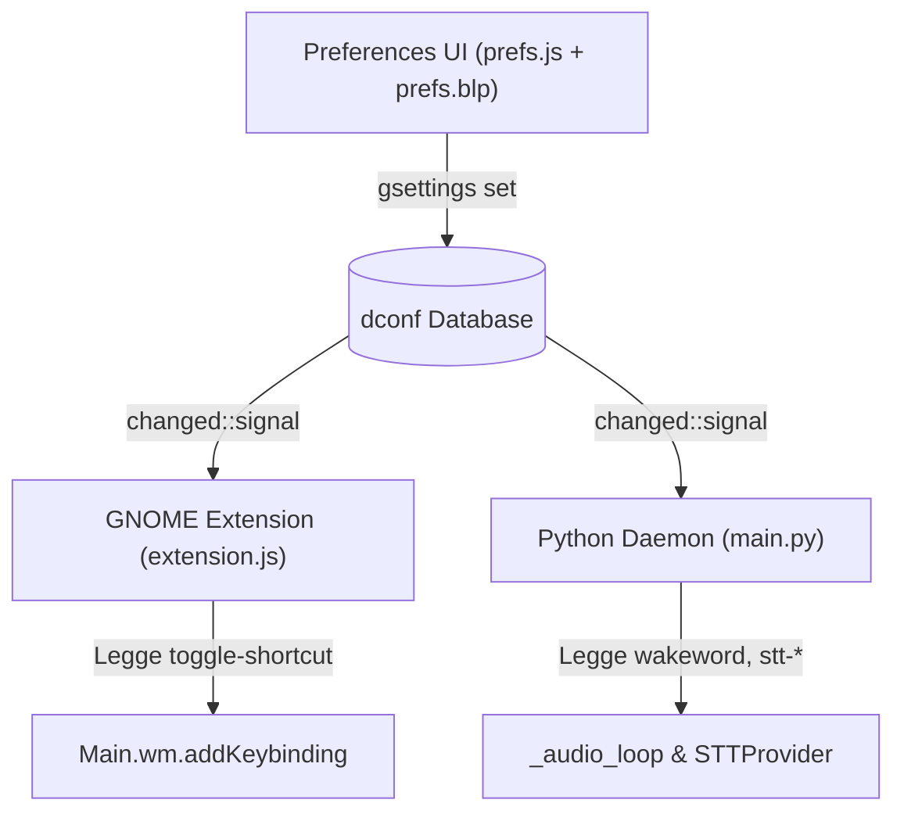

# GSettings Schema Reference

> Schema ID: `org.gnome.shell.extensions.voice-assistant`  
> Path: `/org/gnome/shell/extensions/voice-assistant/`  
> File: `data/schemas/org.gnome.shell.extensions.voice-assistant.gschema.xml`

GSettings è il bus di configurazione persistente condiviso tra l'interfaccia delle preferenze (`prefs.js`), l'estensione GNOME Shell (`extension.js`) e il daemon Python (`main.py`). Ogni modifica ad una chiave viene salvata nel database dconf e notificata istantaneamente a tutti i componenti iscritti al segnale `changed::`.



---

## Tabelle di Riferimento Chiavi

### `wakeword` — `string`

| Proprietà | Valore |
|---|---|
| **Tipo** | `s` (stringa) |
| **Default** | `'assistente'` |
| **Descrizione** | La parola chiave che attiva il riconoscimento vocale completo |
| **Consumata da** | `main.py` (comparazione case-insensitive nel filtro Vosk small-it) |
| **Comportamento** | Aggiornamento **istantaneo** in memoria nel main loop del daemon |

### `stt-provider` — `string`

| Proprietà | Valore |
|---|---|
| **Tipo** | `s` (stringa) |
| **Default** | `'vosk'` |
| **Valori validi** | `'vosk'`, `'whisper'` |
| **Descrizione** | Motore STT per il riconoscimento vocale delle frasi complete |
| **Consumata da** | `main.py` → `providers/__init__.py:get_provider()` |
| **Comportamento** | Triggera reload **debounced** (500ms) del provider STT |

### `stt-model` — `string`

| Proprietà | Valore |
|---|---|
| **Tipo** | `s` (stringa) |
| **Default** | `'vosk-model-small-it-0.22'` |
| **Valori tipici** | Vosk: `vosk-model-small-it-0.22`, `vosk-model-it-0.22` |
| | Whisper: `tiny`, `base`, `small`, `medium`, `large-v3` |
| **Descrizione** | Nome/taglia del modello da caricare ed utilizzare |
| **Consumata da** | Costruttore del provider (`VoskProvider` / `WhisperProvider`) |
| **Comportamento** | Triggera reload debounced (500ms) del provider STT |

### `stt-hardware` — `string`

| Proprietà | Valore |
|---|---|
| **Tipo** | `s` (stringa) |
| **Default** | `'cpu'` |
| **Valori validi** | `'cpu'`, `'cuda'` |
| **Descrizione** | Dispositivo di esecuzione dell'inferenza |
| **Consumata da** | `WhisperProvider` (scelta del tipo di calcolo float16 vs int8) |
| **Comportamento** | Triggera reload debounced (500ms) del provider STT |

### `stt-extra` — `string`

| Proprietà | Valore |
|---|---|
| **Tipo** | `s` (stringa JSON) |
| **Default** | `'{}'` |
| **Descrizione** | Parametri accessori passati al provider in formato JSON |
| **Consumata da** | Costruttore del provider (parametro `extra`) |
| **Comportamento** | Triggera reload debounced (500ms) del provider STT |

### `enabled` — `boolean`

| Proprietà | Valore |
|---|---|
| **Tipo** | `b` (booleano) |
| **Default** | `true` |
| **Descrizione** | Abilita o disabilita globalmente l'ascolto del microfono |
| **Consumata da** | `main.py` (governa transizioni `disabled ↔ idle`) ed `extension.js` |
| **Comportamento** | Aggiornamento **istantaneo** senza reload del modello |

### `models-dir` — `string`

| Proprietà | Valore |
|---|---|
| **Tipo** | `s` (stringa percorso) |
| **Default** | `''` (vuoto per percorso default `~/.local/share/voice-assistant/models`) |
| **Descrizione** | Cartella personalizzata per il salvataggio dei modelli STT |
| **Consumata da** | `prefs.js`, `main.py`, `VoskProvider`, `WhisperProvider` |
| **Comportamento** | Triggera reload debounced del provider |

### Policy di unload modelli — `int`

| Chiave | Default | Descrizione |
|---|---:|---|
| `idle-unload-timeout` | `300` | Timeout globale, in secondi, per liberare modelli in-process inattivi |
| `stt-idle-unload-timeout` | `0` | Override STT; `0` usa il timeout globale |
| `llm-idle-unload-timeout` | `180` | Override per GGUF locale; lo rende più aggressivo rispetto al default globale |
| `tts-idle-unload-timeout` | `0` | Override TTS; `0` usa il timeout globale |

Le modifiche sono applicate senza riavviare il daemon. Il controllo idle viene eseguito ogni 30 secondi e libera soltanto gli handle in RAM/VRAM: i file dei modelli non vengono rimossi.

### `mcp-registry-url` — `string`

| Proprietà | Valore |
|---|---|
| **Default** | `'https://api.smithery.ai'` |
| **Descrizione** | Endpoint del marketplace MCP usato per discovery e ricerca server |
| **Comportamento** | Aggiorna `MCPManager` immediatamente, senza riavvio del daemon |

### `toggle-shortcut` — `array of strings`

| Proprietà | Valore |
|---|---|
| **Tipo** | `as` (array di stringhe) |
| **Default** | `['<Super>v']` |
| **Descrizione** | Combinazione di tasti per attivare/disattivare l'ascolto via tastiera |
| **Consumata da** | `extension.js` via `Main.wm.addKeybinding()` |
| **Comportamento** | Re-registrazione istantanea della shortcut in GNOME Shell |

---

## Gestione CLI da Terminale

```bash
# Elenca tutte le impostazioni correnti
gsettings list-recursively org.gnome.shell.extensions.voice-assistant

# Modifica la wakeword
gsettings set org.gnome.shell.extensions.voice-assistant wakeword "computer"

# Cambia il provider a Whisper con modello base
gsettings set org.gnome.shell.extensions.voice-assistant stt-provider "whisper"
gsettings set org.gnome.shell.extensions.voice-assistant stt-model "base"

# Modifica la scorciatoia da tastiera nativa
gsettings set org.gnome.shell.extensions.voice-assistant toggle-shortcut "['<Super><Shift>v']"

# Riduce a 2 minuti il timeout del GGUF locale
gsettings set org.gnome.shell.extensions.voice-assistant llm-idle-unload-timeout 120

# Ripristina tutte le impostazioni ai valori di fabbrica
gsettings reset-recursively org.gnome.shell.extensions.voice-assistant
```

---

## Gotchas e Note per gli Sviluppatori

1. **Schema compilato obbligatorio**: GNOME Shell non legge file XML `.gschema.xml` non compilati. È necessario eseguire `glib-compile-schemas` nella directory `schemas/` dopo ogni modifica.
2. **Coerenza dei tipi**: In `prefs.js`, i binding a widget GTK/Adwaita devono corrispondere al tipo GSettings (es. `Gio.SettingsBindFlags.DEFAULT` per booleani o stringhe).
3. **Mancanza di accoppiamento diretto**: `prefs.js` non comunica mai direttamente via codice con `main.py`. Tutta la sincronizzazione dello stato delle opzioni avviene esclusivamente tramite GSettings.
