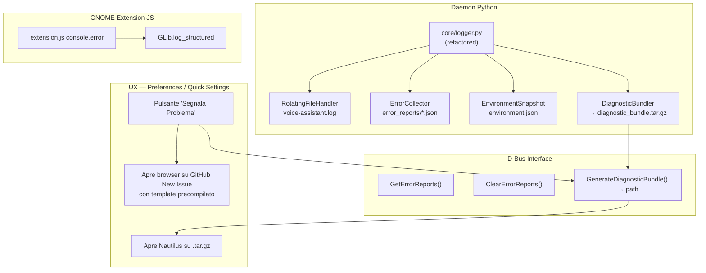

# 🏗️ Progetto: Sistema di Logging e Bug Report per Voice Assistant

## Obiettivo
Creare un sistema strutturato per cui **ogni errore possibile** nel demone e nell'estensione venga catturato, registrato e reso disponibile come bundle allegabile a una Issue GitHub dall'utente finale.

---

## 📊 Mappa Completa degli Error Path Attuali

Dall'analisi del codice emergono **35+ punti di errore** sparsi su 12 file, la maggior parte dei quali attualmente loggati con `print()` nudo e senza persistenza su disco.

### Daemon Backend (`src/daemon/`)

| # | File | Linee | Tipo Errore | Stato attuale |
|---|------|-------|-------------|---------------|
| 1 | `main.py` | 45-46 | Audio callback `status` error (xrun, overflow) | `print(status, stderr)` |
| 2 | `main.py` | 75-76 | Logind inhibitor D-Bus fail | `print()` |
| 3 | `main.py` | 96-97 | GNOME SessionManager inhibitor fail | `print()` |
| 4 | `main.py` | 105-106 | Logind lock rilascio errore | `print()` |
| 5 | `main.py` | 124-125 | GNOME lock rilascio errore | `print()` |
| 6 | `main.py` | 167-168 | JSON parsing `stt-extra` | Silenzioso, `{}` fallback |
| 7 | `main.py` | 183 | `notify2.init()` fallito | `print()` |
| 8 | `main.py` | 202-203 | Wake Word init fallito (Vosk load) | `print()` |
| 9 | `main.py` | 351 | Notifica creazione except | `except:` **bare** (!) |
| 10 | `main.py` | 411-421 | Provider STT load fallito | `print()` |
| 11 | `main.py` | 443-444 | D-Bus signal emission error | `print()` |
| 12 | `main.py` | 527 | Error report cleanup fail | `print()` |
| 13 | `main.py` | 551-552 | Notifica download creazione fail | `print()` |
| 14 | `main.py` | 586-602 | Download model error / cancel | `print()` |
| 15 | `main.py` | 631-632 | Cleanup partial download error | `print()` |
| 16 | `main.py` | 650-651 | Cancel download notifica errore | `print()` |
| 17 | `main.py` | 740-741 | **Audio thread crash** (catastrofico) | `print(stderr)` — **nessun recovery** |
| 18 | `audio/player.py` | 57-58 | WAV parsing error | `print()` |
| 19 | `audio/player.py` | 79-80 | Audio playback error (sounddevice) | `print()` |
| 20 | `services/tts_service.py` | 62-63 | Piper model download HuggingFace error | `logger.error()` ✅ |
| 21 | `services/tts_service.py` | 77-78 | `piper-tts` ImportError | `logger.warning()` ✅ |
| 22 | `services/tts_service.py` | 104-105 | Piper native synth error | `logger.error()` ✅ |
| 23 | `services/tts_service.py` | 132-133 | Piper CLI fallback error | `logger.error()` ✅ |
| 24 | `services/tts_service.py` | 149-150 | espeak-ng non trovato | `logger.warning()` ✅ |
| 25 | `services/tts_service.py` | 176-177 | espeak synth error | `logger.error()` ✅ |
| 26 | `services/llm_service.py` | 44-46 | HuggingFace GGUF download error | `logger.error()` ✅ |
| 27 | `services/llm_service.py` | 64-66 | `llama-cpp-python` ImportError | `logger.error()` ✅ |
| 28 | `services/llm_service.py` | 67-69 | Llama init error | `logger.error()` ✅ |
| 29 | `services/llm_service.py` | 109-111 | LLM `create_chat_completion` error | `logger.error()` ✅ |
| 30 | `services/llm_service.py` | 158-159 | Local GGUF runtime error → fallback | `logger.warning()` ✅ |
| 31 | `services/llm_service.py` | 218-223 | HTTP/Ollama connection error | `logger.error()` ✅ |
| 32 | `core/pipeline.py` | 113-114 | FastPath intent handler error | `logger.error()` ✅ |
| 33 | `core/pipeline.py` | 149-150 | TTS sentence callback error | `logger.error()` ✅ |
| 34 | `core/pipeline.py` | 195-196 | LLM streaming pipeline error | `logger.error()` ✅ |
| 35 | `providers/vosk_provider.py` | 59-62 | Modello Vosk corrotto | `print()` |
| 36 | `providers/vosk_provider.py` | 109-114 | Download Vosk retry failures | `print()` |
| 37 | `providers/vosk_provider.py` | 127-133 | ZIP extraction / model load failure | `print()` |
| 38 | `providers/whisper_provider.py` | 84-87 | `faster-whisper` ImportError | `print()` |
| 39 | `providers/whisper_provider.py` | 129-135 | Whisper model load/download error | `print()` |
| 40 | `providers/whisper_provider.py` | 165-167 | Whisper transcription runtime error | `print()` |
| 41 | `core/settings.py` | 20-21 | GSettings connection error | `print()` |
| 42 | `core/settings.py` | 28-29 | Settings change callback error | `print()` |
| 43 | `core/model_manager.py` | 84 | `malloc_trim` warning | `print()` |
| 44 | `services/downloader.py` | 62 | Download worker error | `print()` |

### Extension Frontend (`src/extension.js`)

| # | File | Linee | Tipo Errore | Stato attuale |
|---|------|-------|-------------|---------------|
| 45 | `extension.js` | 46-52 | Template servizi non trovato | `throw Error` |
| 46 | `extension.js` | 66-68 | Systemd service install error | `console.error()` |
| 47 | `extension.js` | 81-83 | D-Bus service install error | `console.error()` |
| 48 | `extension.js` | 100-103 | Systemd enable/start error | `console.error()` |
| 49 | `extension.js` | 362-364 | D-Bus proxy connection error | `console.error()` |
| 50 | `extension.js` | 396-398 | ToggleListening D-Bus error | `console.error()` |
| 51 | `extension.js` | 413-415 | OSD display error | `console.error()` |

---

## 🏛️ Architettura Proposta

### Principio Chiave
> **Ogni errore, anche gestito, lascia una traccia persistente su disco.**  
> L'utente non deve ricostruire l'errore: deve solo premere un pulsante.

### Componenti



---

## 📐 Design Dettagliato

### 1. Refactoring `core/logger.py`

Il modulo attuale va espanso con tre responsabilità aggiuntive:

#### a) Logger Unificato con Propagazione Gerarchica
```python
# Sostituire tutti i print() nel codebase con logger strutturati.
# Gerarchia dei logger:
#
#   VoiceAssistant              (root)
#   ├── VoiceAssistant.Audio    (player, callback, VAD)
#   ├── VoiceAssistant.STT      (vosk, whisper providers)
#   ├── VoiceAssistant.TTS      (piper, espeak) — già esiste
#   ├── VoiceAssistant.LLM      (local GGUF, HTTP) — già esiste
#   ├── VoiceAssistant.Pipeline  — già esiste
#   ├── VoiceAssistant.Download (downloader, progress)
#   ├── VoiceAssistant.DBus     (signal emission, proxy)
#   ├── VoiceAssistant.Power    (inhibitor)
#   └── VoiceAssistant.Settings (GSettings observer)
```

**Livelli di log**:
- `DEBUG`: Stato interno, transizioni, buffer sizes (solo su file, non su console)
- `INFO`: Operazioni riuscite, transizioni di stato (file + console)
- `WARNING`: Fallback attivati, risorse mancanti non critiche (file + console)
- `ERROR`: Errori gestiti con recovery (file + console + **ErrorCollector**)
- `CRITICAL`: Crash non gestiti, errori fatali (file + console + **ErrorCollector** + **notifica utente**)

#### b) `ErrorCollector` — Arricchimento Report
Ogni report JSON deve includere **contesto ricco** per la riproduzione del bug:

```json
{
  "timestamp": "2026-09-01T01:54:26+02:00",
  "error_type": "RuntimeError",
  "message": "Errore durante create_chat_completion: ...",
  "traceback": "...",
  "severity": "ERROR",
  "component": "VoiceAssistant.LLM",
  "state_at_crash": "speaking",
  "context": {
    "stt_provider": "vosk",
    "stt_model": "vosk-model-small-it-0.22",
    "llm_mode": "local",
    "llm_model": "Llama-3.2-1B-Instruct-Q4_K_M.gguf",
    "tts_provider": "piper",
    "tts_voice": "it_IT-paola-medium",
    "hardware": "cpu",
    "last_transcription": "chi è napoleone",
    "pipeline_state": "streaming_llm"
  },
  "thread": "Thread-3 (_audio_loop)"
}
```

**Strategia di arricchimento**: Il `VoiceAssistant.__init__` registra un context updater che mantiene aggiornato lo snapshot dei settings e dello stato corrente in `ErrorCollector._context`. Ogni `set_state()` aggiorna `state_at_crash`. Ogni `_process_text()` aggiorna `last_transcription`.

#### c) `EnvironmentSnapshot` — Informazioni Sistema

Classe che raccoglie e scrive un file `environment.json` contenente:

```json
{
  "timestamp": "2026-09-01T01:54:26+02:00",
  "os": "Fedora Linux 42 (Workstation Edition)",
  "kernel": "6.12.8-200.fc42.x86_64",
  "desktop": "GNOME 48.1",
  "session_type": "wayland",
  "cpu": "12th Gen Intel(R) Core(TM) i7-1260P (16 cores)",
  "gpu": "Intel Iris Xe / NVIDIA RTX 3050",
  "ram_total_mb": 32768,
  "ram_available_mb": 24500,
  "python_version": "3.14.0",
  "venv_packages": {
    "vosk": "0.3.50",
    "sounddevice": "0.5.1",
    "llama-cpp-python": "0.3.8",
    "piper-tts": "1.2.0",
    "faster-whisper": "1.1.0",
    "dasbus": "1.7"
  },
  "pipewire_version": "1.2.7",
  "audio_devices": ["Framework 16 Microphone (Built-in)"],
  "gsettings_dump": {
    "stt-provider": "vosk",
    "stt-model": "vosk-model-small-it-0.22",
    "llm-mode": "local",
    "...": "..."
  },
  "installed_models": {
    "stt": ["vosk-model-small-it-0.22"],
    "llm": ["Llama-3.2-1B-Instruct-Q4_K_M.gguf"],
    "tts": ["it_IT-paola-medium.onnx"]
  },
  "extension_uuid": "voice-assistant@scroker.github.io",
  "extension_version": "1.0.0",
  "daemon_uptime_seconds": 3456
}
```

**Raccolta dati**:
- OS: da `/etc/os-release`
- Kernel: `platform.release()`
- GNOME: da `gnome-shell --version` o D-Bus `org.gnome.Shell`
- Packages: `pip list --format=json` nel venv
- Audio: `sounddevice.query_devices()`
- GSettings: iterazione su tutte le chiavi dello schema
- Modelli installati: scan delle directory `~/.local/share/voice-assistant/models/`

#### d) `DiagnosticBundler` — Generazione Bundle per Issue

Classe che crea un archivio `.tar.gz` contenente tutto il necessario:

```
voice-assistant-diagnostic-20260901_015426.tar.gz
├── environment.json          # Snapshot ambiente (sanitizzato)
├── voice-assistant.log       # Ultimi 500KB del log rotante
├── error_reports/            # Tutti i report JSON degli errori
│   ├── report_20260901_014835_123456.json
│   └── report_20260901_015012_789012.json
├── journalctl.log            # Output di journalctl --user -u voice-assistant (ultime 200 righe)
├── gnome-shell-errors.log    # Estratto da journalctl -b /usr/bin/gnome-shell con filtro [VoiceAssistant]
└── gsettings.json            # Dump completo dei settings (con valori sensibili mascherati)
```

**Sanitizzazione**: Prima di scrivere i file, rimuovere:
- Path assoluti dell'utente (`/home/username/` → `~`)
- Token/API key (se presenti in futuro)
- Contenuto delle trascrizioni vocali (privacy) — sostituire con `[REDACTED]`

---

### 2. Interfaccia D-Bus Estesa

Aggiungere al file `org.local.VoiceAssistant.xml`:

```xml
<!-- Genera il bundle diagnostico e ritorna il percorso del file .tar.gz -->
<method name="GenerateDiagnosticBundle">
  <arg type="s" direction="out" name="bundle_path"/>
</method>
```

Implementazione in `main.py`:
```python
def GenerateDiagnosticBundle(self) -> str:
    bundler = DiagnosticBundler()
    path = bundler.generate(
        log_file=MAIN_LOG_FILE,
        error_reports_dir=ERROR_REPORTS_DIR,
        settings=self.settings,
        state=self._state
    )
    return path
```

---

### 3. UX nell'Estensione GNOME

#### a) Pulsante nelle Preferences (`prefs.js`)

Aggiungere una sezione **"Diagnostica e Supporto"** nella pagina delle preferenze:

```
┌──────────────────────────────────────────┐
│  🔧 Diagnostica e Supporto              │
│                                          │
│  [📋 Genera Report Diagnostico]          │
│                                          │
│  [🐛 Segnala un Problema su GitHub]      │
│                                          │
│  Errori recenti: 3                       │
│  [🗑️ Pulisci cronologia errori]          │
└──────────────────────────────────────────┘
```

- **"Genera Report Diagnostico"**: Chiama `GenerateDiagnosticBundle()` via D-Bus → Apre il file manager nella directory contenente il `.tar.gz`
- **"Segnala un Problema"**: Apre il browser con URL precompilato:
  ```
  https://github.com/Scroker/voice-assistant/issues/new?template=bug_report.md&title=[Bug]&labels=bug
  ```

#### b) GitHub Issue Template (`.github/ISSUE_TEMPLATE/bug_report.md`)

Creare il template nella repository:

```markdown
---
name: Bug Report
about: Segnala un problema con Voice Assistant
title: "[Bug] "
labels: bug
---

## Descrizione del problema
<!-- Descrivi cosa è successo -->

## Passi per riprodurre
1. 
2. 
3. 

## Comportamento atteso
<!-- Cosa ti aspettavi che succedesse -->

## Allegati diagnostici
<!-- 
Genera il report diagnostico dalle Preferenze dell'estensione:
  Impostazioni → Voice Assistant → Diagnostica → "Genera Report Diagnostico"
Allega qui il file .tar.gz generato.
-->

## Informazioni aggiuntive
<!-- Qualsiasi altro contesto utile -->
```

---

### 4. Migrazione dei `print()` esistenti

> [!IMPORTANT]
> Questo è il lavoro quantitativamente più grande: **tutti i 25+ `print()` nel backend** devono essere sostituiti con chiamate `logger` appropriate.

Strategia per file:

| File | Logger name | Azione |
|------|-------------|--------|
| `main.py` (PowerInhibitor) | `VoiceAssistant.Power` | `print()` → `logger.warning/error()` |
| `main.py` (VoiceAssistant) | `VoiceAssistant.Daemon` | Ogni `print()` → `logger.info/error()`. Aggiungere `try/except` con `ErrorCollector.record_error()` nei punti critici (#9, #17) |
| `audio/player.py` | `VoiceAssistant.Audio` | `print()` → `logger.error()` |
| `providers/vosk_provider.py` | `VoiceAssistant.STT.Vosk` | `print()` → `logger.info/error()` |
| `providers/whisper_provider.py` | `VoiceAssistant.STT.Whisper` | `print()` → `logger.info/error()` |
| `core/settings.py` | `VoiceAssistant.Settings` | `print()` → `logger.warning()` |
| `core/model_manager.py` | `VoiceAssistant.ModelManager` | `print()` → `logger.info/warning()` |
| `services/downloader.py` | `VoiceAssistant.Download` | `print()` → `logger.error()` |

**Regola chiave**: Ogni `except` che oggi contiene solo `print()` deve anche chiamare `ErrorCollector.record_error(...)` quando l'errore è di gravità ERROR o superiore.

---

### 5. Punti Critici da Blindare

Tre zone del codice attualmente possono causare crash **silenziosi** senza lasciare traccia:

#### a) Audio Thread (`main.py:669-741`)
Il `try/except` generico alla riga 740 cattura tutto ma **non salva nulla**. Se il thread audio muore, il demone resta vivo ma muto, senza alcun report.

**Soluzione**: Wrappare con `ErrorCollector.record_error()` e tentare un restart del thread:
```python
except Exception as e:
    logger.critical(f"Audio thread crashed: {e}", exc_info=True)
    ErrorCollector.record_error(*sys.exc_info(), {"component": "audio_loop"})
    # Tentativo di restart dopo 2 secondi
    time.sleep(2)
    self._audio_thread = threading.Thread(target=self._audio_loop, daemon=True)
    self._audio_thread.start()
```

#### b) Bare `except:` alla riga 351
L'`except:` senza tipo cattura silenziosamente qualsiasi errore (inclusi `SystemExit`, `KeyboardInterrupt`). Deve diventare `except Exception as e:` con logging.

#### c) GSettings `get()` che fallisce silenziosamente (riga 240-241)
Il metodo `get()` restituisce il default in caso di errore, ma se la chiave è assente dallo schema, è un bug della configurazione che dovrebbe essere loggato almeno una volta.

---

## 📋 Piano di Implementazione

| Fase | Descrizione | File coinvolti |
|------|-------------|----------------|
| **1** | Refactoring `core/logger.py`: aggiungere `EnvironmentSnapshot`, `DiagnosticBundler`, arricchire `ErrorCollector` | `core/logger.py` |
| **2** | Migrazione `print()` → `logger.*()` in tutti i file del daemon | `main.py`, `audio/player.py`, `providers/*.py`, `core/settings.py`, `core/model_manager.py`, `services/downloader.py` |
| **3** | Blindatura punti critici (audio thread, bare except, GSettings) | `main.py` |
| **4** | D-Bus: aggiungere `GenerateDiagnosticBundle` | `org.local.VoiceAssistant.xml`, `main.py` |
| **5** | UI Preferences: sezione "Diagnostica e Supporto" | `prefs.js`, `prefs.blp` |
| **6** | GitHub: creare `.github/ISSUE_TEMPLATE/bug_report.md` | Nuovo file |
| **7** | Test unitari per `EnvironmentSnapshot`, `DiagnosticBundler` | `tests/test_logger.py` |

> [!TIP]
> Le fasi 1-3 sono prioritarie e possono essere completate in un singolo ciclo di lavoro. Le fasi 4-6 sono UX e possono seguire successivamente.
