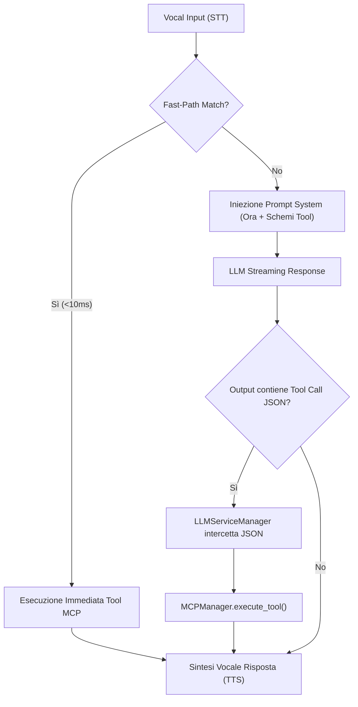

# Guida Completa all'Integrazione Model Context Protocol (MCP)

Questa guida documenta l'architettura **Model Context Protocol (MCP)** e i **Tool Nativi** integrati nel demone del Voice Assistant per GNOME Shell.

---

## 💡 Cos'è il Model Context Protocol (MCP) nel Voice Assistant?

MCP è uno standard aperto che consente al modello di linguaggio (LLM) e al motore della pipeline vocale di interagire direttamente con il sistema operativo GNOME e con servizi esterni.

L'architettura MCP del Voice Assistant supporta:
1. **Tool Nativi GNOME (In-Process)**: Funzioni Python ad alta velocità per il controllo hardware e di sistema.
2. **Fast-Path Offline (<10ms)**: Esecuzione deterministica istantanea per i comandi vocali comuni senza passare dall'LLM.
3. **Dynamic Prompt Injection**: Iniezione automatica degli schemi dei tool abilitati e del timestamp di sistema aggiornato nel `system_prompt` dell'LLM.
4. **Server MCP Esterni (Stdio / SSE)**: Possibilità di collegare server MCP esterni definiti in `~/.config/voice-assistant/mcp_servers.json`.

---

## 🛠️ Elenco dei 8 Tool Nativi MCP Integrati

Il demone include 8 tool nativi pronti all'uso situati in `src/daemon/mcp/tools/`:

### 1. `system_volume` (`SystemVolumeTool`)
- **Descrizione**: Regola e legge il volume audio principale di sistema (PipeWire / WirePlumber / PulseAudio / ALSA).
- **Parametri**:
  - `action` (string, obbligatorio): `["get", "set", "increase", "decrease", "mute", "unmute"]`
  - `level` (integer, opzionale): Percentuale del volume `0-100` o incremento per `increase`/`decrease`.
- **Esempio JSON**:
  ```json
  {"tool": "system_volume", "args": {"action": "set", "level": 50}}
  ```

### 2. `dark_mode` (`DarkModeTool`)
- **Descrizione**: Cambia il tema di GNOME Desktop tra modalità chiara e scura.
- **Parametri**:
  - `mode` (string, obbligatorio): `["dark", "light", "toggle", "get"]`
- **Esempio JSON**:
  ```json
  {"tool": "dark_mode", "args": {"mode": "dark"}}
  ```

### 3. `app_launcher` (`AppLauncherTool`)
- **Descrizione**: Avvia un'applicazione Desktop o il browser predefinito (`gtk-launch` / comandi di sistema).
- **Parametri**:
  - `app_name` (string, obbligatorio): Nome dell'applicazione (es. `"firefox"`, `"nautilus"`, `"terminal"`, `"calculator"`).
- **Esempio JSON**:
  ```json
  {"tool": "app_launcher", "args": {"app_name": "firefox"}}
  ```

### 4. `date_time` (`DateTimeTool`)
- **Descrizione**: Restituisce la data, l'orario locale ed il giorno della settimana corrente dal clock di sistema.
- **Parametri**:
  - `format` (string, opzionale): `["time", "date", "full"]`
- **Esempio JSON**:
  ```json
  {"tool": "date_time", "args": {"format": "full"}}
  ```

### 5. `system_media` (`SystemMediaTool`)
- **Descrizione**: Controlla la riproduzione multimediale nei lettori compatibili MPRIS / `playerctl`.
- **Parametri**:
  - `action` (string, obbligatorio): `["play", "pause", "play-pause", "next", "previous", "stop"]`
- **Esempio JSON**:
  ```json
  {"tool": "system_media", "args": {"action": "pause"}}
  ```

### 6. `screen_brightness` (`ScreenBrightnessTool`)
- **Descrizione**: Regola e legge la luminosità dello schermo per laptop e monitor (`brightnessctl` / D-Bus Power).
- **Parametri**:
  - `action` (string, obbligatorio): `["get", "set", "increase", "decrease"]`
  - `level` (integer, opzionale): Percentuale luminosità `0-100`.
- **Esempio JSON**:
  ```json
  {"tool": "screen_brightness", "args": {"action": "set", "level": 70}}
  ```

### 7. `system_power` (`SystemPowerTool`)
- **Descrizione**: Esegue azioni di gestione della sessione di sistema.
- **Parametri**:
  - `action` (string, obbligatorio): `["lock", "suspend", "logout", "restart", "shutdown"]`
- **Esempio JSON**:
  ```json
  {"tool": "system_power", "args": {"action": "lock"}}
  ```

### 8. `clipboard` (`ClipboardTool`)
- **Descrizione**: Legge o copia testo dagli/agli appunti di sistema (Wayland `wl-copy`/`wl-paste` e X11 `xclip`).
- **Parametri**:
  - `action` (string, obbligatorio): `["get", "copy"]`
  - `text` (string, opzionale): Testo da copiare quando `action` è `"copy"`.
- **Esempio JSON**:
  ```json
  {"tool": "clipboard", "args": {"action": "copy", "text": "Testo da copiare"}}
  ```

---

## ⚡ Flusso di Esecuzione (Pipeline LLM & Fast-Path)



### Fast-Path Dispatcher
Se l'utente esprime un comando diretto (es. *"alza il volume"*, *"modalità scura"*, *"imposta volume al 50"*), il `FastPathDispatcher` intercetta l'intenzione prima dell'invio all'LLM ed esegue il tool MCP nativo in **<10ms**.

### LLM Tool Interception
Se il comando richiede elaborazione da parte dell'LLM:
1. Gli schemi JSON degli 8 tool vengono iniettati nel `system_prompt`.
2. Il parser dell' `LLMServiceManager` decodifica la risposta JSON generata dal modello.
3. Il metodo `_execute_tool_sync` gestisce l'esecuzione `asyncio` isolata nel thread dello streaming.

---

## 🧩 Come Creare un Nuovo Tool Nativo MCP

Per aggiungere un nuovo tool nativo al progetto:

1. Crea un nuovo file in `src/daemon/mcp/tools/mio_tool.py`:
   ```python
   from typing import Dict, Any
   from .base import NativeTool

   class MioTool(NativeTool):
       @property
       def name(self) -> str:
           return "mio_tool"

       @property
       def description(self) -> str:
           return "Descrizione del mio nuovo tool nativo"

       @property
       def parameters(self) -> Dict[str, Any]:
           return {
               "type": "object",
               "properties": {
                   "param1": {"type": "string", "description": "Descrizione parametro"}
               },
               "required": ["param1"]
           }

       async def execute(self, args: Dict[str, Any]) -> str:
           param1 = args.get("param1")
           # Logica del tool...
           return f"Eseguito con successo: {param1}"
   ```

2. Esporta il tool in `src/daemon/mcp/tools/__init__.py`.
3. Registralo in `MCPManager.initialize()` (`src/daemon/mcp/manager.py`).

---

## 🌐 Configurazione Server MCP Esterni (`mcp_servers.json`)

È possibile collegare server MCP esterni (es. Stdio o SSE) modificando `~/.config/voice-assistant/mcp_servers.json`:

```json
{
  "mcpServers": {
    "filesystem": {
      "command": "npx",
      "args": ["-y", "@modelcontextprotocol/server-filesystem", "/home/user/Documents"],
      "enabled": true
    }
  }
}
```

I tool esposti dai server esterni verranno automaticamente unificati nell'elenco dei tool disponibili per l'LLM.
