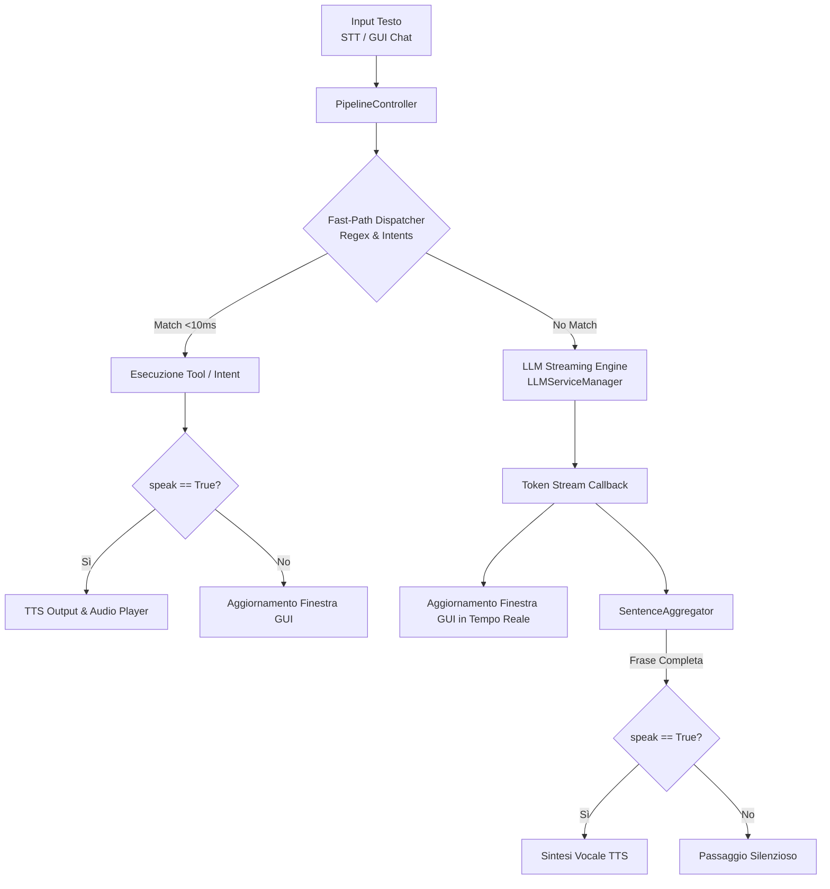

# Documentazione dell'Elaborazione Pipeline (`PipelineController`)

> Guida tecnica dettagliata sull'architettura della pipeline di elaborazione testo, Fast-Path dispatcher, aggregatore di frasi per l'LLM Streaming e gestione delle modalità vocale e silenziosa.

---

## 1. Architettura della Pipeline

La classe `PipelineController` (`src/daemon/core/pipeline.py`) coordina l'elaborazione dei testi provenienti dal riconoscimento vocale (STT) o dall'input diretto della finestra interattiva (GUI).



---

## 2. Fast-Path Dispatcher (`FastPathDispatcher`)

Per evitare le latenze dei modelli LLM nel caso di comandi semplici e deterministici, il sistema utilizza un sistema di **Fast-Path Intent Dispatcher** con tempo di risposta inferiore a **10ms**.

### Intenti Supportati

| Intento | Regex / Pattern Riconosciuto | Azione / Tool Eseguito | Risposta Standard |
|---|---|---|---|
| `set_volume` | `imposta volume al X%` | Modifica volume di sistema | "Volume impostato al X%" |
| `volume_up` | `alza il volume`, `più forte` | Aumenta volume +10% | "Volume alzato" |
| `volume_down` | `abbassa il volume`, `meno forte` | Riduce volume -10% | "Volume abbassato" |
| `mute` | `silenzioso`, `disattiva audio` | Mute audio di sistema | "Audio disattivato" |
| `set_theme_dark` | `attiva la modalità scura` | Attiva Dark Mode GNOME | "Modalità scura attivata" |
| `set_theme_light` | `attiva la modalità chiara` | Attiva Light Mode GNOME | "Modalità chiara attivata" |
| `get_time` | `che ore sono`, `orario` | Recupera ora locale | "Oggi è ... e sono le ore HH:MM" |
| `get_date` | `che giorno è`, `data di oggi` | Recupera data locale | "Oggi è [Giorno] [Data]" |
| `launch_app` | `apri firefox / terminale / calcolatrice` | Avvio applicazione Desktop | "Apro [Applicazione]" |

---

## 3. Aggregatore di Frasi per Streaming LLM (`SentenceAggregator`)

Quando la richiesta viene inoltrata al modello linguistico (LLM), la risposta viene prodotta sotto forma di token atomici tramite uno stream.

Per permettere una sintesi vocale naturale (TTS) senza attendere l'intera generazione del testo, `SentenceAggregator` accumula i token in un buffer e isola le **frasi complete** non appena rileva punteggiatura terminale (`.`, `!`, `?`, `\n`).

### Caratteristiche Principali

1. **Gestione delle Abbreviazioni**: Previene lo split prematuro della frase quando rileva abbreviazioni comuni (es. `art.`, `dott.`, `sig.`, `prof.`, `e.g.`, `i.e.`, `pag.`).
2. **Filtro del Contenuto Tecnico**: Rileva blocchi di codice Markdown (```` ``` ````) o JSON (`{"tool": ...}`) ed evita di inviarli al motore di sintesi vocale TTS per evitare riproduzioni sgradevoli di sintassi.
3. **Metodo `flush()`**: Forza lo svuotamento del buffer residuo quando lo stream dell'LLM si interrompe.

---

## 4. Modalità di Elaborazione: Vocale vs Testo Silenzioso

La pipeline supporta il parametro `speak: bool = True` per differenziare la modalità di interazione:

### 1. Interazione Vocale (`is_voice=True`, `speak=True`)
- Attivata via **Wakeword** o pulsante microfono.
- L'output dell'assistente viene mostrato a schermo nella GUI ed **emesso acusticamente via TTS** tramite l'`AudioPlayer`.
- Lo stato passa a `AssistantState.SPEAKING` durante la riproduzione.

### 2. Interazione da Tastiera (`is_voice=False`, `speak=False`)
- Attivata dalla casella di testo nella **Finestra GUI Chat**.
- I token dell'LLM e le frasi del Fast-Path vengono visualizzati **in tempo reale** nella chat della GUI, ma la riproduzione audio TTS viene **completamente disattivata**.
- Lo stato del sistema rimane in `AssistantState.PROCESSING` durante la generazione e ritorna immediatamente in `AssistantState.IDLE`.

---

## 5. Integrazione con D-Bus e GUI Interattiva

L'oggetto principale D-Bus `VoiceAssistant` (`src/daemon/main.py`) collega la pipeline ai client esterni:

- **`ProcessTextInput(text)`**: Endpoint D-Bus invocato dalla GUI. Richiama `_process_text(text, is_voice=False)` eseguendo la risposta in modalità silenziosa.
- **`on_token_callback`**: Callback del `PipelineController` che trasmette ciascun token LLM in tempo reale al metodo `append_assistant_token` della finestra GTK4/Libadwaita.
