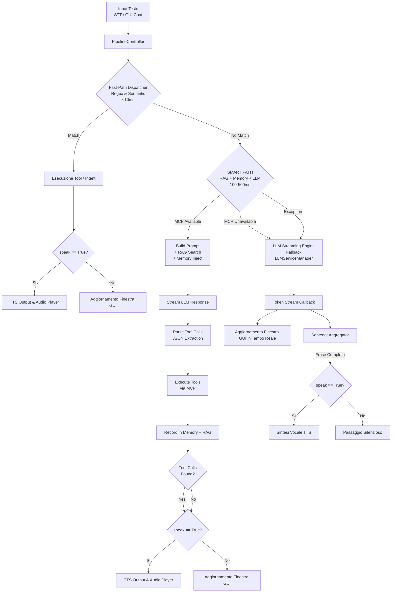

# Documentazione dell'Elaborazione Pipeline (`PipelineController`)

> Guida tecnica dettagliata sull'architettura della pipeline di elaborazione testo con dual-path dispatch (FAST PATH + SMART PATH), aggregatore di frasi per l'LLM Streaming e gestione delle modalità vocale e silenziosa.

---

## 1. Architettura della Pipeline

La classe `PipelineController` (`src/daemon/core/pipeline.py`) implementa un **dual-path dispatch architecture** per l'elaborazione dei testi provenienti dal riconoscimento vocale (STT) o dall'input diretto della finestra interattiva (GUI).

> [!WARNING]
> `PipelineController` è **l'implementazione attiva** nel daemon reale (importata da `core/runtime_manager.py` e `main.py`) — a differenza di `core/streaming_pipeline.py`/`core/pipeline_integration.py`, che pur documentati in [`docs/streaming-pipeline-guide.md`](streaming-pipeline-guide.md) non sono collegati al daemon in esecuzione. Fast-Path e Medium-Path sono **configurabili dall'utente** tramite le chiavi GSettings `fast-path-enabled` (default `false`) e `medium-path-enabled` (default `true`), esposte in **Generali → Dispatch dei Comandi**; le modifiche sono applicate a caldo. Esiste inoltre uno stadio "Medium Path" non mostrato nel diagramma sottostante — vedi sezione 2.5.

### Flusso Complessivo



### Stages di Elaborazione

| Stage | Latenza | Descrizione | Quando Attivato |
|-------|---------|-------------|-----------------|
| **FAST PATH** | <10ms | Regex pattern matching + sparse vector semantic similarity | Solo se `fast-path-enabled` è attivo — **disattivo di default** |
| **MEDIUM PATH** | ~stesso ordine dell'LLM | Selezione tool via un'unica chiamata LLM (`_try_llm_tool_select`) | Se `medium-path-enabled` è attivo (default), FAST PATH non matcha, E `mcp_manager` e `llm_streamer` sono entrambi disponibili |
| **SMART PATH** | 100-500ms | RAG retrieval + conversation memory + LLM tool calling | Se FAST PATH e MEDIUM PATH non risolvono E `mcp_manager` disponibile |
| **LLM Streaming** | Streaming | Token-by-token LLM response con aggregazione frasi | Se nessuno degli stage precedenti risolve la richiesta |

---

## 2. Fast-Path Dispatcher (`FastPathDispatcher`)

Per evitare le latenze dei modelli LLM nel caso di comandi semplici e deterministici, il sistema utilizza un sistema di **Fast-Path Intent Dispatcher** con tempo di risposta inferiore a **10ms**. Il dispatcher è implementato interamente dentro `src/daemon/core/pipeline.py` (classe `FastPathDispatcher`, righe ~140-297) — non è un modulo separato. **È disattivo di default**, attivabile dall'utente con `fast-path-enabled` (vedi warning in cima alla pagina): il codice sotto descrive il comportamento del dispatcher quando attivo.

### Intenti Supportati

| Intento | Regex / Pattern Riconosciuto | Azione / Tool Eseguito | Risposta Standard |
|---|---|---|---|
| `set_volume` | `imposta volume al X%` | Modifica volume di sistema | "Volume impostato al X%" |
| `volume_up` | `alza il volume`, `più forte` | Aumenta volume +10% | "Volume alzato" |
| `volume_down` | `abbassa il volume`, `meno forte` | Riduce volume -10% | "Volume abbassato" |
| `mute` | `silenzioso`, `disattiva audio` | Mute audio di sistema | "Audio disattivato" |
| `set_theme_dark` | `attiva la modalità scura` | Attiva Dark Mode GNOME | "Modalità scura attivata" |
| `set_theme_light` | `attiva la modalità chiara` | Attiva Light Mode GNOME | "Modalità chiara attivata" |
| `get_time` | `che ore sono`, `orario` | Recupera ora locale | "Oggi è ... e sono le ore HH:MM" |
| `get_date` | `che giorno è`, `data di oggi` | Recupera data locale | "Oggi è [Giorno] [Data]" |
| `launch_app` | `apri firefox / terminale / calcolatrice` | Avvio applicazione Desktop | "Apro [Applicazione]" |

---

## 2.5 Medium Path (`_try_llm_tool_select`)

Tra il Fast-Path e lo SMART PATH, `PipelineController.process_text_input()` esegue uno stadio intermedio: se `medium_path_enabled` è attivo (chiave `medium-path-enabled`, default `true`) e `mcp_manager` e `llm_streamer` sono entrambi disponibili, `_try_llm_tool_select()` chiede all'LLM di selezionare direttamente un tool da eseguire, senza passare per il ciclo completo di memoria conversazionale + RAG dello SMART PATH. Il risultato di questo stadio è esposto come chiave `medium_path` nel dizionario ritornato da `process_text_input()`, verificata anche da `assistant_runtime.py` (`res.get("medium_path")`).

Disattivarlo è utile quando si vuole che ogni comando non deterministico riceva il trattamento completo dello SMART PATH (memoria + RAG), oppure per risparmiare una chiamata LLM aggiuntiva su richieste che finirebbero comunque nello SMART PATH.

---

## 3. SMART PATH Controller (`SmartPathController`)

Quando il **Fast-Path non trova una corrispondenza** e l'**MCP Manager è disponibile**, il sistema attiva il **SMART PATH**, un'intelligenza conversazionale completa che combina:

1. **Conversazione Memory**: Ricorda i messaggi precedenti
2. **RAG (Retrieval-Augmented Generation)**: Recupera documenti simili
3. **LLM Tool Calling**: Estrae e esegue tool call
4. **Skill Execution**: Esegue markdown SKILL.md files

### Flusso SMART PATH

```python
# 1. Aggiungi messaggio alla memoria conversazionale
memory.add_user_message(user_input)

# 2. Costruisci prompt contestuale
prompt = build_prompt_with(
    rag_results=rag_store.search(user_input, top_k=3),
    conversation_history=memory.get_context_window(),
    available_skills=skill_registry.list_all(),
)

# 3. Chiedi all'LLM
response = llm_streamer(prompt)

# 4. Estrai tool call dal JSON
tool_calls = parse_json_tool_calls(response)

# 5. Esegui tool via MCP (if allowed)
for tool in tool_calls:
    result = mcp_manager.execute_tool(tool.name, tool.args)

# 6. Registra interazione in memoria + RAG
memory.add_assistant_message(response)
rag_store.add_document(user_input, response, metadata={...})
```

### Componenti SMART PATH

| Componente | Descrizione | Latenza |
|---|---|---|
| **ConversationMemory** | Sliding window (20 messaggi max, TTL 1h) | <1ms |
| **VectorStore (RAG)** | Vector store ibrido in-memory + persistenza SQLite | 10-50ms |
| **PromptBuilder** | Context-aware prompt construction | <5ms |
| **LLMStreamer** | Token streaming from external LLM | 500ms-5s |
| **ToolCallParser** | JSON extraction from LLM response | 10-20ms |
| **MCPManager** | Tool execution via Model Context Protocol | 100-1000ms (dipende da tool) |

### Esempio di Tool Call Format

L'LLM genera risposte con tool call embeddati in JSON:

```
Accendo la luce della cucina e aumento il volume.

{"tool": "turn_on_light", "args": {"room": "cucina"}}
{"tool": "set_volume", "args": {"level": 70}}
```

Il ToolCallParser estrae il JSON e l'MCPManager esegue ciascun tool in sequenza.

### Configurazione Memory

Non esistono costanti a livello di modulo: sono default del costruttore `ConversationMemory.__init__` in `src/daemon/services/memory_manager.py`:

```python
class ConversationMemory:
    def __init__(self, max_messages: int = 20, max_age_seconds: int = 3600):
        ...
```

`SmartPathController()` viene istanziato senza argomenti in `pipeline.py:323`, quindi in pratica usa sempre questi default.

### Configurazione RAG

Anche qui sono default del costruttore `VectorStore.__init__` in `src/daemon/services/rag_store.py` (persistenza SQLite in `~/.local/share/voice-assistant/rag_store.db`, sincronizzazione periodica ogni 30s), non costanti globali:

```python
class VectorStore:
    def __init__(self, max_documents: int = 1000, ttl_seconds: int = ..., ...):
        ...
    def search(self, query, top_k: int = 3, min_score: float = 0.1):
        ...
```

`smart_path_controller.py` invoca la ricerca con `search(query, top_k=3, min_score=0.15)`. Il vettore sparso usato per la similarità è puro **term-frequency** (conteggio normalizzato), non TF-IDF: non c'è alcuna componente di inverse-document-frequency nel codice. La deduplicazione avviene per hash del contenuto; l'eviction quando si supera `max_documents` rimuove il documento con il `timestamp` di creazione più vecchio (FIFO), non il meno usato di recente (non è vera LRU, perché il timestamp non si aggiorna agli accessi).

---

## 4. Aggregatore di Frasi per Streaming LLM (`SentenceAggregator`)

Quando la richiesta viene inoltrata al modello linguistico (LLM), la risposta viene prodotta sotto forma di token atomici tramite uno stream.

Per permettere una sintesi vocale naturale (TTS) senza attendere l'intera generazione del testo, `SentenceAggregator` accumula i token in un buffer e isola le **frasi complete** non appena rileva punteggiatura terminale (`.`, `!`, `?`, `\n`).

### Caratteristiche Principali

1. **Gestione delle Abbreviazioni**: Previene lo split prematuro della frase quando rileva abbreviazioni comuni (es. `art.`, `dott.`, `sig.`, `prof.`, `e.g.`, `i.e.`, `pag.`).
2. **Filtro del Contenuto Tecnico**: Rileva blocchi di codice Markdown (```` ``` ````) o JSON (`{"tool": ...}`) ed evita di inviarli al motore di sintesi vocale TTS per evitare riproduzioni sgradevoli di sintassi.
3. **Metodo `flush()`**: Forza lo svuotamento del buffer residuo quando lo stream dell'LLM si interrompe.

---

## 5. Modalità di Elaborazione: Vocale vs Testo Silenzioso

La pipeline supporta il parametro `speak: bool = True` per differenziare la modalità di interazione:

### 1. Interazione Vocale (`is_voice=True`, `speak=True`)
- Attivata via **Wakeword** o pulsante microfono.
- L'output dell'assistente viene mostrato a schermo nella GUI ed **emesso acusticamente via TTS** tramite l'`AudioPlayer`.
- Lo stato passa a `AssistantState.SPEAKING` durante la riproduzione.

### 2. Interazione da Tastiera (`is_voice=False`, `speak=False`)
- Attivata dalla casella di testo nella **Finestra GUI Chat**.
- I token dell'LLM e le frasi del Fast-Path vengono visualizzati **in tempo reale** nella chat della GUI, ma la riproduzione audio TTS viene **completamente disattivata**.
- Lo stato del sistema rimane in `AssistantState.PROCESSING` durante la generazione e ritorna immediatamente in `AssistantState.IDLE`.

---

## 6. Integrazione con D-Bus e GUI Interattiva

La GUI (`src/gui/`) è un'applicazione GTK4/Libadwaita **separata** che comunica con il daemon esclusivamente via D-Bus. Il daemon non ha dipendenze GTK.

### Metodi D-Bus invocati dalla GUI

| Metodo | Comportamento |
|---|---|
| `ProcessTextInput(text)` | Richiama `_process_text(text, is_voice=False)` — pipeline completa in modalità silenziosa (nessun TTS) |
| `ToggleListening()` | Attiva/disattiva il microfono dalla GUI |

### Segnali D-Bus emessi verso la GUI

| Segnale | Dati | Uso nella GUI |
|---|---|---|
| `TranscriptReceived(text, is_final)` | Testo STT | Mostra il messaggio dell'utente nella chat quando `is_final=True` |
| `ResponseTokenStreamed(token, is_complete)` | Token LLM o risposta fast-path | `is_complete=False` → append token; `is_complete=True` → chiude bolla |
| `StateChanged(state)` | Stato corrente | Aggiorna l'indicatore di stato nella barra del titolo |

### Distinzione Fast-Path vs LLM Streaming

La GUI usa il flag interno `_streaming_active` per distinguere i due casi:
- **Fast-Path**: arriva un singolo `ResponseTokenStreamed(risposta_completa, True)` senza token precedenti → messaggio completo immediato.
- **LLM Streaming**: arrivano N `ResponseTokenStreamed(token, False)` seguiti da `ResponseTokenStreamed("", True)` → bolla aperta che si riempie progressivamente poi si chiude.
