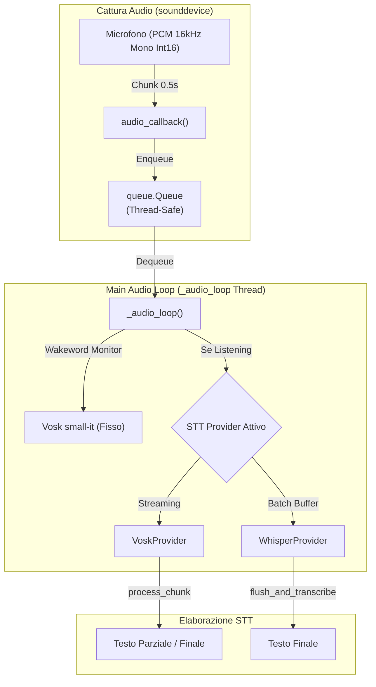

# Guida ai Provider STT

> Come funzionano, come aggiungerne di nuovi, e le differenze operative tra Vosk e Whisper.

---

## Pipeline Audio e Architettura Provider



---

## Interfaccia Astratta (`providers/base.py`)

Ogni provider estende la classe astratta `STTProvider`:

```python
import abc

class STTProvider(abc.ABC):
    @abc.abstractmethod
    def __init__(self, model: str, hardware: str, extra: dict, progress_callback=None):
        """Inizializza il provider, scaricando il modello se necessario."""
        pass

    @abc.abstractmethod
    def process_chunk(self, data: bytes) -> tuple[str, str]:
        """
        Processa un chunk di audio PCM int16 mono a 16 kHz.
        
        Returns:
            tuple: (text, partial_text)
            - text: stringa non vuota se una frase è stata completata
            - partial_text: testo parziale mentre l'utente sta parlando
        """
        pass

    @abc.abstractmethod
    def flush_and_transcribe(self) -> str:
        """Forza la trascrizione dell'audio accumulato (per provider batch)."""
        return ""

    @abc.abstractmethod
    def reset(self):
        """Resetta lo stato interno del riconoscitore."""
        pass
```

### Factory (`providers/__init__.py`)

```python
def get_provider(provider_name, model, hardware, extra, progress_callback=None) -> STTProvider
```

Il parametro `progress_callback` è una funzione thread-safe `(percent: int) -> None` che il provider chiama durante il download del modello per emettere il segnale D-Bus `DownloadProgress`.

---

## Provider: Vosk

| Proprietà | Valore |
|---|---|
| **File** | `providers/vosk_provider.py` |
| **Dipendenza** | `vosk` (pip) |
| **Modalità** | Streaming reale |
| **Download** | Automatico da `alphacephei.com/vosk/models/` |
| **Resume** | Sì (HTTP Range headers, fino a 10 retry) |
| **Hardware** | Solo CPU |

### Funzionamento

Vosk processa ogni chunk audio con `KaldiRecognizer.AcceptWaveform()`:
- Se ritorna `True`: è disponibile un risultato finale (`Result()`)
- Se ritorna `False`: è disponibile un risultato parziale (`PartialResult()`)

Il riconoscimento è **in tempo reale**: il testo appare progressivamente mentre l'utente parla.

### Alias dei Modelli

`VoskProvider.MODEL_MAPPINGS` traduce alias brevi nei nomi ufficiali:

```python
{
    "it": "vosk-model-small-it-0.22",
    "en": "vosk-model-small-en-us-0.15",
    "small-it": "vosk-model-small-it-0.22",
    "large-it": "vosk-model-it-0.22",
    "small-en": "vosk-model-small-en-us-0.15",
    "large-en": "vosk-model-en-us-0.22",
}
```

### Recovery da Corruzione

Se un modello esiste ma non è valido (`Model()` lancia un'eccezione), la cartella viene rimossa automaticamente e il download viene rieseguito in modo trasparente.

---

## Provider: Whisper

| Proprietà | Valore |
|---|---|
| **File** | `providers/whisper_provider.py` |
| **Dipendenza** | `faster-whisper` (pip) + opzionalmente PyTorch/CUDA |
| **Modalità** | Batch (accumula poi trascrive) |
| **Download** | Automatico via HuggingFace Hub (Systran/faster-whisper-*) |
| **Hardware** | CPU (`int8`) o CUDA (`float16`) |

### Funzionamento

A differenza di Vosk, Whisper **non supporta streaming nativo**. I chunk audio vengono accumulati in un `bytearray`. La trascrizione avviene solo quando `flush_and_transcribe()` viene invocato, tipicamente dopo 2 secondi di silenzio (rilevato nel `_audio_loop()` di `main.py` con soglia RMS > 500).

```
Audio chunks (int16) → bytearray → flush_and_transcribe() → float32 normalizzato (-1.0 to 1.0) → model.transcribe()
```

### Taglie dei Modelli

| Taglia | Dimensione approssimativa | VRAM (CUDA) | Compute Type (CPU / CUDA) |
|---|---|---|---|
| `tiny` | ~75 MB | ~1 GB | `int8` / `float16` |
| `base` | ~140 MB | ~1 GB | `int8` / `float16` |
| `small` | ~466 MB | ~2 GB | `int8` / `float16` |
| `medium` | ~1.5 GB | ~5 GB | `int8` / `float16` |
| `large-v3` | ~3.1 GB | ~10 GB | `int8` / `float16` |

### Tracking del Progresso di Download (Thread-Safe File Growth Monitoring)

Per evitare l'inaffidabilità del parsing di `tqdm` su stderr (che falliva durante download concorrenti o senza TTY), `WhisperProvider` utilizza un monitoraggio thread-safe indipendente della crescita delle dimensioni dei file sul filesystem.

Un thread di monitoraggio dedicato misura in tempo reale la dimensione accumulata della cartella di destinazione del modello rispetto alla dimensione attesa e notifica il `progress_callback` isolando gli stati di ciascun modello in parallelo.

---

## Aggiungere un Nuovo Provider STT

Per aggiungere un nuovo motore STT (es. Piper, Coqui, Llama-STT):

1. **Creare il file** `providers/nuovo_provider.py`:

```python
from .base import STTProvider

class NuovoProvider(STTProvider):
    def __init__(self, model: str, hardware: str, extra: dict, progress_callback=None):
        super().__init__(model, hardware, extra, progress_callback)
        # Inizializzare/scaricare il modello
        pass

    def process_chunk(self, data: bytes) -> tuple[str, str]:
        # Processare il chunk audio PCM int16 mono 16kHz
        return "", ""

    def flush_and_transcribe(self) -> str:
        return ""

    def reset(self):
        pass
```

2. **Registrare il provider nella Factory** (`providers/__init__.py`):

```python
from .nuovo_provider import NuovoProvider

def get_provider(provider_name, model, hardware, extra, progress_callback=None):
    ...
    elif provider_name == "nuovo":
        return NuovoProvider(model, hardware, extra, progress_callback)
```

3. **Aggiungere l'opzione in UI (`data/ui/prefs.blp` & `src/prefs.js`)**:
   - In `data/ui/prefs.blp`, aggiungere la nuova voce nel widget `Adw.ComboRow` del provider.
   - In `src/prefs.js`, collegare l'ID del provider ed eventuali opzioni di configurazione aggiuntive.

4. **Schema GSettings**: Se il nuovo provider introduce impostazioni specifiche, aggiungere la chiave in `data/schemas/org.gnome.shell.extensions.voice-assistant.gschema.xml` e collegarla in `main.py:on_settings_changed()`.

---

## Formato Audio Standard

Tutti i provider ricevono audio nel seguente formato fisso:

| Proprietà | Valore |
|---|---|
| **Sample rate** | 16000 Hz (16 kHz) |
| **Canali** | 1 (mono) |
| **Formato** | PCM int16 (little-endian) |
| **Block size** | 8000 frames (0.5 secondi per chunk) |
