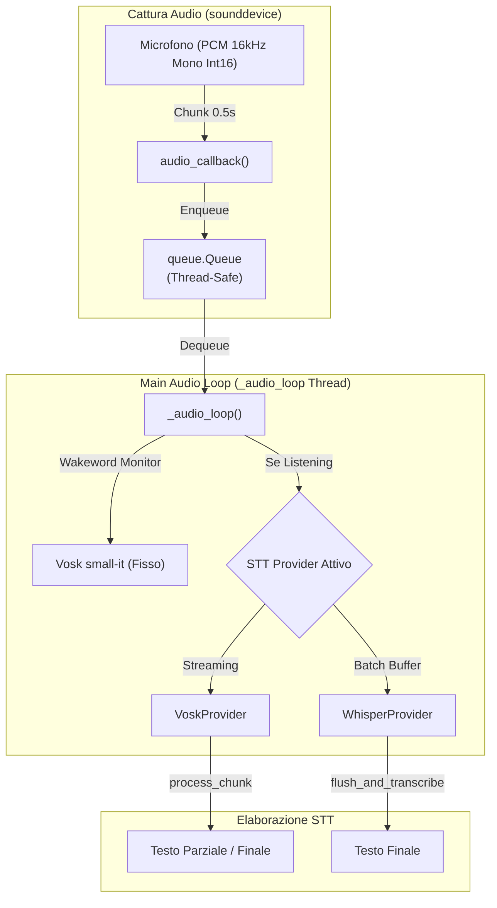

# Guida ai Provider STT

> Come funzionano, come aggiungerne di nuovi, e le differenze operative tra Vosk e Whisper.

---

## Pipeline Audio e Architettura Provider



---

## Interfaccia Astratta (`providers/base.py`)

Ogni provider estende la classe astratta `STTProvider`:

```python
import abc

class STTProvider(abc.ABC):
    @abc.abstractmethod
    def __init__(self, model: str, hardware: str, extra: dict):
        """Inizializza il provider, scaricando il modello se necessario."""
        pass

    @abc.abstractmethod
    def process_chunk(self, data: bytes) -> tuple[str, str]:
        """
        Processa un chunk di audio PCM int16 mono a 16 kHz.
        
        Returns:
            tuple: (text, partial_text)
            - text: stringa non vuota se una frase è stata completata
            - partial_text: testo parziale mentre l'utente sta parlando
        """
        pass

    @abc.abstractmethod
    def flush_and_transcribe(self) -> str:
        """Forza la trascrizione dell'audio accumulato (per provider batch)."""
        return ""

    @abc.abstractmethod
    def reset(self):
        """Resetta lo stato interno del riconoscitore."""
        pass

    @classmethod
    @abc.abstractmethod
    def get_available_models(cls) -> list[dict]:
        """Ritorna la lista dei modelli disponibili per questo provider."""
        pass

    @classmethod
    @abc.abstractmethod
    def get_default_model(cls, lang: str = None, **kwargs) -> str:
        """Ritorna il modello predefinito per questo provider."""
        pass
```

> **Nota**: Le implementazioni concrete (`VoskProvider`, `WhisperProvider`) aggiungono alla firma di `__init__` i parametri `progress_callback=None`, `models_dir=None` e `download_only=False`, non presenti nella classe astratta.

### Factory (`providers/__init__.py`)

```python
def get_provider(provider_name, model, hardware, extra,
                 progress_callback=None, models_dir=None,
                 download_only=False) -> STTProvider
```

Il parametro `progress_callback` è una funzione thread-safe `(percent: int) -> None` che il provider chiama durante il download del modello per emettere il segnale D-Bus `DownloadProgress`. `models_dir` consente di specificare un percorso personalizzato per i modelli; `download_only` avvia solo il download senza caricare il modello.

---

## Provider: Vosk

| Proprietà | Valore |
|---|---|
| **File** | `providers/vosk_provider.py` |
| **Dipendenza** | `vosk` (pip) |
| **Modalità** | Streaming reale |
| **Download** | Automatico da `alphacephei.com/vosk/models/` |
| **Resume** | Sì (HTTP Range headers, fino a 10 retry) |
| **Hardware** | Solo CPU |

### Funzionamento

Vosk processa ogni chunk audio con `KaldiRecognizer.AcceptWaveform()`:
- Se ritorna `True`: è disponibile un risultato finale (`Result()`)
- Se ritorna `False`: è disponibile un risultato parziale (`PartialResult()`)

Il riconoscimento è **in tempo reale**: il testo appare progressivamente mentre l'utente parla.

### Risoluzione del Nome Modello

`VoskProvider` non usa un dizionario statico di alias (non esiste alcun `MODEL_MAPPINGS`). La risoluzione del nome richiesto segue invece questo ordine:
1. Se inizia già con `vosk-model-` o `vosk-`, viene usato così com'è.
2. Altrimenti, se corrisponde a un id presente in `get_available_models()` (catalogo centralizzato in `services/catalog_manager.py`), viene usato quell'id.
3. Altrimenti, ricade su `get_default_model(lang)` per determinare il modello predefinito per la lingua richiesta.

### Migrazione da `~/.cache/vosk/`

Se il modello richiesto non è presente nella directory modelli corrente ma esiste nella vecchia posizione `~/.cache/vosk/<nome-modello>` (usata da versioni precedenti dell'estensione), `VoskProvider` la rileva e la riutilizza trasparentemente senza richiedere un nuovo download.

### Recovery da Corruzione

Se un modello esiste ma non è valido (`Model()` lancia un'eccezione), la cartella viene rimossa automaticamente e il download viene rieseguito in modo trasparente.

---

## Provider: Whisper

| Proprietà | Valore |
|---|---|
| **File** | `providers/whisper_provider.py` |
| **Dipendenza** | `faster-whisper` (pip) + opzionalmente PyTorch/CUDA |
| **Modalità** | Batch (accumula poi trascrive) |
| **Download** | Automatico via HuggingFace Hub (Systran/faster-whisper-*) |
| **Hardware** | CPU (`int8`) o CUDA (`float16`) |

### Funzionamento

A differenza di Vosk, Whisper **non supporta streaming nativo**. I chunk audio vengono accumulati in un `bytearray`. La trascrizione avviene solo quando `flush_and_transcribe()` viene invocato. Il trigger non è un timer fisso né vive in `main.py`: `_audio_loop()` è oggi implementato in `src/daemon/core/assistant_runtime.py` e ferma l'ascolto quando il testo parziale resta invariato per **1.0 secondi**, con due timeout aggiuntivi di sicurezza — 2.5s senza alcun parlato rilevato e 6.0s di durata massima dell'ascolto. La rilevazione dell'attività vocale (VAD) usata da Whisper stesso è **Silero VAD ONNX** (soglia di probabilità 0.3); solo se il modello Silero non è disponibile si ricade su una soglia RMS di **250** (non 500) calcolata dentro `whisper_provider.py`, non in `_audio_loop()`.

```
Audio chunks (int16) → bytearray → flush_and_transcribe() → float32 normalizzato (-1.0 to 1.0) → model.transcribe()
```

### Taglie dei Modelli

| Taglia | Dimensione approssimativa | VRAM (CUDA) | Compute Type (CPU / CUDA) |
|---|---|---|---|
| `tiny` | ~75 MB | ~1 GB | `int8` / `float16` |
| `base` | ~140 MB | ~1 GB | `int8` / `float16` |
| `small` | ~466 MB | ~2 GB | `int8` / `float16` |
| `medium` | ~1.5 GB | ~5 GB | `int8` / `float16` |
| `large-v3` | ~3.1 GB | ~10 GB | `int8` / `float16` |

### Tracking del Progresso di Download (Monkey-Patch di `tqdm`, non polling su filesystem)

Per evitare l'inaffidabilità del parsing di `tqdm` su stderr (che falliva durante download concorrenti o senza TTY), `WhisperProvider` (`setup_tqdm_patch()`) sostituisce direttamente in-process `__init__`/`update` di `tqdm.std.tqdm`, di `huggingface_hub.file_download.tqdm` e di `faster_whisper.utils.disabled_tqdm`, intercettando i valori `n`/`total` non appena vengono aggiornati — non esiste un thread dedicato che misura la dimensione della cartella di destinazione sul disco.

L'isolamento tra download concorrenti avviene indicizzando lo stato per `threading.get_ident()`, così ogni thread di download aggiorna il proprio `progress_callback` senza interferire con gli altri.

---

## Provider: STT Cloud (`OpenAICloudSTTProvider`)

| Proprietà | Valore |
|---|---|
| **File** | `providers/openai_cloud_provider.py` |
| **ID `stt-provider`** | `openai_cloud`, `groq_cloud`, `cloud_stt` (tutti mappati sulla stessa classe in `providers/__init__.py`) |
| **Modalità** | Richiesta HTTP multipart per segmento audio verso un endpoint compatibile OpenAI/Groq |
| **Autenticazione** | Chiave API (stessa famiglia di credenziali cloud usate per LLM) |

Implementa la stessa interfaccia `STTProvider` (`process_chunk`, `flush_and_transcribe`, `reset`, `get_available_models`, `get_default_model`) dei provider locali, permettendo di scambiarlo con Vosk/Whisper senza modifiche al resto della pipeline.

---

## Aggiungere un Nuovo Provider STT

Per aggiungere un nuovo motore STT (es. Piper, Coqui, Llama-STT):

1. **Creare il file** `providers/nuovo_provider.py`:

```python
from .base import STTProvider

class NuovoProvider(STTProvider):
    def __init__(self, model: str, hardware: str, extra: dict,
                 progress_callback=None, models_dir=None, download_only=False):
        super().__init__(model, hardware, extra)
        # Inizializzare/scaricare il modello
        pass

    def process_chunk(self, data: bytes) -> tuple[str, str]:
        # Processare il chunk audio PCM int16 mono 16kHz
        return "", ""

    def flush_and_transcribe(self) -> str:
        return ""

    def reset(self):
        pass

    @classmethod
    def get_available_models(cls) -> list[dict]:
        return []

    @classmethod
    def get_default_model(cls, lang=None, **kwargs) -> str:
        return "default-model"
```

2. **Registrare il provider nella Factory** (`providers/__init__.py`):

```python
from .nuovo_provider import NuovoProvider

def get_provider(provider_name, model, hardware, extra,
                 progress_callback=None, models_dir=None, download_only=False):
    ...
    elif provider_name == "nuovo":
        return NuovoProvider(model, hardware, extra, progress_callback,
                             models_dir=models_dir, download_only=download_only)
```

3. **Aggiungere l'opzione in UI (`data/ui/prefs.blp` & `src/prefs.js`)**:
   - In `data/ui/prefs.blp`, aggiungere la nuova voce nel widget `Adw.ComboRow` del provider.
   - In `src/prefs.js`, collegare l'ID del provider ed eventuali opzioni di configurazione aggiuntive.

4. **Schema GSettings**: Se il nuovo provider introduce impostazioni specifiche, aggiungere la chiave in `data/schemas/org.gnome.shell.extensions.voice-assistant.gschema.xml` e collegarla in `main.py:on_settings_changed()`.

---

## Formato Audio Standard

Tutti i provider ricevono audio nel seguente formato fisso:

| Proprietà | Valore |
|---|---|
| **Sample rate** | 16000 Hz (16 kHz) |
| **Canali** | 1 (mono) |
| **Formato** | PCM int16 (little-endian) |
| **Block size** | 8000 frames (0.5 secondi per chunk) |

---

## Provider LLM (Language Models)

L'assistente supporta diversi provider di intelligenza artificiale per l'elaborazione del linguaggio:

| Provider | ID `llm-mode` / `llm-provider` | Descrizione | Autenticazione |
|---|---|---|---|
| **Local GGUF** | `local` | Esecuzione diretta nel demone via `llama-cpp-python` e download automatico HuggingFace. | Nessuna (Offline) |
| **Ollama** | `ollama` | Connessione all'istanza locale o di rete di Ollama (`http://localhost:11434`). | Nessuna |
| **OpenAI API** | `openai` | API Cloud ufficiali OpenAI (GPT-4o, GPT-4o-mini), DeepSeek, Groq o OpenRouter. | Bearer `llm-api-key` |
| **Anthropic Claude** | `anthropic` | API Cloud ufficiali Anthropic (Claude 3.5 Sonnet / Haiku). | Header `x-api-key` |

---

## Provider TTS (Sintesi Vocale)

| Provider | ID `tts-provider` | Descrizione | Voce / Modelli |
|---|---|---|---|
| **Piper TTS** | `piper` | Sintesi neurale locale ONNX ad altissima velocità e naturalezza umanoide. | `it_IT-paola-medium`, `it_IT-riccardo-x_low`, `en_US-lessac-medium` |
| **eSpeak-ng** | `espeak` | Sintesi offline ultra-leggera e nativa Linux. | Voci di sistema (es. `it`) |
| **OpenAI Cloud TTS** | `openai` | Sintesi neurale ad altissima qualità via API Cloud OpenAI. | `alloy`, `echo`, `fable`, `onyx`, `nova`, `shimmer` |
| **System Dispatcher** | `system` | Fallback di sistema basato su `spd-say`. | Voci installate su GNOME |

> [!WARNING]
> Le chiavi GSettings `tts-api-key`, `tts-model` e `tts-cloud-voice` che `cloud_config.py` tenta di leggere per il Cloud TTS **non esistono nello schema** — vedi [`docs/gsettings.md`](gsettings.md). Il Cloud TTS con credenziali/voce dedicate è quindi attualmente non configurabile via UI/GSettings.

